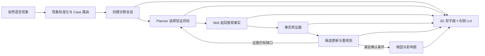

# 故障诊断 Agent Demo V2

> 文档状态：V2.0.1 归档一致性修订  
> 日期：2026-08-01  
> 定位：面向存储故障诊断演示与后续真实 Runtime 接入的小型“故障运维可执行本体”

## 1. 项目目标

本项目不是一组静态故障动画，而是一套由 Case、Diagnosis Runtime 和统一视图投影驱动的可执行诊断演示框架。用户从自然语言故障现象进入诊断，会经历：



V2 的核心能力是：

- 上层实例拓扑、下层故障知识图谱和跨层映射共同解释“故障发生在哪里、为何可能发生”；
- Planner、Skill、Fact、Evidence、Candidate 和 Runtime Event 解释“Agent 如何得到结论”；
- 右侧 LUI 持续回答“当前知道什么、正在做什么、下一步为什么这样做”；
- Case 数据与前端实现解耦，新增 Case 原则上只新增数据和领域配置；
- 同一套协议兼容确定性 Mock Planner 与未来真实大模型 Planner。

## 2. 三种主视图

| 视图 | 作用 | 首屏策略 |
|---|---|---|
| 融合诊断视图 | 上层实例拓扑、下层知识图谱、跨层映射和右侧 LUI | 默认主入口；约 30～40 个可见节点 |
| 全量实例拓扑 | 查看业务、网络、端口、控制器、服务、LUN、池和磁盘关系 | 通过聚合、展开、上钻和下钻控制规模 |
| 全量故障图谱 | 查看现象、故障模式、机制、证据类型和处置知识 | 按本体语义聚合，不一次铺开全部节点 |

融合诊断视图建议占比：主画布 68%～72%，右侧 LUI 28%～32%。

## 3. 运行语义

### 3.1 单一事实来源

前端只消费 `DiagnosisSessionSnapshot` 和递增 `RuntimeEvent`。Planner、Skill 和推理模块不能分别向前端写状态。

### 3.2 严格语义边界

```text
Skill Result
→ Canonical Fact（客观观测）
→ Evidence（事实对候选的诊断解释）
→ Candidate Update（诊断支持分与状态变化）
→ Conclusion（满足最小证据链后的结论）
```

“诊断支持分”不是概率，也不是置信度。达到分数门槛仍必须满足最小证据链、关键竞争候选检查和冲突消解。

### 3.3 八幕与真实状态

八幕保留为演示章节书签和回归检查点，不是 Runtime 状态机。真实状态由按序事件推进；历史回放只展示当时已知信息，不得泄露未来事实。

## 4. 右侧 LUI

LUI 固定为五层结构：

1. 会话状态栏；
2. 诊断态势——当前知道什么；
3. 当前行动——正在做什么、为什么、期望获得什么；
4. 候选根因——诊断支持分、变化和证据缺口；
5. 调查工作区——证据链、计划和历史。

日志、告警和 KPI 采用三级信息密度：

```text
当前行动摘要
→ 证据链事实预览
→ 原始事实详情
```

## 5. 关键工程不变量

1. Case 数据包 V1.0 目录与原始字段保持兼容；新语义由 Runtime Adapter 生成。
2. `confidence: 0～1` 仅作为旧字段读取，统一映射为 `diagnosis_support_score: 0～100`，前端禁止显示百分号。
3. `focused_selection` 拆分为 Runtime 的 `agent_focus` 与前端 Projection Store 的 `user_selection`。
4. 根因、Agent 当前对象、异常对象和关键路径不能被聚合隐藏。
5. 聚合只属于视图投影，不新增真实资源，不写回 Case 或本体状态。
6. 用户自由浏览后 Agent 可以继续诊断，但不得抢夺相机和选择状态。
7. 所有场景通过领域数据与投影策略适配，禁止按 `case_id` 写前端特判。
8. 正常结果、无匹配、数据缺失、部分成功和执行失败必须使用不同状态。

## 6. 文档导航

推荐阅读顺序：

1. [文档体系与版本矩阵](docs/00_文档体系与版本矩阵_V2.0.md)
2. [可视化原型与诊断推理总纲](docs/01_故障诊断Agent_可视化原型与诊断推理总纲_V2.0.md)
3. [Diagnosis Runtime 统一状态与事件协议](docs/02_Diagnosis_Runtime统一状态与事件协议_V2.0.md)
4. [故障运维可执行本体基线](docs/03_故障运维可执行本体基线_V2.0.md)
5. [前端交互联动规则](docs/04_故障诊断Agent_前端交互联动规则基线_V2.0.md)
6. [图谱与拓扑聚合钻取](docs/05_故障诊断Agent_图谱与拓扑聚合钻取及自适应缩放基线_V2.0.md)
7. [实例拓扑展示规格](docs/06_实例拓扑视图展示与交互规格_V2.0.md)
8. [右侧 LUI 与 Fact Detail](docs/07_故障诊断Agent_右侧LUI三级事实展示与FactDetailViewModel基线_V2.0.md)
9. [Planner 输出与重规划](docs/08_故障诊断Agent_Planner输出协议与重规划基线_V2.0.md)
10. [演示级 Skill 规范](docs/09_故障诊断Agent_演示级Skill规范_V2.0.md)
11. [推理与候选更新](docs/10_故障诊断Agent_推理模块与候选更新规则基线_V2.0.md)
12. [Case V1.0 兼容适配附录](docs/11_Case数据包V1.0兼容适配附录_V2.0.md)
13. [三 Case 归档完整性审计](docs/12_三Case归档完整性审计_V2.0.1.md)

场景设计：

- [控制器热复位](docs/cases/01_控制器热复位Case设计_V2.0.md)
- [共享存储扰邻](docs/cases/02_共享存储扰邻Case设计_V2.0.md)
- [远程复制链路拥塞](docs/cases/03_远程复制容灾Case设计_V2.0.md)

可执行 Mock Case：

| Case ID | 诊断主线 | 数据包 |
|---|---|---|
| `controller_warm_reset_001` | Watchdog超时→控制器热复位→主备切换→业务时延 | [打开目录](cases/controller_warm_reset_001/) |
| `noisy_neighbor_io_contention_001` | Host-A负载突增→共享资源争用→Host-B业务变慢 | [打开目录](cases/noisy_neighbor_io_contention_001/) |
| `remote_replication_lag_001` | WAN丢包→重传/吞吐下降→积压与RPO超标 | [打开目录](cases/remote_replication_lag_001/) |

统一入口：[Case目录与校验索引](cases/README.md)；机器可读索引：`cases/index.json`。

## 7. 附带工程资产

| 目录 | 内容 |
|---|---|
| `schemas/` | Runtime 合约 Schema 和可验证样例 |
| `tools/` | 单 Case 校验器、Case 目录总索引校验器与 Runtime 合约校验器 |
| `prototype/` | 已改为“诊断支持分”并接入五层 LUI 语义的 HTML 原型 |
| `cases/` | 控制器热复位、共享存储扰邻、远程复制滞后三套 Case V1.0 Mock 数据包 |
| `docs/legacy/` | 作为兼容参考保留的 Case 数据包 V1.0 原规范 |

## 8. 验证命令

```bash
python3 tools/validate_case_catalog.py
python3 tools/validate_runtime_contract.py schemas/runtime_fixture.json
```

两项都通过后，才能认为三套 Case 原始数据兼容、目录索引完整和 V2 Runtime 引用链同时成立。需要单独诊断某个数据包时，可再调用 `validate_case_package.py <case_path>`。

`schemas/runtime_fixture.json` 与当前 HTML 原型以 Controller Case 作为协议和交互参考样例；三套全量模拟数据均以 `cases/index.json` 和各 Case 数据目录为准。

## 9. V2 完成定义

- 文档之间不存在 `confidence/支持分`、选择状态、Skill 状态或证据方向的冲突口径；
- Case V1.0 无需迁移即可由 Adapter 生成 Canonical Fact；
- 任一 Evidence 可追溯到一个或多个 Fact，任一候选变化可追溯到 Evidence；
- LUI 能稳定展示当前行动、证据链和日志/告警/KPI 原始值；
- 三类 Case 共用相同 Runtime、投影和交互协议；
- 历史回放不会提前显示未来事件、事实或结论；
- 前端不包含诊断计算和按 Case 特判。
