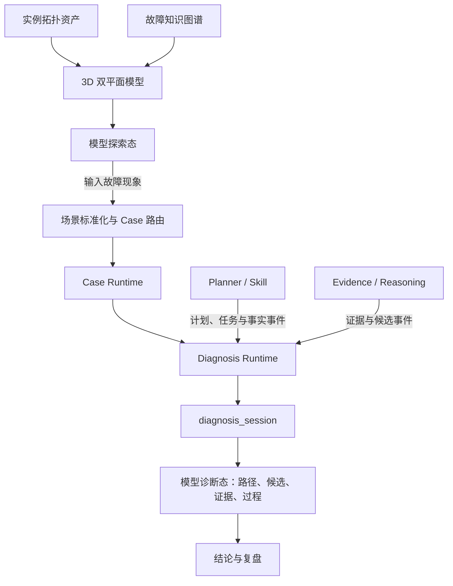

# 故障诊断 Agent Demo

> 文档状态：工程总览与开发入口  
> 版本：V1.2  
> 日期：2026-07-30  
> 首个基线 Case：`controller_warm_reset_001`

## 1. 项目定位

本项目用于构建一套以“存储系统拓扑与故障知识图谱”为入口、可执行探索式诊断的故障诊断 Agent 演示框架。

进入系统后，用户首先看到的不是诊断表单、Planner 任务或八幕流程，而是一个可探索的 3D 故障认知模型：

- 上层是动态实例拓扑平面，展示业务、主机、网络、控制器、LUN、存储池等实例及访问关系；
- 下层是静态故障知识图谱平面，展示对象类型、故障现象、故障模式、触发机制、证据要求和历史案例；
- 两个平面通过实例映射、故障模式映射、证据映射和案例匹配等跨层关系连接；
- 默认采用“聚合全景、按需展开”，双图同时可见，实例拓扑的视觉权重略高。

用户可以先在模型中浏览系统结构与知识关系，再通过常驻的“开始故障诊断”入口输入故障场景。诊断启动后，系统不切换到另一套孤立页面，而是在同一模型上叠加故障对象、候选根因、证据链、影响路径、恢复路径及诊断进度，逐步呈现 Agent 的认知收敛过程。

因此，本工程不是把 Controller 热复位过程写死在页面中的“八幕动画”，也不是一个以 Planner 或 Skill 列表为首页的 Agent 控制台，而是一套由模型资产承载认知、由标准 Case 提供演示事实、由统一诊断事件推进、能够逐步替换 Mock 能力并接入真实 Agent 的演示运行系统。

项目希望让观看者在任意时刻都能理解：

1. 系统由哪些对象、链路和依赖构成；
2. 某个实例在故障知识图谱中对应哪些故障模式和证据要求；
3. 故障发生在哪里，可能沿什么路径传播并影响业务；
4. Agent 当前知道什么、正在验证什么；
5. 为什么选择当前 Skill，以及希望获得什么证据；
6. 当前有哪些候选根因，每项证据如何支持、削弱或冲突于候选；
7. 新证据为什么触发重规划；
8. 最终为什么能够确认根因，或为什么只能输出可能原因、证据不足。

首个基线 Case 使用“Controller-0A 热复位导致数据库业务短时时延升高”，重点展示三项核心能力：

- 动态 Planner：根据证据缺口逐轮生成任务，并在关键证据出现后调整计划；
- Skill 化取证：通过业务映射、拓扑、告警、日志、KPI、链路健康和相似案例等标准能力获取事实；
- 证据驱动推理：通过事实、证据、候选、诊断支持分和最小证据链形成可追溯结论。

### 1.1 不可改变的产品主线

所有产品设计、组件选型、数据建模和编码任务都必须服务于以下四段主线，顺序不可颠倒：

| 阶段 | 用户行为与系统行为 | 主视觉 | 完成条件 |
|---|---|---|---|
| 1. 3D 模型呈现 | 系统加载实例拓扑、故障知识图谱及跨层映射，用户先探索系统结构和故障知识 | 3D 实例拓扑、3D 故障知识图谱、二者之间的映射连线 | 无诊断 Session 时，模型已可搜索、聚焦、旋转、展开和查看关联 |
| 2. 故障现象输入 | 用户输入自然语言故障现象和时间范围，场景路由器标准化现象并匹配演示 Case | 原 3D 模型 + 轻量诊断入口 | 匹配到唯一 Case，或明确提示无法匹配/需要补充信息 |
| 3. 故障诊断推演 | Case Runtime 按统一事件链推进 Planner、Skill、Fact、Evidence、Candidate 和 Replan | 同一 3D 模型上的诊断叠加层 + 过程面板 | 每一步都能回答“当前知道什么、正在做什么、下一步为什么这样做” |
| 4. 结论收敛与复盘 | 最小证据链和竞争候选检查完成，输出根因或证据不足结论 | 根因链、传播链、影响链、恢复链、结论卡片和时间线 | 结论可追溯到事件、证据、事实和 Skill 原始结果 |

这四段不是四个彼此独立的页面。它们是一条在同一认知模型上连续发生的用户旅程：

```text
3D 模型探索
→ 输入故障现象
→ 场景标准化与 Case 路由
→ 创建 diagnosis_session
→ Planner 决策与 Skill 取证
→ Fact / Evidence / Candidate 状态演进
→ 重规划与竞争候选检查
→ 结论收敛
→ 历史复盘或返回模型
```

任何实现如果只完成其中一段，都不能被称为本项目的完整 Demo：

- 只有 3D 图但不能触发诊断，是模型浏览器；
- 只有诊断面板但没有 3D 图谱与拓扑，是流程控制台；
- 输入后直接播放预设答案，是固定分镜播放器；
- 只有炫酷动画但没有事件、证据和状态演进，是视觉样片。

## 2. 一句话理解整个工程

> 模型资产先把“实例拓扑”和“故障知识”投影为可探索的 3D 双平面；用户从模型进入诊断后，Case 提供客观事实和预期轨迹，Planner 决定下一步验证什么，Skill 返回实际查到的事实，推理模块将事实解释为证据并更新候选，Diagnosis Runtime 将所有变化归并为统一诊断会话，前端再把会话状态叠加回同一模型并支持探索与回放。



这里最关键的边界是：

- 3D 模型是拓扑与图谱数据的可视化投影，不是新的领域事实源；
- 模型探索态可以独立于诊断 Session 存在，用户浏览模型不会改变任何诊断状态；
- 输入故障场景后才创建 `diagnosis_session`，诊断结果以叠加层方式进入同一模型；
- Case 必须由“现象标准化 + 场景匹配”触发，不能由前端绕过路由直接读取最终结论；
- Planner 与 Skill 负责约束诊断过程“为什么查、查什么、返回什么”，不是首屏主体，也不直接控制视觉动画；
- 八幕或其他 Story Scene 只负责演示节奏和讲解检查点；
- 真正的诊断状态只能由 Runtime Event 改变；
- 前端用户的选中、聚焦、筛选和回放操作不能修改 Agent 的诊断结论；
- 新增故障 Case 原则上只新增数据，不修改前端和 Runtime 的 Case 专用逻辑。

### 2.1 三种核心工作状态

| 状态 | 用户看到什么 | 核心数据来源 | 允许的主要操作 |
|---|---|---|---|
| 模型探索态 `MODEL_OVERVIEW` | 上层实例拓扑、下层故障知识图谱、跨层映射、对象摘要 | 拓扑资产、图谱资产、模型投影配置 | 旋转、缩放、聚焦、展开、搜索、视角切换、查看对象知识、进入诊断 |
| 诊断运行态 `DIAGNOSING` | 原模型 + 故障路径、候选、证据、当前动作、下一步与时间线 | `diagnosis_session` 快照和 Runtime Event | 观察推进、选择对象、联动证据、暂停、单步、回放、返回当前 |
| 诊断结论态 `DIAGNOSIS_REVIEW` | 根因链、影响链、恢复链、竞争候选检查和结论边界 | 终态 Session 和完整事件链 | 复盘、追溯、切换历史事件、导出或重新诊断 |

状态转换如下：

```text
MODEL_OVERVIEW
  → DIAGNOSIS_INPUT
  → SESSION_INITIALIZING
  → DIAGNOSING
  → DIAGNOSIS_REVIEW
  → MODEL_OVERVIEW
```

诊断结束后返回模型探索态时，可以保留最近一次诊断摘要，但必须清晰区分“当前模型状态”和“历史诊断结果”。

### 2.2 首屏 3D 双平面模型

首屏采用“上下平行双平面 + 跨层映射”的空间结构。

| 空间层 | 默认内容 | 展示原则 | 诊断启动后的变化 |
|---|---|---|---|
| 上层：实例拓扑平面 | 业务到存储的实例化访问路径及资源层级 | 拓扑权重略高；主访问路径居中；外部依赖置于侧翼；聚合显示、按需展开 | 高亮故障对象、影响路径、传播路径和有效冗余路径 |
| 下层：故障知识图谱平面 | 对象类型、故障现象、故障模式、机制、证据规则、案例 | 数据完整加载但不默认全展开；按语义簇和层级聚合 | 展开当前候选对应的故障模式、证据要求和案例关系 |
| 中间：跨层映射空间 | `instance_of`、故障模式映射、证据映射、`case_match` | 使用克制的光柱或曲线；只强化当前选中或诊断相关关系 | 随候选、证据和结论逐步显现，禁止初始阶段泄露最终根因 |

首屏必须提供：

- 清晰的模型名称、当前数据版本和数据完整性状态；
- 视角预设：全景、仅实例拓扑、仅知识图谱、业务路径；
- 对象搜索与快速聚焦；
- 图例、缩放、复位视角和逐级展开；
- 常驻但不喧宾夺主的“开始故障诊断”入口；
- 无诊断 Session 时的中性状态，不预设红色故障节点或最终故障模式。

实例拓扑与故障知识图谱均使用真实 3D 图引擎渲染，不以 CSS 透视或二维画布伪装 3D。两类图采用同一坐标、拾取、相机和状态语法：

- 资源拓扑按照“业务与计算—网络与接入—控制与服务—逻辑资源—物理资源”组织为五个稳定空间域，并在域内继续细分资源子层；
- 故障知识图谱按照“对象类型—故障现象—故障模式/机制—证据规则/案例”组织为四层；
- 两者通过受控的 `cross_layer` 关系连接，不允许前端根据名称猜测关系；
- 物理拓扑、逻辑拓扑和诊断影响关系可以切换权重，但不能在切换时破坏对象位置和用户视角；
- 默认只显示聚合全景与关键映射，选中对象、候选或证据后再展开相邻关系。

### 2.3 故障诊断入口

诊断入口采用右上角主操作按钮或浮动命令入口，点击后打开轻量面板，不遮挡整个模型。V1 至少支持输入：

```yaml
diagnosis_input:
  symptom: 数据库访问突然变慢
  occurred_at: 2026-07-30T14:32:18.120+08:00
  business_scope: DB业务
  additional_context: 部分请求响应时间显著升高，业务出现短时抖动
```

提交后依次发生：

1. `SymptomNormalizer` 将自然语言描述转换为标准故障现象、对象范围和时间窗；
2. `CaseRouter` 根据标准现象、对象类型、环境范围和可用 Case 元数据进行匹配；
3. 唯一匹配后加载对应 Case，并创建 Diagnosis Session；多匹配或无匹配时不得猜测；
4. 将业务描述映射到模型中的可查询入口；
5. 将相机平滑聚焦到相关业务区域，但不提前锁定最终根因；
6. 展开 Planner 当前目标、选择原因和预期证据；
7. 由 Skill 执行结果产生 Fact，再由推理模块形成 Evidence 和 Candidate Update；
8. Runtime 将事件归并为 Session，前端按基线更新模型与过程面板；
9. 达到终态门控条件后，展示根因链或明确证据不足。

V1 的场景路由可以是确定性的规则或索引匹配，但必须保留统一输出协议：

```yaml
case_route:
  normalized_symptom:
    object_type: BUSINESS
    symptom_code: BUSINESS_LATENCY_INCREASE
    occurred_at: 2026-07-30T14:32:18.120+08:00
  route_status: MATCHED
  matched_case_id: controller_warm_reset_001
  match_reason: 业务时延升高现象、DB业务范围和演示时间窗匹配
  alternatives: []
```

`route_status` 至少支持 `MATCHED`、`AMBIGUOUS`、`NOT_MATCHED`、`INVALID_INPUT`。只有 `MATCHED` 才能进入 Case Runtime。

### 2.4 诊断过程如何约束呈现

诊断过程不是把 Planner 和 Skill 原样打印到页面，而是由不同基线共同约束“显示什么、何时显示、如何联动”。

| 基线 | 在呈现中的主责 |
|---|---|
| 《可视化原型与诊断推理基线》 | 定义诊断阶段、候选收敛、证据链、终态门控及故事检查点 |
| 《前端交互联动规则基线》 | 定义模型、候选、证据、任务、时间线和详情抽屉如何联动 |
| 《Planner 输出协议与重规划基线》 | 约束当前目标、选择原因、预期证据、任务变化和重规划差异的展示 |
| 《演示级 Skill 规范》 | 约束 Skill 的开始、执行、完成、失败、数据缺失及原始结果追溯 |
| 《推理模块与候选更新规则基线》 | 约束事实如何成为证据、候选如何变化以及何时允许确认根因 |

Planner 与 Skill 的价值是让诊断过程可信、可解释、可审计；它们在页面上主要表现为当前动作、任务状态、选择原因、预期证据和结果追溯，而不是抢占 3D 模型的主视觉。

## 3. 核心诊断语义

工程内必须区分以下四类对象：

| 对象 | 含义 | 示例 |
|---|---|---|
| Fact / 事实 | Skill 实际返回并完成结构化的数据 | Controller-0A 在故障窗口内发生热复位 |
| Evidence / 证据 | 事实与某个候选之间的诊断解释 | 热复位事件强支持“控制器异常或复位” |
| Candidate / 候选 | 尚待验证的根因假设 | Controller-0A 异常或复位 |
| Conclusion / 结论 | 满足确认规则后的诊断结果 | watchdog 超时触发 Controller-0A 热复位 |

候选分数统一称为“诊断支持分”：

- 取值范围为 `0～100`；
- 用于候选排序、变化展示和过程解释；
- 不是概率，不是统计置信度，界面不显示百分号；
- 分数达到门槛不能单独确认根因；
- 根因确认还必须满足最小证据链、关键竞争候选检查和冲突消解。

## 4. 资产总览

### 4.1 正式基线文档

以下文档共同构成演示工程的开发契约。README 负责导航，不替代各专项规范。

| 文档 | 解决的核心问题 | 主要指导的工程模块 | 建议使用阶段 |
|---|---|---|---|
| [故障诊断Agent_可视化原型与诊断推理基线_V1.0.md](./故障诊断Agent_可视化原型与诊断推理基线_V1.0.md) | 从 3D 模型进入诊断后，诊断过程如何在同一模型上呈现和收敛 | 总体架构、诊断状态、Runtime 投影、结论门控 | 项目启动时首先阅读 |
| [Case数据包定义规范_V1.0.md](./Case数据包定义规范_V1.0.md) | 一个 Case 需要包含哪些事实、知识、轨迹、事件和检查点 | Case Schema、Loader、Adapter、Registry、Case 制作工具 | 数据模型和 Case 开发 |
| [故障诊断Agent_Planner输出协议与重规划基线_V1.0.md](./故障诊断Agent_Planner输出协议与重规划基线_V1.0.md) | Planner 每轮输入输出什么、如何生成任务、何时重规划和结束 | Planner、Task、Plan、Replan、决策状态机 | Agent 流程实现 |
| [故障诊断Agent_演示级Skill规范_V1.0.md](./故障诊断Agent_演示级Skill规范_V1.0.md) | Skill 如何调用、返回什么、事实和推理如何分离 | Skill Registry、Mock Executor、结果适配、事实生成 | Skill 执行层实现 |
| [故障诊断Agent_推理模块与候选更新规则基线_V1.0(1).md](./故障诊断Agent_推理模块与候选更新规则基线_V1.0(1).md) | 候选如何生成、证据如何影响候选、何时确认或停止 | Evidence Builder、Candidate Reducer、Reasoning、Conclusion Gate | 推理与候选状态实现 |
| [故障诊断Agent_前端交互联动规则基线_V1.0.md](./故障诊断Agent_前端交互联动规则基线_V1.0.md) | 前端如何展示“已知、正在做、下一步”，以及各区域如何联动 | Session Store、候选/证据/任务面板、时间线、历史回放 | 前端整体实现 |
| [实例拓扑视图展示与交互规格_V1.0.md](./实例拓扑视图展示与交互规格_V1.0.md) | 3D 实例拓扑、故障知识图谱和跨层映射如何分层、布局、展开、聚焦和交互 | Model Adapter、3D Canvas、节点/边组件、跨层映射、路径交互 | 首屏模型实现 |

### 4.2 当前样例与辅助资产

| 资产 | 当前作用 | 使用约束 |
|---|---|---|
| `controller_warm_reset_001.zip` | 提供首个 Case 的资源、拓扑、告警、日志、KPI、候选、任务、证据和八幕分镜样例 | 属于早期数据包，工程实现前需要按统一后的 Case、Plan、Event、Session 协议迁移 |
| `validate_case_package.py` | 展示 Case 文件完整性、ID 引用和基础数据关系的校验思路 | 当前只是基础校验器；最终验收器还需增加支持分、根因泄露、事件因果、重规划、最小证据链和历史快照校验 |
| `fault-diagnosis-storyboard-v2.html` | 作为八幕叙事、页面信息区域和视觉表现的参考原型 | 当前是静态分镜页面，不是 Diagnosis Runtime，也不能作为协议和状态语义的事实来源 |

正式开发时遵循以下优先级：

```text
专项基线文档
> 统一 Schema 与 Runtime 协议
> 新版 Case 数据
> 当前 ZIP / HTML / 校验脚本中的旧实现
```

当样例代码、样例字段或页面文案与基线文档冲突时，以对应专项基线文档为准。

### 4.3 模型资产及其工程作用

首屏模型不是 Case 分镜的一部分，应作为可被多个诊断 Session 复用的独立资产层。

| 模型资产 | 工程作用 | 与诊断的关系 |
|---|---|---|
| 实例拓扑数据 | 实例化业务、主机、网络、存储对象及其连接关系 | 提供故障定位、影响分析和路径联动的空间底座 |
| 故障知识图谱 | 沉淀对象类型、故障现象、故障模式、机制、证据要求和案例 | 为候选生成、证据解释和竞争候选检查提供知识依据 |
| 实例—知识映射 | 连接具体实例与对象类型、适用故障模式、证据规则、历史案例 | 支撑上下双平面的跨层联动 |
| 模型投影配置 | 定义聚合层级、初始坐标、相机预设、显隐规则和视觉 Token | 只决定如何呈现，不新增或改写领域事实 |
| Case 观测数据 | 提供某次故障窗口内的告警、日志、KPI 和预期事件轨迹 | 诊断启动后按 Skill 查询逐步进入 Session，不在首屏提前加载为已知结论 |

模型资产必须与 Case 使用同一套对象 ID、对象类型和时间语义。若物理实例数据暂时不足，允许使用逻辑一致、离线配置化的 Mock 实例，但 Mock 标识、来源和数据边界必须可追溯。

### 4.4 场景路由资产

Case 不能仅靠文件名被前端选择，还需要可查询的路由元数据。每个 Case 至少声明：

```yaml
case_route_profile:
  case_id: controller_warm_reset_001
  supported_symptoms:
    - object_type: BUSINESS
      symptom_code: BUSINESS_LATENCY_INCREASE
      aliases: [数据库变慢, 数据库访问时延升高, DB业务抖动]
  supported_scopes: [DB业务]
  required_inputs: [symptom, occurred_at]
  priority: 100
```

路由元数据只用于确定进入哪个演示 Case，不得包含可在匹配阶段泄露给 Agent 的根因、最终支持分或结论。

## 5. 文档之间如何协同

七份基线文档不是彼此独立的功能说明，而是同一条诊断链路上的不同契约。

| 上游产物 | 下游消费者 | 约束关系 |
|---|---|---|
| 实例拓扑、故障知识图谱 | 3D Model Adapter、搜索与模型探索 | 首屏模型只投影已有资产，不从 Case 最终结论反向生成图结构 |
| 实例—知识映射 | 跨层连接、候选生成、知识详情 | 跨层边必须使用明确关系类型，并能追溯到映射来源 |
| Case 路由元数据 | Symptom Normalizer、Case Router | 只决定 Case 选择，不向初始 Session 注入根因真值 |
| 模型投影配置 | 3D Model Canvas | 坐标、聚合、相机和显隐只影响呈现，不改变模型语义 |
| Case 中的资源、拓扑和观测事实 | Skill Executor、Topology | 对象 ID、时间基准和数据来源必须一致 |
| Planner Plan / Task | Skill Executor、前端执行区 | Skill 只能执行 Planner 已提交且校验通过的任务 |
| Skill Result / Fact | Evidence Builder | Skill 只返回事实，不直接给出根因或候选分 |
| Evidence | Reasoning、Planner、前端 | 每条证据必须追溯到事实、任务和 Skill |
| Candidate Update | Planner、Session、候选区 | 每次分数和状态变化必须引用触发证据 |
| Plan Replanned | Runtime、前端执行区 | 必须保留旧计划、新计划、变更类型和调整原因 |
| Runtime Event | Session Projector | 事件按递增序号、确定性、幂等地生成状态 |
| diagnosis_session | 所有前端视图 | 前端不得分别拼装 Planner、Skill 和推理模块内部状态 |
| Story Scene | Playback / Presenter | 只引用事件检查点，不直接写候选、证据或结论 |

## 6. 推荐阅读顺序

新加入项目的产品、开发人员或编码 Agent 建议按以下顺序阅读：

1. 本 README：理解项目目标、边界和资产关系；
2. 《实例拓扑视图展示与交互规格》：先理解首屏模型中的实例拓扑结构、聚合与探索方式；
3. 《可视化原型与诊断推理基线》：理解从模型进入诊断后的总体架构和演示边界；
4. 《前端交互联动规则》：理解同一模型如何叠加 Session 状态并联动候选、证据和时间线；
5. 《Case 数据包定义规范》：理解诊断输入、事实数据和统一对象；
6. 《Planner 输出协议与重规划基线》：理解逐轮诊断流程；
7. 《演示级 Skill 规范》：理解事实从哪里来；
8. 《推理模块与候选更新规则》：理解事实如何成为证据和结论；
9. 最后再查看 ZIP、HTML 和校验脚本，识别需要迁移和复用的部分。

不建议先照着 HTML 编写页面，再倒推数据结构。正确顺序应是：

```text
模型资产与映射 → 3D 模型探索态 → 场景路由 → 统一协议 → Case → Runtime
→ 事件链 → diagnosis_session → 模型诊断态
```

## 7. 推荐开发顺序

### 阶段 1：建立模型资产与统一对象标识

目标：先构建进入系统后可浏览、可查询、可映射的拓扑与图谱底座。

主要工作：

- 定义实例拓扑、故障知识图谱和跨层映射的数据接口；
- 统一模型资产与 Case 中的对象 ID、对象类型、关系类型和数据来源；
- 准备首屏所需的聚合层级、初始坐标、语义簇和相机预设；
- 建立对象搜索、按需展开和模型数据完整性检查；
- 明确哪些数据来自真实资产，哪些属于离线 Mock。

完成标志：不启动诊断也能进入系统，看到双平面模型并完成搜索、聚焦、展开和跨层查看。

### 阶段 2：实现 3D 模型探索态

目标：把模型资产稳定投影为首屏，并建立诊断叠加所需的视觉能力。

主要工作：

- 实现上层实例拓扑、下层故障知识图谱和跨层连接；
- 实现全景、拓扑、图谱和业务路径视角预设；
- 实现相机控制、选择、聚焦、聚合展开、标签分级和图例；
- 实现故障路径、影响路径、恢复路径和候选映射的通用 Overlay；
- 实现性能降级策略与减少动态效果模式。

完成标志：双平面 3D 模型达到稳定、清晰、可探索的演示效果，且 Overlay 可以由外部状态驱动。

### 阶段 3：冻结共享诊断协议

目标：所有模块使用同一套类型、字段和状态。

主要工作：

- 定义 Candidate、Fact、Evidence、Plan、Task、Event、Session 的共享 Schema；
- 固化资源 ID、任务 ID、证据 ID、候选 ID 和事件 ID 的引用规则；
- 固化诊断支持分、任务状态、候选状态、终态和事件枚举；
- 建立 Schema 版本与兼容性策略；
- 将协议转换为前后端共享类型和 JSON Schema。

完成标志：任何模块不能再自行定义 `confidence`、任务状态或候选状态别名。

### 阶段 4：实现故障现象标准化与 Case 路由

目标：用户通过自然语言故障现象进入正确的演示场景，而不是手工选择预设答案。

主要工作：

- 定义故障现象、对象类型、时间窗和业务范围的标准化结构；
- 为每个 Case 建立不包含根因泄露的路由元数据；
- 实现 `MATCHED / AMBIGUOUS / NOT_MATCHED / INVALID_INPUT` 四类路由结果；
- 记录匹配原因和候选 Case，但只有唯一匹配时才能创建 Session；
- 建立同义描述、输入缺失和错误匹配的测试集。

完成标志：输入“数据库访问突然变慢”能够稳定路由到 `controller_warm_reset_001`，输入不匹配现象时不会误播该 Case。

### 阶段 5：实现 Case 基础设施

目标：任何合法 Case 均可被统一加载和校验。

主要工作：

- 实现 Case Registry、Loader、Adapter 和索引；
- 同时支持目录和 ZIP；
- 实现结构校验、ID 引用校验、时间校验和语义校验；
- 将 `controller_warm_reset_001` 迁移为统一协议；
- 确保离线真值不会进入 Agent 初始可见状态；
- 将 Story Scene 改为只引用 Runtime Event 检查点。

完成标志：切换 Case 不需要修改 Runtime 或前端代码。

### 阶段 6：实现 Diagnosis Runtime

目标：把各模块输出统一为可回放的诊断会话。

主要工作：

- 实现 Runtime Event Append Log；
- 实现事件排序、去重、幂等和序号缺口处理；
- 实现确定性 Reducer / Session Projector；
- 生成 `diagnosis_session` 快照；
- 支持从检查点重放、事件跳转、断线续传和返回当前；
- 确保历史版本不包含未来事实、证据和结论。

完成标志：同一初始 Case 和同一事件序列始终得到完全相同的 Session。

### 阶段 7：实现演示级 Agent 闭环

目标：让 Controller 热复位 Case 按标准轨迹真实推进，而不是用定时动画模拟。

主要工作：

- 实现确定性 V1 Planner 和逐轮任务提交；
- 实现 Mock Skill Executor；
- 将 Skill Result 转换为 Fact；
- 将 Fact 转换为 Evidence；
- 按证据更新候选支持分、状态和排序；
- 实现至少两次有触发依据、有计划差异的重规划；
- 实现根因确认、可能原因和证据不足三类终态。

完成标志：每一步计划、查询、事实、证据、候选变化和结论都能在事件流中追溯。

### 阶段 8：实现模型上的诊断联动界面

目标：让用户从首屏模型进入诊断，并在同一空间中观看过程、探索依据和完成回放。

主要工作：

- 实现诊断输入面板、Session 初始化和模型态切换；
- 顶部显示当前判断、当前动作、诊断阶段和下一步原因；
- 中部保持双平面 3D 模型，并叠加故障对象、候选映射和影响路径；
- 底部展示 Planner、Skill、Evidence、Reasoning 事件和重规划差异；
- 实现拓扑对象、候选、证据、时间线四条核心联动链；
- 实现播放、暂停、单步、跳转、历史回放和返回当前；
- 实现异常、冲突、数据缺失和 Skill 失败状态。

完成标志：前端只依赖 `diagnosis_session` 和 Runtime Event，不包含 Case 专用判断。

### 阶段 9：证明框架可扩展

至少补充以下 Case：

| Case | 主要验证目标 |
|---|---|
| Controller 热复位—完整数据 | `ROOT_CAUSE_CONFIRMED` 和完整证据链 |
| Controller 热复位—缺日志 | `PROBABLE_CAUSES` 或降级诊断 |
| KPI 缺失或 Skill 失败 | `INSUFFICIENT_EVIDENCE` |
| 控制器与链路证据冲突 | 冲突消解与重规划 |
| 磁盘坏道或 FC 链路抖动 | 验证前端和 Runtime 无控制器 Case 专用逻辑 |

完成标志：不修改通用前端和 Runtime，即可切换并正确演示不同故障域。

## 8. 前端组件选型与视觉实现基线

### 8.1 设计目标

本项目明确使用 3D 双平面表达拓扑与图谱的层次关系，但“高级感”不等于无限旋转、持续粒子和霓虹堆叠，而来自五件事：

1. 模型空间清晰：用户第一眼能区分实例拓扑、故障知识图谱和跨层映射；
2. 诊断入口自然：用户先理解系统，再从模型进入诊断；
3. 状态变化可感知：新证据、候选升降、重规划和根因确认均有克制而明确的动效；
4. 画布体验专业：模型可以平滑缩放、旋转、聚焦、展开、路径高亮和历史回放；
5. 视觉语言统一：3D 材质、DOM 组件、图标、颜色、间距和动画使用同一套设计 Token。

推荐的整体风格可定义为：

> **Precision Operations Canvas：苹果式克制质感 + 谷歌式信息层级 + 专业可观测平台的信息密度。**

避免将项目实现为传统后台管理系统，也避免实现为强调装饰而弱化诊断逻辑的“赛博大屏”。

### 8.2 推荐技术组合

| 层次 | 首选组件 / 技术 | 在本项目中的用途 | 选型理由与使用边界 |
|---|---|---|---|
| 应用基础 | React + TypeScript + Vite | 单页演示应用、模块化组件和类型共享 | Demo 不依赖 SSR 时优先使用 Vite；若未来明确需要服务端路由、鉴权或同构渲染，再评估 Next.js |
| 设计系统 | [shadcn/ui](https://ui.shadcn.com/docs) + Tailwind CSS | Button、Tabs、Sheet、Tooltip、Command、Resizable、ScrollArea、Skeleton、Toast 等基础组件 | 开放源码、可深度定制，适合形成自己的设计系统；只引入实际使用的组件，不再并行引入第二套完整 UI 框架 |
| Agent 过程组件 | [AI Elements](https://elements.ai-sdk.dev/) 的 `Task`、`Tool`、`CodeBlock` 等 | Planner 任务、Skill 调用、执行状态、原始结果折叠展示 | 与 shadcn/ui 风格和代码分发方式一致；组件只消费结构化 Runtime Event，不展示大模型原始思维链 |
| 3D 模型主画布 | [`3d-force-graph`](https://github.com/vasturiano/3d-force-graph) | 实例拓扑、故障知识图谱、跨层连线、邻接高亮、相机聚焦、节点拾取和诊断路径动画 | 已验证具有强 3D 表现力并适合本项目演示；拓扑和图谱统一使用同一引擎，避免两套相机、拾取和状态系统 |
| 3D 底层能力 | Three.js（由主引擎承载，按需扩展） | 自定义节点几何、材质、跨层光线、标签和少量着色器效果 | 仅通过领域封装扩展，不直接另建第二套图场景；坐标和语义仍由模型投影配置控制 |
| KPI 与时序图 | [Apache ECharts](https://echarts.apache.org/en/index.html) | KPI 趋势、故障窗口、证据时间点、恢复区间和多序列对比 | 交互、缩放、标注、数据区域和动态更新能力成熟；复杂时序统一使用 ECharts，不用多个图库拼接 |
| 可调工作台布局 | [react-resizable-panels](https://github.com/bvaughn/react-resizable-panels) 或 shadcn `Resizable` 封装 | 拓扑主区、候选侧栏、底部事件区的拖拽调整、折叠与布局记忆 | 直接复用成熟的分栏和键盘交互能力，不自行实现拖拽尺寸计算 |
| 长事件列表 | [TanStack Virtual](https://tanstack.com/virtual/latest/docs/introduction) | Runtime Event、Skill 日志、证据列表和历史回放列表虚拟化 | 保留完全自定义的行样式，同时避免长会话造成大量 DOM 节点 |
| 微交互与过渡 | [Motion for React](https://motion.dev/docs/react) | 候选排序、面板切换、证据出现、共享元素聚焦和页面布局过渡 | 仅使用 `opacity`、`transform`、layout transition 等低成本动画；动画解释状态，不替代状态 |
| 图标 | [Lucide React](https://lucide.dev/guide/react/) | 通用操作、状态和导航图标 | 线性风格统一、可定制且可按需打包；存储控制器、LUN、端口等领域对象只补充一套同笔画风格的领域 SVG |
| 氛围增强 | [Magic UI](https://magicui.design/) 中少量可控组件 | 首屏进入、演示待机、根因确认等少数高光时刻 | 仅选用与 shadcn/ui、Tailwind、Motion 同栈的效果；禁止在核心数据区使用持续背景动画、跑马灯和强发光边框 |
| 组件开发与验收 | [Storybook](https://storybook.js.org/docs/writing-tests) + Playwright | 独立开发组件状态、交互测试、可访问性检查和视觉回归 | 每个核心组件都要覆盖正常、加载、空、失败、冲突、历史快照等状态，避免只在完整页面中人工检查 |

建议将以上组合视为 V1 的正式组件基线，而不是候选组件池。没有明确缺口时，不再加入新的同类库。

### 8.3 页面区域与组件映射

| 页面区域 | 建议直接复用 | 需要轻量定制的领域组件 | 数据来源 |
|---|---|---|---|
| 顶部诊断状态栏 | shadcn `Badge`、`Tooltip`、`Progress`、Motion layout | `DiagnosisStatusBar`、`CurrentDecision`、`NextActionReason` | `diagnosis_session.summary` |
| 左侧模型 / 视角导航 | shadcn `Sidebar`、`Command`、`Tabs` | `ModelNavigator`、`ViewModeSwitcher` | 模型资产、当前 Session |
| 中央 3D 模型画布 | `3d-force-graph`、Three.js Object3D、Link Particles、Camera API | `DualPlaneModelCanvas`、`TopologyPlane`、`KnowledgePlane`、`CrossLayerLink`、`DiagnosticOverlay` | 模型资产 + Session 中的节点状态、候选映射、路径和焦点 |
| 候选根因侧栏 | shadcn `Card`、`Collapsible`、`ScrollArea`，Motion reorder | `CandidateCard`、`SupportScoreDelta`、`EvidenceCoverage` | `session.candidates` |
| Planner / Skill 执行区 | AI Elements `Task`、`Tool`，shadcn `Badge` | `PlanRound`、`ReplanDiff`、`SkillInvocation` | Plan、Task 和 Runtime Event |
| 证据抽屉 | shadcn `Sheet`、`Tabs`、`Table`、`CodeBlock` | `EvidenceInspector`、`FactTrace`、`ConflictBanner` | Evidence、Fact、Task、Skill Result |
| KPI 详情 | ECharts line、markLine、markArea、dataZoom | `MetricEvidenceChart`、`FaultWindowOverlay` | KPI Fact 和事件时间 |
| 底部事件时间线 | TanStack Virtual、shadcn `ToggleGroup`、`Tooltip` | `RuntimeEventRow`、`EventFilter`、`PlaybackScrubber` | Runtime Event Log |
| 播放与历史回放 | shadcn `ButtonGroup`、`Slider`，Lucide 图标 | `PlaybackControls`、`HistoricalModeBanner` | Playback Controller |
| 全局命令面板 | shadcn `Command` | `DiagnosisCommandPalette` | 可执行的纯前端探索操作 |

第三方组件进入工程后必须经过一层领域封装。业务代码引用 `DualPlaneModelCanvas`、`SkillInvocation`、`MetricEvidenceChart` 等本项目组件，不直接在各页面散落 `3d-force-graph`、Three.js、ECharts 或 AI Elements API。这样以后升级或替换组件时，不会影响统一诊断协议。

### 8.4 关键选型决策

#### 1. 主模型选择 `3d-force-graph`，不并行维护第二套图引擎

`3d-force-graph` 负责拓扑和图谱的真实 3D 渲染、相机、拾取、节点/边状态和邻接高亮。本工程不是任由全局力导布局随机漂移：双平面高度、资源域、知识层级和关键路径坐标主要来自模型投影配置，局部力只用于避免重叠和改善可读性。

V1 的主问题是“观察和探索拓扑—图谱模型”，不是让用户拖拽编辑工作流，因此：

- 实例拓扑、故障知识图谱、跨层映射和诊断 Overlay 统一使用 `3d-force-graph`；
- 使用固定或半固定坐标约束双平面、五个拓扑空间域和四层知识图谱，避免全局随机布局；
- 首先完成一个技术验证，验收双平面固定布局、标签清晰度、节点拾取、跨层曲线、状态动画和目标数据规模；
- V1 不再引入 G6 3D、React Three Fiber 或 React Flow 作为第二主模型引擎；
- 若未来确需自定义 Shader 或非图形场景，优先在现有 Three.js 场景内扩展，不重建第二套模型状态；
- Planner 先使用任务列表和计划差异，不另建流程画布；
- 只有未来明确需要可视化编辑 Planner 工作流时，才单独评估 [React Flow](https://reactflow.dev/)；
- 不允许同一张模型画布混用 `3d-force-graph`、G6、React Flow、R3F 和纯 DOM 图节点。

#### 2. Agent 过程组件选择 AI Elements，不混用 Ant Design X

[Ant Design X](https://x.ant.design/components/introduce/) 和 AI Elements 都提供 Agent 任务、工具调用和过程展示能力。若整个系统已经全面采用 Ant Design，Ant Design X 是合理选择；但本项目追求更自由的苹果 / 谷歌式视觉风格，并计划以 shadcn/ui 为设计基础，因此优先使用同栈的 AI Elements。

约束：

- 复用 `Task`、`Tool`、`CodeBlock` 等结构和交互；
- 不直接套用聊天机器人页面模板；
- 不展示模型内部原始 Chain of Thought；
- “推理过程”只展示协议允许公开的计划理由、证据解释、候选变化原因和结论门控结果。

#### 3. 复杂时序选择 ECharts，不把 Recharts 作为主图表引擎

shadcn Chart 基于 Recharts，适合首页小型统计卡片；故障诊断需要故障窗口、多序列缩放、事件标记、异常区间和证据联动，统一使用 ECharts 更合适。简单的支持分微型条形图可以使用 CSS 或 shadcn 组件，但所有需要时间轴联动的 KPI 图必须走 `MetricEvidenceChart`。

#### 4. 炫酷组件只作为增强层

Magic UI、React Bits、Rive 等组件或运行时可以快速产生强视觉效果，但不应成为核心工作台的基础：

- Magic UI 仅允许用于首屏、空状态、加载态和关键结论的短时增强；
- Rive 可在 P2 用于品牌角色、引导动画或演示待机页，不参与诊断状态表达；
- 禁止使用会遮挡信息的粒子背景、持续自动巡航、文字扰动和大面积强渐变；
- 任何增强效果都必须支持关闭，并遵循 `prefers-reduced-motion`。

### 8.5 视觉语言基线

#### 布局

- 以 `1440 × 900` 桌面演示尺寸作为首要设计基线，同时保证 `1280 × 720` 可用；
- 中央双平面模型是首屏视觉主角，模型探索态默认占可用内容区的 `75%～90%`；
- 启动诊断后，通过可折叠侧栏和底部面板进入工作台布局，模型仍保留不少于 `50%` 的主要视觉空间；
- 候选和当前决策常驻，证据详情使用抽屉或二级面板按需展开；
- 底部时间线可折叠、可拖拽调整高度，不长期挤压主画布；
- 页面只保留一个主视觉焦点，避免每个区域都像独立 Dashboard。

#### 色彩

使用语义 Token，不在组件内写死色值：

| Token | 语义 | 建议视觉 |
|---|---|---|
| `--status-fault` | 当前故障、强异常、根因对象 | 克制的珊瑚红 |
| `--status-warning` | 冲突、证据缺失、待验证 | 琥珀色 |
| `--status-active` | 当前计划、当前 Skill、当前焦点 | 电光蓝 |
| `--status-evidence` | 新事实、支持证据、证据链 | 青绿色 |
| `--status-recovered` | 已恢复、有效冗余路径 | 低饱和绿色 |
| `--status-muted` | 未参与、历史状态、弱关联 | 中性灰 |

红色不能同时表达“故障”“选中”和“支持分上升”。同一语义在拓扑、候选、证据和时间线中必须使用同一 Token，并同时配合图标、线型或文字，不能只依赖颜色。

#### 表面与字体

- 亮色主题使用暖白 / 冷灰背景，暗色主题使用石墨灰，不使用纯白或纯黑铺满全屏；
- 卡片以 `1px` 低对比边框和轻阴影建立层级，玻璃模糊只用于浮动工具栏、命令面板和画布悬浮层；
- 圆角统一控制在 `10～16px`，小控件不使用夸张胶囊形；
- 字体优先使用 Inter、Geist 或系统字体栈，不随工程打包 SF Pro、Google Sans 等授权受限字体；
- KPI、时间、支持分和事件序号使用等宽数字或 `tabular-nums`；
- 标题不依赖大字号制造层级，主要通过字重、留白、色彩和分组建立节奏。

#### 动效

- 微交互建议 `120～180ms`，面板和共享元素过渡建议 `180～280ms`；
- 首屏相机只做一次克制的入场定位，进入稳定状态后不自动绕场旋转；
- 从模型探索态进入诊断态时，相机可在 `400～700ms` 内聚焦业务入口，同时淡入诊断 Overlay；
- 跨层光柱或曲线只在选择、候选生成、证据映射和根因收敛时增强，不持续流动；
- 新证据出现、候选排序变化和路径聚焦可以动画；历史回放跳转应快速、确定，不做长时间过场；
- 故障节点只在首次出现或重新激活时短暂脉冲，禁止永久呼吸和无限闪烁；
- 根因确认可以有一次 `400～600ms` 的路径收敛和结论强调，完成后立即回到稳定界面；
- 动效由 Session 状态变化触发，不允许用定时器伪造 Agent 进度。

### 8.6 性能与可访问性约束

- 双平面模型使用 WebGL 渲染；HTML / React DOM 只用于少量悬浮卡片、标签和工具条；
- 模型投影层与诊断 Overlay 分层缓存，Session 更新不能触发全量模型重建；
- 标签按相机距离、缩放级别和选择状态显示；远景只保留聚合标签和关键业务路径；
- 节点与边按语义重要性分级，优先保障可读性，不以一次展示全部知识节点为目标；
- 对重复几何和材质启用复用或实例化，避免每个节点创建独立高成本对象；
- 节点较多时执行层级聚合、按视口显示标签和按缩放级别切换细节，不一次绘制所有装饰；
- 事件、日志或证据列表超过约 `200` 行时启用 TanStack Virtual；
- 3D 模型、ECharts、原始结果查看器和可选动画资源按视图懒加载；
- Motion 优先动画 `transform` 和 `opacity`，避免频繁触发布局和大面积模糊重绘；
- 页面隐藏、播放暂停或历史回放停止时，中止不必要的动画和布局计算；
- 所有播放、筛选、折叠、缩放和返回当前操作必须支持键盘；
- 图表和拓扑的关键结论必须能在文本区域找到等价表达；
- 必须尊重 `prefers-reduced-motion`，关闭非必要动画；
- 组件验收至少覆盖亮色、暗色、窄屏、200% 缩放、键盘操作和色觉缺陷可辨识性。

### 8.7 推荐落地顺序

| 优先级 | 先落地的组件 | 目的 |
|---|---|---|
| P0 | `3d-force-graph` 技术验证、双平面投影、相机与拾取、设计 Token | 先证明首屏核心呈现可行，并冻结模型交互边界 |
| P0 | shadcn/ui、Resizable 工作台、ECharts | 建立诊断态页面骨架和数据表达 |
| P0 | AI Elements `Task` / `Tool` 的领域封装 | 快速建立 Planner 与 Skill 的专业过程展示 |
| P1 | TanStack Virtual、Motion、Command Palette | 补齐长会话性能、状态过渡和探索效率 |
| P1 | Storybook、交互测试、视觉回归和 a11y 检查 | 冻结组件质量，避免页面越做越散 |
| P2 | Magic UI 少量效果、Rive 品牌动画 | 在核心链路稳定后增加演示记忆点 |

在双平面模型和诊断闭环完成前，不投入数字人、全屏粒子、复杂 Shader 或品牌动画。

### 8.8 编码 Agent 的组件使用规则

编码 Agent 实现前端时，还必须遵循：

1. 先从本节组件基线和现有 Design Token 中选择，不自行引入同类依赖；
2. 每个第三方组件先封装为领域组件，再进入业务页面；
3. 模型基础结构由模型资产驱动，`3d-force-graph` 诊断状态、ECharts 标记和 Motion 动画由 `diagnosis_session` 或 Runtime Event 驱动；
4. 组件只负责呈现，不在内部计算支持分、推断根因或生成 Planner 决策；
5. 复制 shadcn、AI Elements、Magic UI 源码后，将其视为项目代码，纳入测试、审查和升级记录；
6. 新增依赖必须记录用途、许可证、包体影响、替代方案和移除条件；
7. 禁止为了一个按钮、卡片或动效引入第二套完整设计系统；
8. 视觉 PR 必须附正常、加载、空、失败、冲突和历史模式截图；
9. 任何“炫酷效果”都必须说明它表达了哪个诊断状态；没有语义的效果默认不进入核心页面。

### 8.9 官方参考入口

- [shadcn/ui Components](https://ui.shadcn.com/docs/components)
- [AI Elements Components](https://elements.ai-sdk.dev/)
- [AI Elements Task](https://elements.ai-sdk.dev/components/task)
- [AI Elements Tool](https://elements.ai-sdk.dev/components/tool)
- [3d-force-graph](https://github.com/vasturiano/3d-force-graph)
- [three.js](https://threejs.org/docs/)
- [Apache ECharts Data Transition](https://echarts.apache.org/handbook/en/how-to/animation/transition/)
- [React Flow Built-in Components](https://reactflow.dev/learn/concepts/built-in-components)
- [Motion for React](https://motion.dev/docs/react)
- [TanStack Virtual](https://tanstack.com/virtual/latest/docs/introduction)
- [Storybook Interaction Testing](https://storybook.js.org/docs/writing-tests/interaction-testing)
- [Storybook Accessibility Testing](https://storybook.js.org/docs/writing-tests/accessibility-testing)
- [Tailwind Theme Variables](https://tailwindcss.com/docs/theme)

## 9. 建议的目标工程结构

当前仓库可继续保留基线文档。开始工程实现后，建议逐步形成以下结构：

```text
fault-diagnosis-agent-demo/
├── README.md
├── docs/                       # 本项目各专项基线文档
├── schemas/                    # Model、Candidate、Evidence、Plan、Event、Session
├── model/
│   ├── topology/               # 实例拓扑资产与对象索引
│   ├── knowledge-graph/        # 故障知识图谱与语义簇
│   ├── mappings/               # 实例—类型—模式—证据—案例映射
│   └── projection/             # 聚合层级、3D 坐标、相机预设和显隐规则
├── routing/
│   ├── symptom-normalizer/     # 自然语言现象标准化
│   └── case-router/            # Case 匹配、歧义和未匹配处理
├── cases/
│   └── controller_warm_reset_001/
├── runtime/
│   ├── case-loader/
│   ├── event-log/
│   ├── reducer/
│   └── session-projector/
├── modules/
│   ├── planner/
│   ├── skill-executor/
│   ├── evidence-builder/
│   └── reasoning/
├── ui/
│   ├── design-system/             # Design Token 与第三方基础组件封装
│   ├── shell/                     # 工作台分栏、导航和全局命令
│   ├── model-scene/
│   │   ├── dual-plane/
│   │   ├── topology-plane/
│   │   ├── knowledge-plane/
│   │   ├── cross-layer/
│   │   └── diagnostic-overlay/
│   ├── diagnosis-entry/
│   ├── candidates/
│   ├── evidence/
│   ├── agent-progress/            # Planner、Task、Skill 和重规划差异
│   ├── metrics/
│   ├── timeline/
│   ├── motion/
│   └── session-store/
├── validators/
├── tests/
│   ├── schema/
│   ├── runtime/
│   ├── semantic/
│   └── e2e/
└── legacy/                     # 尚未迁移的旧样例，仅供参考
```

目录结构可以根据技术栈调整，但模块职责和协议边界不应被打散。

## 10. Controller 热复位标准演示主线

标准轨迹应按以下认知顺序推进：

1. 用户进入系统，首先看到正常态的实例拓扑—故障知识图谱双平面模型；
2. 用户可旋转、聚焦、搜索和展开模型，理解业务到存储的结构及关联知识；
3. 用户点击“开始故障诊断”，只输入“交易数据库访问突然变慢”及大致时间；
4. 系统创建 Session，并将模型视角聚焦到业务入口，不提前高亮最终根因；
5. Planner 调用业务映射和 KPI Skill，将业务现象定位到 `LUN-DB01`；
6. 拓扑 Skill 展开业务到存储的端到端访问路径；
7. 推理模块结合拓扑和故障知识图谱生成 3～5 个泛化候选；
8. 候选对应的知识节点和待验证证据在下层图谱中按需展开；
9. 告警查询发现 Controller-0A 热复位，控制器候选成为领先候选；
10. 强证据触发第一次重规划，新增触发机制、主备切换和影响链验证；
11. 日志指纹、控制器吞吐、0B 接管和 LUN 时延回落形成机制、状态和影响证据；
12. 第二次重规划主动检查 FC、SAN、存储池等竞争解释；
13. 最小证据链、竞争候选检查和冲突检查全部满足后，才产生 `ROOT_CAUSE_CONFIRMED`；
14. 双平面模型收敛展示根因链、影响链、恢复链和当前能力边界。

初始阶段不得将以下信息作为 Agent 已知状态：

- Controller-0A 热复位；
- `watchdog_timeout`；
- 控制器吞吐归零；
- Controller-0B 接管；
- 最终支持分和最终结论。

## 11. 编码 Agent 工作约束

使用本仓库指导编码 Agent 开发时，任务描述应明确引用对应基线文档和章节，并遵循以下规则：

1. 先读取 README 和任务关联的所有专项文档，再修改代码；
2. 首屏必须先实现模型探索态，不得把诊断表单、Planner 或 Story Scene 作为默认首页；
3. 先确认模型资产、输入、输出、状态枚举和事件类型，再实现组件；
4. 用户输入必须先经过现象标准化和 Case 路由，前端不得根据关键词直接播放某个 Case；
5. 不从旧 HTML 或旧 Case 字段反向生成新协议；
6. 不在前端计算证据强度、候选分或根因；
7. 不在 Skill 返回中预置证据解释和诊断结论；
8. 不让 Story Scene 直接修改诊断状态；
9. 不使用 `case_id`、故障名称或对象名称编写专用分支；
10. 新增字段时先更新共享 Schema 和相关基线，再更新实现；
11. 每个功能必须同时补充协议测试、状态测试或端到端验收；
12. 每次交付说明“实现了哪条基线、产生了哪些事件、如何验收”；
13. 前端实现必须遵守第 8 章组件基线，不并行引入多套 UI、图表或图引擎；
14. 3D 只负责投影模型和诊断状态，不得在渲染组件内生成新的拓扑、图谱或诊断事实；
15. Planner 与 Skill 必须通过统一事件影响 Session，不得直接调用相机、节点动画或页面面板；
16. 视觉效果必须由模型状态、交互状态或 Runtime Event 驱动，并支持减少动态效果；
17. 核心领域组件必须有 Storybook 状态样例和视觉回归基线。

推荐的开发任务表达：

```text
目标：实现 PLAN_REPLANNED 事件及前端差异展示。
依据：
- Planner 输出协议与重规划基线，第8章；
- 前端交互联动规则基线，第8章；
- Case 数据包定义规范中的 Runtime Event 约束。
输入：旧计划、新计划、触发证据、变更列表。
输出：合法 Runtime Event、更新后的 diagnosis_session、可回放的计划差异视图。
验收：历史回放只显示当时计划，且新增、调序、暂停、取消均能追溯原因。
```

## 12. 工程验收基线

### 12.1 首屏模型与诊断入口

- [ ] 进入系统后首先展示实例拓扑—故障知识图谱 3D 双平面，而不是直接进入诊断流程；
- [ ] 上层实例拓扑、下层故障知识图谱和跨层映射可以被清晰区分；
- [ ] 默认聚合全景可读，支持搜索、聚焦、逐级展开、视角复位和图例；
- [ ] 无诊断 Session 时不泄露故障对象、最终故障模式、证据或结论；
- [ ] “开始故障诊断”入口常驻可见，输入后在同一模型上进入诊断态；
- [ ] 用户输入先经过现象标准化和 Case 路由；未匹配、歧义和输入无效均有明确状态；
- [ ] 模型探索操作不会创建候选、改变支持分或修改诊断结论；
- [ ] 3D 技术验证覆盖目标节点规模、标签可读性、拾取、跨层曲线和稳定帧率。

### 12.2 协议与数据

- [ ] 所有模块使用统一 ID、时间基准、状态和事件枚举；
- [ ] 模型资产与 Case 使用同一对象 ID、对象类型和关系语义；
- [ ] 支持分使用 `0～100`，不以百分比或概率展示；
- [ ] Fact、Evidence、Candidate、Conclusion 在数据结构上明确分离；
- [ ] Case 离线真值不会泄露到初始 Session；
- [ ] ZIP 和目录 Case 均可加载、校验和索引。

### 12.3 Runtime

- [ ] 诊断状态只能由 Runtime Event 更新；
- [ ] 事件具备唯一 ID、递增序号、来源和发生时间；
- [ ] 重复事件不会重复改变状态；
- [ ] 同一事件序列能够确定性恢复相同快照；
- [ ] 历史回放不展示未来证据和最终结论；
- [ ] 断线后可以续传或重新获取快照。

### 12.4 Planner、Skill 与推理

- [ ] Planner 每轮说明目标、Skill、选择原因和期望证据；
- [ ] Planner 和 Skill 的展示从属于诊断过程，不取代首屏模型；
- [ ] Planner、Skill 只能通过 Runtime Event 改变 Session，不直接操纵 3D 场景；
- [ ] 重规划展示触发证据、前后计划和逐项变更原因；
- [ ] Skill 只返回实际查询事实；
- [ ] `FAILED`、`PARTIAL`、`DATA_MISSING` 不被错误解释为候选被排除；
- [ ] 候选每次变化都能追溯到具体证据；
- [ ] 根因确认同时满足支持分、最小证据链、竞争候选和冲突检查。

### 12.5 前端与模型联动

- [ ] 模型探索态下，用户在 5 秒内能识别实例拓扑平面、故障知识图谱平面和诊断入口；
- [ ] 诊断运行态下，用户在 5 秒内能识别当前现象、领先候选、当前动作和下一步原因；
- [ ] 点击拓扑对象可联动候选、证据和任务；
- [ ] 点击实例可查看对应对象类型、适用故障模式、证据要求和案例关系；
- [ ] 点击候选可查看支持、削弱、冲突和缺失证据；
- [ ] 点击证据可追溯原始事实、Skill、对象和候选变化；
- [ ] 点击事件可恢复当时快照并返回当前状态；
- [ ] 故障路径、影响路径和有效冗余路径可同时辨识；
- [ ] 用户探索不会改变 Agent 的真实诊断状态。
- [ ] 基础组件、图标、色彩、圆角、间距和动效遵循统一 Design Token；
- [ ] 复杂 KPI 图统一使用 ECharts，实例拓扑与知识图谱统一使用 `3d-force-graph`；
- [ ] 双平面 3D 模型不混用第二套图引擎，跨层映射、拾取和相机共享同一状态；
- [ ] 长事件列表启用虚拟化，拓扑和图表按需加载；
- [ ] 关闭动画后，所有诊断信息和交互仍然完整可用；
- [ ] 核心组件具备正常、加载、空、失败、冲突和历史状态样例；
- [ ] 键盘、200% 缩放、亮暗主题和关键可访问性检查通过。

### 12.6 可扩展性

- [ ] 新增 Case 不需要修改通用前端；
- [ ] 新增 Case 不需要修改 Runtime Reducer；
- [ ] 同一 Skill 可被多个 Case 复用；
- [ ] 至少一个跨故障域 Case 能完成端到端演示；
- [ ] 至少覆盖确认、可能原因、证据不足和冲突四类路径。

## 13. 当前阶段边界

V1 的目标是构建“模型可探索、诊断可进入、过程可信、结果可解释”的演示框架，不宣称已经具备生产级数字孪生或自主诊断能力。

当前允许：

- 离线配置化的实例拓扑、故障知识图谱和 3D 投影配置；
- 上下双平面、跨层映射及诊断状态 Overlay；
- Case 预设的确定性 Planner 轨迹；
- Mock Skill 返回；
- 可解释的规则化诊断支持分；
- 标准事件链和状态回放；
- 用统一协议替换 Mock 为真实能力。

### 13.1 演示工程交付形态

V1 最终交付为可离线启动的独立网页工程：

- 解压后通过 `python3 start.py` 启动；
- 默认访问 `http://服务器IP:8080`；
- 运行时不依赖 Docker、Node.js 或 npm；
- 前端依赖在构建阶段打包进入静态资源；
- Case、图谱、拓扑、跨层映射、诊断事件和 Skill Mock 数据均通过 JSON 扩展；
- 新增合法 Case 或模型数据不需要重新编写通用前端逻辑。

当前不包括：

- 生产环境实时数字孪生同步；
- 由 3D 场景自行推断拓扑关系或生成故障知识；
- 真实大模型自由规划；
- 生产接口鉴权、限流、重试和权限治理；
- 基于真实数据训练或校准的概率模型；
- 前端展示大模型内部原始思维链；
- 自动执行修复和生产变更；
- 将演示结果包装为生产环境准确率结论。

## 14. 最终目标

当本项目完成时，应能够证明：

> 用户进入系统后能够先从实例拓扑—故障知识图谱 3D 双平面理解系统；再从同一模型进入任意故障 Case 的诊断。相同的模型投影、Runtime、Session 和前端可以复用到不同故障域，Agent 的计划、Skill 调用、事实发现、证据形成、候选变化、重规划和结论确认均由统一事件驱动，并在模型中做到可理解、可探索、可追溯、可回放、可验收。

这也是本仓库所有文档和资产共同服务的工程目标。
