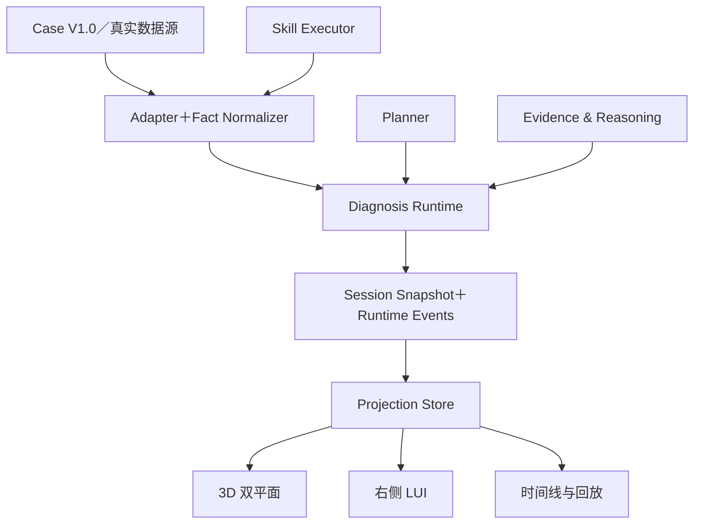

# 故障诊断 Agent 可视化原型与诊断推理总纲 V2.0

## 1. 定位

V2 是一套“可执行诊断会话＋可解释可视化投影”框架。它通过确定性 Case 复现故障诊断过程，同时为真实 Planner、真实 Skill 与生产数据接入保留稳定契约。

系统必须能让用户随时理解：

1. 当前故障现象和影响对象；
2. Agent 已经确认的事实；
3. 当前领先候选及其诊断支持分；
4. 当前正在执行的验证动作；
5. 选择该动作的原因与期望证据；
6. 证据缺口、冲突与竞争候选；
7. 结论为何成立或为何仍不能确认。

## 2. 总体架构



| 层 | 职责 | 禁止事项 |
|---|---|---|
| Case/Data | 保存资源、关系、观测、知识与确定性推演 | 不写前端布局状态 |
| Planner | 决定验证目标、任务顺序和重规划 | 不把事实解释为证据，不确认根因 |
| Skill | 查询对象、时间窗和指标，返回结果 | 不更新候选分数 |
| Fact Normalizer | 将自由记录转为 Canonical Fact | 不做诊断判断 |
| Reasoning | Fact→Evidence→Candidate Update | 不控制相机和 UI |
| Runtime | 归并状态、发布事件、回放和审计 | 不保存用户临时浏览选择 |
| Projection Store | 生成聚合视图和 LUI View Model | 不改写 Runtime 诊断事实 |

## 3. 产品流程

### 3.1 探索态

- 默认进入融合视图，也可切换全量拓扑或全量知识图谱；
- 用户浏览对象、关系和故障模式，不创建诊断候选；
- 自然语言输入是 V2 的唯一诊断入口；
- 信息不足时 Agent 通过结构化问题补齐对象和时间窗。

### 3.2 诊断态

```text
现象标准化
→ 资源映射与范围定位
→ 候选生成
→ Planner逐轮取证
→ Skill结果标准化为Fact
→ Evidence解释与候选更新
→ 重规划/追问/继续
→ 根因确认、多个可能原因或证据不足
```

### 3.3 回放态

- 以 Runtime Event `sequence` 还原任意历史快照；
- 所有区域只展示该序号之前的 Fact、Evidence、Candidate 和 Plan；
- 回放期间新的实时事件只增加提示，不强制退出回放；
- 返回实时态后恢复进入回放前的用户视口和展开上下文。

## 4. 视图结构

### 4.1 融合诊断视图

上层为实例拓扑，下层为知识图谱，中间以映射曲线/光柱关联实例、类型、故障模式和证据。右侧 LUI 占 28%～32%。

首屏节点预算约 36 个，允许 30～40；常态深钻不超过 60；80 仅为临时安全硬上限。超过预算时依次：隐藏低价值装饰、合并平行关系、聚合非关键对象、延迟加载低优先级分支。

### 4.2 独立视图

- 全量实例拓扑按资源包含关系聚合；
- 全量知识图谱按本体与知识语义聚合；
- 两者都支持聚合、展开、上钻、下钻、面包屑和视口恢复；
- 跨层映射随两端层级自动合并和拆分。

## 5. 右侧 LUI

| 区域 | 常驻信息 |
|---|---|
| 会话状态栏 | 现象、阶段、实时/暂停/回放 |
| 诊断态势 | 当前判断、领先候选、支持分、证据链进度、冲突 |
| 当前行动 | 目标、Skill、对象、时间窗、原因、期望证据、结果摘要 |
| 候选根因 | 3～5 个候选、分数变化、状态和缺口 |
| 调查工作区 | 证据链、计划差异、事件历史和原始详情 |

Planner 和 Skill 不拆成两个孤立大面板，而是组合为“目标→执行→事实→证据→候选变化”的行动闭环。

## 6. 事实、证据与候选

| 层次 | 定义 | 示例 |
|---|---|---|
| Fact | 客观观测与查询覆盖 | LUN时延在14:32:18为38.6ms |
| Evidence | Fact 对候选的诊断作用 | 时延突增与控制器复位同窗，支持影响链 |
| Candidate | 对象＋故障模式假设 | Controller-0A热复位 |
| Conclusion | 满足确认条件的根因断言 | watchdog超时触发0A热复位并导致业务变慢 |

同一个 Evidence 可引用多个 Fact，同一个 Fact 可分别影响多个 Candidate；每个作用必须单独说明方向和原因。

## 7. 诊断支持分与确认规则

诊断支持分范围 0～100，只用于过程可视化和候选排序。默认作用分：强支持 +30、支持 +15、削弱 -15、中性 0；Case 可以覆盖。

确认根因必须同时满足：

```text
支持分达到 Case 门槛
AND 直接故障或关键机制证据已满足
AND 对象位于影响路径
AND 时间一致性已满足
AND 能解释主要业务现象
AND 关键竞争候选已完成区分性检查
AND 无未解决关键冲突
```

终态只有：`ROOT_CAUSE_CONFIRMED`、`PROBABLE_CAUSES`、`INSUFFICIENT_EVIDENCE`。Skill 失败不是根因终态。

## 8. 八幕演示书签

| 幕 | 书签含义 | Runtime 实际来源 |
|---|---|---|
| 1 | 正常基线 | Case 初始快照 |
| 2 | 现象触发 | SYMPTOM_NORMALIZED/KPI Fact |
| 3 | 范围定位 | RESOURCE_MAPPED/TOPOLOGY_EXPANDED |
| 4 | 候选生成 | CANDIDATES_GENERATED |
| 5 | Agent取证 | TASK/SKILL/FACT/EVIDENCE 事件 |
| 6 | 候选评估 | CANDIDATE_UPDATED/PLAN_REPLANNED |
| 7 | 诊断完成 | ROOT_CAUSE_CONFIRMED/DIAGNOSIS_COMPLETED |
| 8 | 处置预览 | 非 V2 主闭环，弱化展示 |

八幕 `scene_id` 可以引用事件区间，但不能决定业务状态。

## 9. 图谱、拓扑与映射不变量

- 根因、领先候选对象、Agent 当前对象、异常对象、用户选中对象和关键路径不可被聚合隐藏；
- 设备外与设备内必须有清晰空间边界；
- 关系至少区分 software、workload、comm、physical、logical、hardware、fault；
- 关系可采用实线、虚线或管道效果，但语义由 relation type 决定，不由颜色单独决定；
- 局部展开以原聚合节点为锚点，禁止全局重新洗牌；
- 自动缩放以目标包围盒为依据，保留 10%～15% 边距；
- 滚轮只控制远近，不直接触发上钻或下钻。

## 10. 三类基线 Case

| Case | 关键推理挑战 | 关键投影 |
|---|---|---|
| 控制器热复位 | 直接故障→触发机制→接管→业务影响 | 单设备双控制器 |
| 扰邻 | 从受害者B向下定位共享资源，再反向追溯施压者A | 双业务共享存储 |
| 远程复制 | 区分本地前端、后端、复制链路和远端写入瓶颈 | 双设备远程复制 |

三者必须共用 Runtime、View Model 和交互协议，禁止 `if (case_id === ...)`。

## 11. 非目标

- 不展示大模型私有思维链；仅展示结构化目标、依据、事实、证据和决策；
- 不将 Mock 推演包装为生产概率模型；
- 不在 V2 执行自动修复，处置仅为预览；
- 不在前端推测 CMDB 关系、补全证据或自行确认根因；
- 不要求变更 Case V1.0 数据包。

## 12. 总体验收

- 用户 5 秒内能识别现象、领先候选、当前行动和行动原因；
- 点击任一 Evidence 能追溯至 Fact、Skill、对象、时间窗和候选变化；
- 日志原文、告警生命周期、KPI精确值和趋势可查看；
- 用户自由浏览不影响 Agent 状态，Agent 新事件不抢视角；
- 三类 Case 均可从数据驱动运行，无前端特判；
- 旧 Case 校验和新 Runtime 合约校验均通过。

