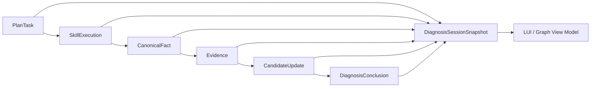

# Diagnosis Runtime 统一状态与事件协议 V2.0

## 1. 目标

本协议是 V2 的唯一运行时工程契约，负责串联 Planner、Skill、Fact Normalizer、推理模块、候选更新、LUI、3D 视图和历史回放。

Runtime 采用：

> 不可变递增事件流＋可重建会话快照＋面向前端的只读 View Model。

## 2. 核心对象关系



## 3. 会话快照

```yaml
diagnosis_session:
  schema_version: "2.0"
  session_id: session-controller-001
  case_id: controller_warm_reset_001
  version: 18
  last_sequence: 41
  mode: LIVE
  phase: CANDIDATE_EVIDENCE
  terminal_status: null

  symptom:
    normalized_text: 交易数据库访问变慢
    object_refs: [db-business-01, lun-db01]
    time_range: {start: ..., end: ...}

  knowledge_snapshot:
    summary: Controller-0A异常成为领先候选，触发机制正在验证
    leading_candidate_id: cand-controller-warm-reset
    critical_conflict_count: 0

  current_activity:
    primary_task_id: task-query-log-fingerprint
    execution_id: exec-log-001
    goal: 确认Controller-0A热复位触发机制
    selection_reason: 已发现热复位告警，但仍缺触发机制证据
    expected_evidence: [watchdog_timeout]
    target_object_refs: [controller-0a]
    status: RUNNING
  background_activity_ids: [exec-kpi-001]

  agent_focus:
    source_type: task
    source_id: task-query-log-fingerprint
    object_refs: [controller-0a]
    path_refs: [path-controller-to-lun]

  plans: []
  tasks: []
  skill_executions: []
  facts: []
  evidences: []
  candidates: []
  minimum_evidence_chain: []
  conclusion: null
  replay_bookmarks: []
```

`user_selection`、相机、展开组、筛选和面包屑不进入该快照，属于 Projection Store。

## 4. Runtime Event Envelope

```yaml
event:
  schema_version: "2.0"
  event_id: evt-000041
  session_id: session-controller-001
  sequence: 41
  occurred_at: "2026-07-30T14:32:25.910+08:00"
  emitted_at: "2026-07-30T14:32:25.930+08:00"
  event_type: FACT_DISCOVERED
  causation_id: evt-000038
  correlation_id: exec-log-001
  producer: fact-normalizer
  payload: {}
```

约束：

- `sequence` 在单会话内严格递增；
- `event_id` 幂等，重复事件不得二次应用；
- `causation_id` 指向直接原因事件；
- `correlation_id` 串联一次 Planner/Skill/Reasoning 闭环；
- 发现序号缺口时暂停 reducer 并补传，不能跳过。

## 5. 事件类型

### 会话与输入

```text
DIAGNOSIS_SESSION_CREATED
USER_QUESTION_REQUESTED
USER_QUESTION_ANSWERED
SYMPTOM_NORMALIZED
RESOURCE_MAPPED
DIAGNOSIS_PHASE_CHANGED
```

### 计划与执行

```text
PLAN_CREATED
PLAN_REPLANNED
TASK_STATUS_CHANGED
SKILL_STARTED
SKILL_COMPLETED
SKILL_FAILED
```

### 事实与推理

```text
FACT_DISCOVERED
FACT_QUALITY_UPDATED
EVIDENCE_CREATED
CANDIDATES_GENERATED
CANDIDATE_UPDATED
CONFLICT_DETECTED
CONFLICT_RESOLVED
MINIMUM_CHAIN_UPDATED
```

### 终态与控制

```text
ROOT_CAUSE_CONFIRMED
PROBABLE_CAUSES_REPORTED
INSUFFICIENT_EVIDENCE_REPORTED
DIAGNOSIS_PAUSED
DIAGNOSIS_RESUMED
DIAGNOSIS_COMPLETED
```

## 6. Canonical Fact

```yaml
fact:
  fact_id: fact-lun-latency-window
  fact_type: KPI_WINDOW
  object_refs: [lun-db01]
  occurred_at: "2026-07-30T14:32:18.000+08:00"
  observed_range: {start: ..., end: ...}
  source:
    execution_id: exec-kpi-001
    skill_id: kpi_query
    source_refs: [kpi-lun-db01-latency]
    query_coverage:
      object_coverage: COMPLETE
      time_coverage: COMPLETE
  quality:
    level: HIGH
    completeness: COMPLETE
    freshness: REPLAY_DATA
  payload:
    metric_name: LUN平均时延
    unit: ms
    baseline: 1.8
    peak_value: 38.6
    peak_at: "2026-07-30T14:32:18.000+08:00"
    warning_threshold: 10
    critical_threshold: 30
    samples: []
```

支持类型：`ALARM`、`LOG`、`LOG_FINGERPRINT`、`KPI_WINDOW`、`TOPOLOGY_RELATION`、`RESOURCE_STATE`、`ABSENCE`、`SIMILAR_CASE_REFERENCE`。

`ABSENCE` 只表示在明确对象、时间窗、条件和完整覆盖下未发现匹配，不等同对象健康。

## 7. Evidence

```yaml
evidence:
  evidence_id: ev-impact-chain
  evidence_type: IMPACT
  fact_refs:
    - fact-controller-throughput-zero
    - fact-controller0b-takeover
    - fact-lun-latency-window
  effects:
    - candidate_id: cand-controller-warm-reset
      effect: STRONG_SUPPORT
      score_delta: 22
      explanation: 0A归零、0B接管和LUN时延突增形成同窗影响链
  object_refs: [controller-0a, controller-0b, lun-db01]
  time_alignment_ms: 230
  quality: HIGH
  created_by: reasoning-engine
```

禁止在 Evidence 中复制伪造原始值；所有原始值必须通过 `fact_refs` 追溯。

## 8. Candidate 与更新

```yaml
candidate:
  candidate_id: cand-controller-warm-reset
  object_id: controller-0a
  fault_mode_code: CONTROLLER_WARM_RESET
  display_name: Controller-0A热复位
  diagnosis_support_score: 84
  status: LEADING
  supporting_evidence_refs: []
  weakening_evidence_refs: []
  conflicting_evidence_refs: []
  missing_requirement_ids: []

candidate_update:
  candidate_id: cand-controller-warm-reset
  score_before: 62
  score_after: 84
  status_before: ACTIVE
  status_after: LEADING
  caused_by_evidence_refs: [ev-impact-chain]
  reason: 影响链得到KPI事实闭环
```

## 9. 最小证据链

```yaml
minimum_evidence_chain:
  template_id: chain-controller-reset
  candidate_id: cand-controller-warm-reset
  items:
    - requirement_id: direct_fault
      label: 直接故障事实
      required: true
      status: SATISFIED
      evidence_refs: [ev-controller-reset-alarm]
    - requirement_id: mechanism
      label: 触发机制
      required: true
      status: IN_PROGRESS
      evidence_refs: []
```

状态：`PENDING | IN_PROGRESS | SATISFIED | CONFLICTING | UNAVAILABLE`。前端不得只使用一个布尔完成值。

## 10. Planner 与活动投影

Planner 输出保持诊断语义，Runtime 额外生成可显示字段：

```yaml
activity_projection:
  goal: 确认复位触发机制
  action_text: 正在查询Controller-0A复位前日志
  reason_text: 已发现热复位告警，但仍缺触发机制证据
  expected_result_text: 期望命中watchdog_timeout或controller_reset指纹
  result_summary: null
  task_id: task-log-001
  execution_id: exec-log-001
  fact_refs: []
  evidence_refs: []
  candidate_update_refs: []
```

并行任务中只有一个 `primary_activity`；其他进入 `background_activities[]`。

## 11. 用户追问

```yaml
user_question:
  question_id: q-time-window
  prompt: 业务变慢大约从什么时间开始？
  options:
    - id: opt-recent-5m
      label: 最近5分钟
  allow_free_text: true
  blocking: true
  status: WAITING_FOR_USER
```

阻塞问题发生时 Runtime 进入 `WAITING_FOR_USER`，但前端探索仍可用。

## 12. Adapter

Adapter 必须完成：

| Case V1.0 | Runtime V2 |
|---|---|
| `initial_confidence: 0.42` | `diagnosis_support_score: 42` |
| trace `confidence: 0.96` | score point `96` |
| `status: confirmed` | `CONFIRMED` |
| `status: excluded` | `WEAKENED`，除非存在明确矛盾 |
| Skill `succeeded` | `SUCCEEDED` |
| `source_ref` | Fact.source.source_refs，然后 Evidence.fact_refs |
| `stance: support` | `SUPPORT/STRONG_SUPPORT` |
| `stance: contradict` | 默认 `WEAKEN` |

Adapter 不得修改 Case 原文件，也不得根据 `case_id` 特判字段含义。

## 13. View Model

Runtime 输出领域状态；Projection Adapter 生成：

- `KnowledgeSnapshotViewModel`
- `CurrentActionViewModel`
- `CandidateListViewModel`
- `EvidenceChainItemViewModel`
- `FactDetailViewModel`
- `GraphProjectionViewModel`
- `TimelineEventViewModel`

View Model 可以包含展示文案、格式化值、颜色 token 和聚合摘要，但不能成为本体事实或反向写回 Runtime。

## 14. 回放与一致性

Reducer 必须满足：

```text
Snapshot(n) + Events(n+1...m) = Snapshot(m)
```

- 每次候选更新必须引用当时已存在 Evidence；
- 每个 Evidence 引用的 Fact 必须在相同或更早序号存在；
- 根因确认时最小证据链必须已满足；
- 历史快照不能包含更晚创建的 Fact、Evidence、候选分和结论；
- 断线恢复优先从最后序号续传，无法续传时重新获取快照。

## 15. 幂等、乱序和失败

- 重复 `event_id` 忽略；
- 低于当前 sequence 的晚到事件不得覆盖状态；
- Skill `FAILED` 不生成“未发现异常”Fact；
- `PARTIAL` Fact 必须声明未覆盖范围；
- `DATA_MISSING` 可以形成数据缺失状态，不能直接削弱候选；
- Fact Normalizer 失败保留原始引用并产生可诊断错误事件。

## 16. 验收

- Schema 可验证快照、事实、证据、候选和事件最小结构；
- Runtime 校验器检查 ID 唯一性、引用闭环、事件顺序和确认条件；
- 同一事件流重复归并结果一致；
- 三类 Case 均能生成同一结构的 LUI 与图投影；
- 旧 Case V1.0 原文件不发生修改。

