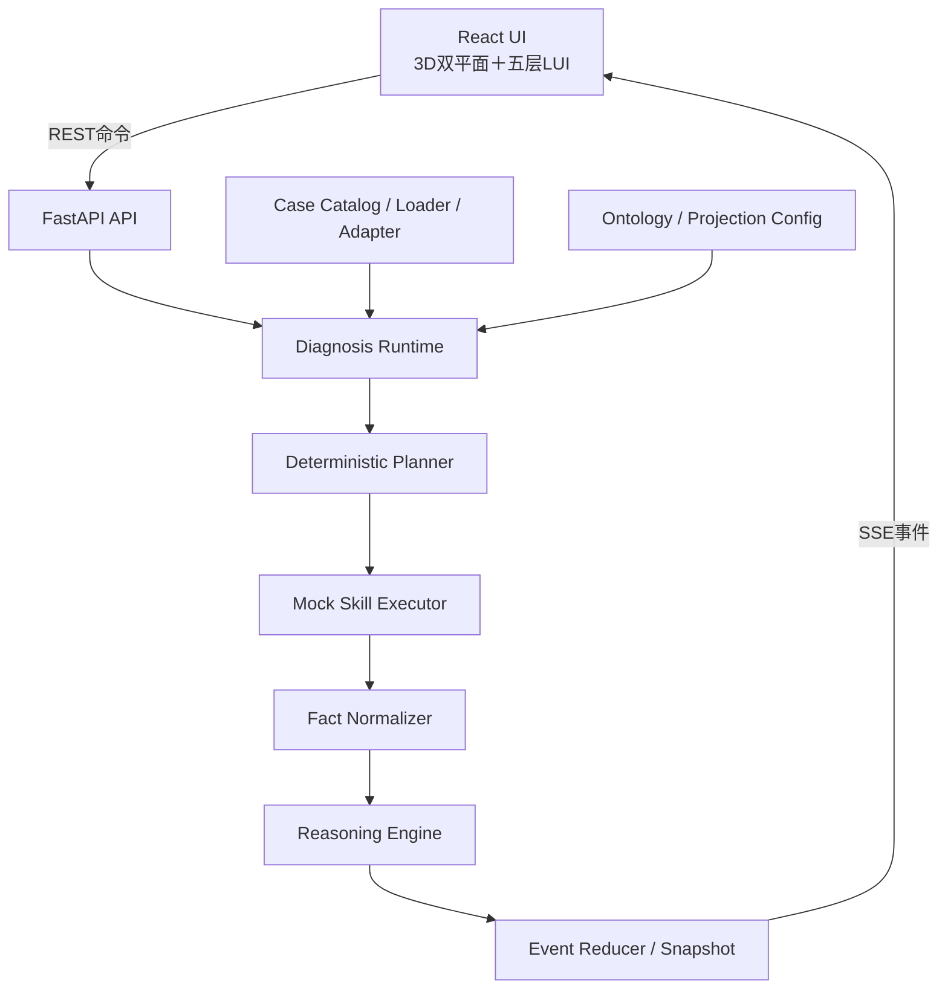

# 故障诊断 Agent 工程实现基线 V2.1

> 文档状态：冻结，可直接进入工程开发  
> 日期：2026-08-01  
> 适用范围：`故障诊断Agent-demoV2` 的应用工程、三 Case 动态运行、自动化测试与离线交付  
> 前置契约：Runtime V2.0、本体 V2.0、前端联动 V2.0、LUI/Fact Detail V2.0、Case V1.0 兼容附录

## 1. 文档目的

本文档冻结此前尚未确定的工程实现口径，使开发团队可以在不继续讨论业务方案的前提下直接实现：

```text
自然语言输入
→ SymptomNormalizer
→ CaseRouter
→ Case Loader / Runtime Adapter
→ Event-driven Diagnosis Runtime
→ 3D 双平面与五层 LUI
→ 三级事实钻取
→ 八幕书签与历史回放
```

本文档负责回答：使用什么技术栈、模块如何拆分、数据如何加载、Runtime 如何推进、前后端如何通信、如何启动、如何测试以及达到什么标准才算完成。

本文档不重新定义 Fact、Evidence、Candidate、Planner、Skill 或本体语义。发生冲突时，以《Diagnosis Runtime统一状态与事件协议 V2.0》和各专项语义规范为准。

## 2. 实现目标与非目标

### 2.1 V2.1 必须实现

1. 一个本地可运行的完整 Web 应用，而不是继续扩展静态 HTML；
2. 三套 Case 的统一发现、校验、加载、路由、会话创建和诊断推演；
3. 确定性 Mock Planner、Mock Skill Executor、Fact Normalizer、Reasoning Engine、Event Reducer；
4. 3D 实例拓扑—故障知识图谱双平面、跨层映射和三种主视图；
5. 右侧五层 LUI，以及“当前行动摘要→证据链→原始事实详情”三级展示；
6. 实时、暂停、单步、跳转书签、历史回放、返回当前状态；
7. `python3 start.py` 一键离线启动；
8. 三 Case 自动化回归、契约校验、性能验收和可重复交付。

### 2.2 V2.1 明确不实现

- 不接入真实 DME、ES、CMDB、告警或性能接口；
- 不调用在线大模型，不依赖外部网络；
- 不实现自动修复、审批、回滚和修复验证；
- 不选择生产级图数据库或本体存储；
- 不升级 Case 数据包定义规范 V1.0；
- 不把八幕实现成 Runtime 状态机；
- 不为扰邻或远程复制新增场景专用 Skill；
- 不允许前端计算 Evidence、候选支持分或根因结论。

## 3. 冻结决策总表

| 决策编号 | 冻结项 | 工程结论 |
|---|---|---|
| E-01 | 前端 | React＋TypeScript；Vite 只用于开发构建 |
| E-02 | UI | Tailwind CSS＋Radix UI primitives；Lucide 图标；Motion 动效 |
| E-03 | 3D | `3d-force-graph`＋Three.js，封装为统一 Graph Engine |
| E-04 | 图表 | Apache ECharts，统一 KPI、支持分轨迹与时间线 |
| E-05 | 前端状态 | Zustand；Runtime Store 与 Projection Store 严格分离 |
| E-06 | 后端 | Python 3.11+、FastAPI、Uvicorn、Pydantic |
| E-07 | 通信 | REST 获取/控制，SSE 单向推送 Runtime Event |
| E-08 | Runtime | Append-only Event Log＋确定性 Reducer＋可重建 Snapshot |
| E-09 | Case | `cases/index.json` 为 Catalog 权威入口；元数据预加载、数据懒加载 |
| E-10 | 路由 | 规则化 SymptomNormalizer＋可解释加权 CaseRouter；歧义时追问 |
| E-11 | Planner | V2.1 使用确定性 Case Planner；契约与未来 LLM Planner 一致 |
| E-12 | 支持分 | 使用 Case 预设确定性轨迹，Evidence 门控后逐点释放 |
| E-13 | 回放 | Event 序列是唯一真时间线；八幕仅为 Event Sequence Bookmark |
| E-14 | 交付 | 预构建 `dist/` 随包交付；运行端不要求 Node.js/npm/Docker |
| E-15 | 启动 | 根目录执行 `python3 start.py`，默认绑定 `127.0.0.1` |

依赖的精确版本由 `requirements.lock` 和前端 lockfile 锁定。开发开始后不得只在文档中手工维护 patch 版本；可复现构建以 lockfile 为准。

## 4. 总体工程架构



### 4.1 单一状态权威

Python Runtime 是诊断状态的唯一权威。前端只持有：

- Runtime Snapshot 的只读镜像；
- 已按顺序应用的 Runtime Event；
- 仅属于浏览交互的 Projection State。

前端不得调用 Case 文件直接推断候选、证据或结论；不得从 HTML 内置剧情推进诊断。

### 4.2 端口与适配器边界

核心 Runtime 仅依赖抽象端口：

```text
CaseRepository
PlannerPort
SkillExecutorPort
FactNormalizerPort
ReasoningPort
EventStorePort
ClockPort
```

V2.1 提供本地 JSON、确定性 Planner、Mock Skill 和文件事件存储适配器。未来接真实系统时替换 Adapter，不修改 Reducer、API 和前端协议。

## 5. 目标目录结构

```text
故障诊断Agent-demoV2/
├── start.py
├── requirements.txt
├── requirements.lock
├── README.md
├── server/
│   ├── app.py
│   ├── api/
│   ├── domain/
│   ├── runtime/
│   │   ├── reducer.py
│   │   ├── orchestrator.py
│   │   ├── event_store.py
│   │   └── session_projector.py
│   ├── routing/
│   ├── cases/
│   ├── planner/
│   ├── skills/
│   ├── reasoning/
│   └── viewmodels/
├── frontend/
│   ├── src/
│   │   ├── app/
│   │   ├── api/
│   │   ├── runtime/
│   │   ├── projection/
│   │   ├── graph/
│   │   ├── lui/
│   │   ├── facts/
│   │   └── components/
│   └── package-lock.json
├── dist/
├── config/
│   ├── case_router.yaml
│   ├── ontology_projection.yaml
│   └── scenarios/
│       ├── controller_warm_reset_001.yaml
│       ├── noisy_neighbor_io_contention_001.yaml
│       └── remote_replication_lag_001.yaml
├── cases/
├── schemas/
├── docs/
├── tools/
├── tests/
│   ├── unit/
│   ├── contract/
│   ├── replay/
│   ├── integration/
│   └── e2e/
└── runtime_data/
    └── sessions/
```

`runtime_data/` 是运行期产物，不能写入 `cases/`。发布包可不携带历史 Session；启动时目录不存在则自动创建。

## 6. 前端实现基线

### 6.1 页面骨架

```text
App Shell
├── Global Header / Case & Session Controls
├── View Switcher: FUSED | TOPOLOGY | KNOWLEDGE_GRAPH
├── Main 3D Canvas
└── Right Diagnosis Workbench
    ├── Session Status
    ├── Knowledge Snapshot
    ├── Current Action
    ├── Candidate List
    └── Investigation Workspace
```

3D 主画布不是 LUI 第六层；它与右侧五层 LUI 并列，共享同一 Runtime Snapshot 和 Projection Store。

### 6.2 状态拆分

```ts
type RuntimeStore = {
  sessionId: string | null;
  snapshot: DiagnosisSessionSnapshot | null;
  lastSequence: number;
  connectionState: 'CONNECTING' | 'LIVE' | 'RECONNECTING' | 'ERROR';
};

type ProjectionStore = {
  viewMode: 'FUSED' | 'TOPOLOGY' | 'KNOWLEDGE_GRAPH';
  userSelection: Selection | null;
  expandedGroupIds: string[];
  activeFilters: Filter[];
  cameraMode: 'AGENT_FOLLOWING' | 'USER_EXPLORING' | 'REPLAY_FOCUS';
  cameraBookmark: CameraBookmark | null;
};
```

约束：

- `agent_focus` 只来自 Runtime Store；
- `user_selection` 只进入 Projection Store；
- Runtime Event 不得直接覆盖用户相机；
- 回放时使用独立的只读 Replay Snapshot，返回实时态后恢复进入回放前的 Projection State；
- 所有 View Model 必须携带 `session_version` 或可追溯到当前快照版本。

### 6.3 3D Graph Engine

Graph Engine 对上层只暴露统一接口：

```ts
setGraphProjection(vm)
applyRuntimeOverlay(overlay)
setUserSelection(selection)
focusAgentContext(options)
expandGroup(groupId)
collapseGroup(groupId)
switchView(mode)
captureCameraBookmark()
restoreCameraBookmark(bookmark)
```

内部负责 `3d-force-graph`、Three.js 材质、局部力布局、标签层、对象拾取、路径动画和相机插值。业务组件不得直接操作 Three.js Scene。

### 6.4 视觉与交互实现

- 使用统一设计 token 管理颜色、阴影、玻璃层、圆角、间距和动效；
- 状态含义不得只依赖颜色，需组合光晕、描边、徽标、标签和动画；
- 相机动画 350～650ms，跨双平面最多 800ms；
- 用户进入 `USER_EXPLORING` 后不自动抢回相机；
- L3 Fact Detail 使用抽屉或侧层，不销毁主画布上下文；
- KPI 精确值通过 hover/crosshair 展示，不把所有样本作为常驻 DOM；
- 日志原文按纯文本渲染，不执行 HTML。

### 6.5 前端禁止项

- 禁止 `if (caseId === ...)` 控制业务渲染；
- 禁止直接读取 `diagnosis/conclusion.json`；
- 禁止从 `strength/confidence` 自算或格式化为概率；
- 禁止把 `LEADING` 显示为“已确认根因”；
- 禁止因 Runtime 更新而重建整个 3D Scene；
- 禁止在组件本地复制一份独立候选或证据状态。

## 7. Case Catalog、Loader 与 Adapter

### 7.1 Catalog

`cases/index.json` 是三套 Case 的机器可读权威入口。启动时必须检查：

1. 索引中的目录均存在；
2. `index.case_id`、目录名、`manifest.case_id`、`case.case_id` 一致；
3. `cases/` 下没有未登记目录；
4. manifest 声明文件齐全；
5. 所有跨文件 ID 引用闭环；
6. 三套 Case 均通过 V1.0 校验。

任一 Case 无效时：该 Case 标记 `INVALID` 并从可启动列表隔离；若三套基线 Case 任一无效，则启动健康检查失败并明确报错。

### 7.2 加载策略

- 启动时只预加载 Catalog 和 Case 元数据；
- 创建 Session 时懒加载完整 Case；
- 解析结果为不可变 `LoadedCase`，按 `case_id + manifest_digest` 缓存；
- 同一 Case 可创建多个独立 Session，Session 状态不得写回缓存；
- 原始 JSON 永远保留，Adapter 生成的新对象放入 Runtime 内存或 Session Event Log。

### 7.3 真值隔离

Loader 必须把 Case 内容逻辑隔离为：

| 区域 | 内容 | 可否直接进入前端 |
|---|---|---:|
| Public Input | Case 元信息、允许展示的触发现象、初始对象映射 | 是 |
| Observation Store | 告警、日志、KPI、拓扑、资源事实 | 仅在 Skill 查询后 |
| Scenario Driver | 任务脚本、Evidence 门控、候选轨迹、确认条件 | 否 |
| Ground Truth | `conclusion.json` 和最终链路 | 仅确认事件后 |
| Playback Bookmark | 八幕与目标 sequence 映射 | 只控制回放定位 |

特别约束：Case V1.0 中 `candidates.json.status=confirmed/excluded`、`confidence_trace` 最终值和 `conclusion.json` 都是 Ground Truth/Scenario Driver 输入，绝不能进入初始 Session。

### 7.4 ScenarioExecutionProfile

V2.1 在 `config/scenarios/<case_id>.yaml` 提供数据驱动的执行配置，但它不是 Case V2 规范，也不改变 Case V1.0 原文件。

```yaml
schema_version: "1.0"
case_id: noisy_neighbor_io_contention_001
initial_disclosure:
  object_refs: [business-b, host-b, lun-b]
  candidate_refs: [cand-host-b-overload, cand-fc-link-b]
rounds:
  - round_id: localize-victim-path
    task_refs: [task-map-business-b, task-query-b-kpi]
  - round_id: expand-shared-consumers
    task_refs: [task-expand-shared-consumers]
    reveal_object_refs: [host-a, lun-a]
    reveal_candidate_refs: [cand-noisy-neighbor-a]
score_release_policy: ALL_REFERENCED_EVIDENCE_EXISTS
confirmation_policy_ref: noisy-neighbor-minimum-chain
```

用途：冻结任务顺序、候选/对象显露门槛、确定性计时和失败回退。Runtime 只按通用 Schema 解释它，禁止出现 Case ID 代码分支。

扰邻场景必须满足：Host-A 和 `cand-noisy-neighbor-a` 只能在“共享消费者展开”任务成功后显露；初始页面不得从 `candidates.json` 泄露施压者。

## 8. 自然语言现象标准化

### 8.1 输出模型

```yaml
normalized_symptom:
  raw_text: 远程复制RPO突然超过10分钟，待复制数据持续堆积
  normalized_types: [REPLICATION_RPO_HIGH, REPLICATION_BACKLOG_HIGH]
  object_mentions: [replication-session]
  scope_mentions: [remote-replication]
  time_hint: null
  extracted_values:
    - {name: rpo, value: 10, unit: minute}
  missing_fields: [exact_session]
  normalization_warnings: []
```

### 8.2 V2.1 实现方式

V2.1 使用可配置词典、同义词、正则、对象别名和单位归一化，不调用大模型。词典至少覆盖：

- 业务慢、时延高、卡顿、I/O 抖动；
- 控制器复位、重启、主备切换、吞吐归零；
- 共享存储、同阵列、其他主机、争抢、扰邻；
- 远程复制、容灾、RPO、积压、同步滞后、丢包、重传；
- Host/主机、LUN、控制器、Pool、端口、复制会话等对象别名；
- ms/s/min、IOPS、GB/s、%、GB 等单位。

Normalizer 只抽取和标准化，不选择 Case。

## 9. Case Router

### 9.1 路由优先级

1. 用户显式选择 Case 或输入精确 Case ID；
2. 精确场景别名；
3. 现象类型＋场景锚点＋对象/关系提示的加权匹配；
4. 无法唯一匹配时追问；
5. 仍无法匹配时返回 `NO_MATCH`，不创建 Session。

用户从 Case Gallery 显式选择时允许直接路由，但仍执行 SymptomNormalizer，并记录 `route_source=USER_SELECTED_CASE`。

### 9.2 可解释加权

```text
route_score =
  scenario_anchor_score      # 0..40
+ symptom_type_score         # 0..30
+ object_relation_score      # 0..20
+ value_time_score           # 0..10
```

唯一命中条件：

- Top-1 `route_score >= 60`；
- Top-1 与 Top-2 分差 `>= 15`；
- 必需场景锚点没有被明确否定。

该分数仅用于 Case 路由，命名为 `route_score`，不得复用或展示为诊断支持分。

### 9.3 三 Case 基线锚点

| Case | 强锚点 | 典型现象 | 关系提示 |
|---|---|---|---|
| Controller 热复位 | 控制器复位/重启、主备切换 | LUN时延突增、I/O短时中断 | 0A异常、0B接管 |
| 共享存储扰邻 | 共享存储、同阵列其他主机、争抢 | 某业务慢但自身资源正常 | sibling consumer、共享池/控制器压力 |
| 远程复制滞后 | 远程复制、容灾、RPO、积压 | 同步滞后、保护降级 | 源端—WAN—远端复制路径 |

### 9.4 歧义与追问

| 路由结果 | 行为 |
|---|---|
| `UNIQUE_MATCH` | 返回候选 Case 和解释，用户确认或自动创建 Session |
| `AMBIGUOUS` | 展示最多 3 个选项，并追问最能区分的场景锚点 |
| `MISSING_OBJECT` | 追问业务对象/设备/复制会话 |
| `MISSING_TIME` | 只有任务确实依赖时间窗时追问 |
| `NO_MATCH` | 明确当前 Demo 只支持三套基线 Case，并提供 Case Gallery |

任何阻塞追问完成前不得创建 Diagnosis Session。

### 9.5 基线回归语句

```text
Controller：数据库访问突然变慢，Controller-0A刚发生过热复位并切到0B。
扰邻：Host-B访问共享存储时延升高，同一阵列其他主机负载可能异常。
远程复制：远程复制会话RPO升到10分钟以上，待复制数据持续积压。
```

三条必须唯一命中对应 Case。仅输入“业务变慢”必须返回追问，不得猜测 Controller Case。

## 10. Diagnosis Runtime 实现

### 10.1 会话生命周期

```text
ROUTING
→ READY
→ RUNNING
↔ PAUSED
→ COMPLETED

RUNNING / PAUSED
→ REPLAY_VIEW（只读投影，不改变真实会话状态）
```

`REPLAY_VIEW` 是客户端查看模式，不是服务端终态。

### 10.2 执行闭环

每轮按固定流水线执行：

```text
Planner读取Snapshot
→ 发布PLAN/TASK事件
→ Skill Executor读取Case Observation
→ Fact Normalizer创建Canonical Fact
→ Reasoning Engine创建Evidence
→ Candidate Reducer更新支持分/最小链
→ Stop Checker决定继续、重规划或终止
```

Planner、Skill、Reasoning 只产生命令或领域结果；只有 Event Reducer 可以修改 Snapshot。

### 10.3 Event Reducer

Reducer 必须是纯确定性函数：

```python
next_snapshot = reduce(current_snapshot, runtime_event)
```

要求：

- 同一 Snapshot＋同一 Event 得到完全相同结果；
- 重复 `event_id` 不重复应用；
- sequence 缺口时暂停并请求补传；
- 事件引用对象必须在当前或更早 sequence 已存在；
- 根因确认事件必须通过 Stop Checker；
- Reducer 不读取当前时间、随机数、文件或网络。

### 10.4 Event Store

每个 Session 保存：

```text
runtime_data/sessions/<session_id>/
├── metadata.json
├── events.ndjson
└── snapshots/
    └── snapshot-000100.json
```

- `events.ndjson` 只追加，不原地修改；
- 每 50 个事件或终态生成一次快照；
- 恢复时加载最近快照并重放后续事件；
- Demo 可提供“清空会话历史”命令，但不得删除 Case 数据；
- 测试时使用内存 Event Store，避免污染交付目录。

### 10.5 调度和计时

- 同一 Session 同时只有一个 Primary Task；
- Background Task 最多 2 个；
- 默认按 ScenarioExecutionProfile 的虚拟耗时推进；
- 自动播放速度支持 `0.5x | 1x | 2x | 4x`；
- 单步模式一次只释放一个语义事件组，不按毫秒等待；
- 暂停后不产生新的诊断事件；SSE 心跳可继续；
- 回放不会再次执行 Skill，也不会产生新 Event。

## 11. 确定性 Planner 与 Mock Skill Executor

### 11.1 Deterministic Planner

Planner 读取：当前阶段、候选、最小证据链缺口、已执行任务、ScenarioExecutionProfile 和可用 Skill Registry。

选择顺序：

1. 阻塞性输入缺口；
2. 直接故障/关键机制缺口；
3. 影响与传播路径缺口；
4. 关键竞争候选区分任务；
5. 恢复闭环或辅助证据；
6. Stop Check。

Planner 必须生成结构化 `selection_reason` 和 `expected_evidence`，LUI 不自行拼接原因。

### 11.2 Mock Skill Executor

统一 Skill Registry：

```text
business_mapping
topology_query
alarm_query
log_fingerprint_query
kpi_query
link_health_query
similar_case_query
```

Executor 根据 Task 的对象、时间窗和参数查询 Observation Store，只返回允许的记录和覆盖情况。它不得读取 `conclusion.json`，也不得返回 Candidate ID、Evidence Effect 或支持分。

### 11.3 失败注入

工程测试允许通过启动参数或测试 Fixture 注入：

- Skill 超时；
- 数据缺失；
- 部分时间窗；
- 空结果；
- 事件重复；
- SSE 断线重连。

失败注入属于测试配置，不能修改正式 Case 数据。

## 12. Fact Normalizer 与 Reasoning Engine

### 12.1 Fact Normalizer

Normalizer 通过 `normalizer_hint`、Skill 类型和记录 Schema 生成判别式 Fact。相同来源、对象、时间窗和语义的 Fact 使用稳定幂等键去重。

```text
fact_dedup_key = hash(
  fact_type + normalized_object_refs + observed_range + source_refs
)
```

Normalizer 必须保留原始值、单位、时区、来源引用、查询覆盖和质量；不得把“查询失败”转换成 ABSENCE。

### 12.2 Reasoning Engine

V2.1 使用配置化规则：

```yaml
when:
  fact_type: KPI_WINDOW
  indicator_id: replication_packet_loss
  predicate: peak_value >= critical_threshold
then:
  evidence_type: MECHANISM
  effects:
    - fault_mode_code: REMOTE_REPLICATION_NETWORK_CONGESTION
      effect: STRONG_SUPPORT
```

规则按 Fault Mode、Evidence Requirement 和 Ontology Relation 配置，不按 Case ID 编码。

同源日志与日志指纹、同一 KPI 的多个窗口必须做相关性去重，不能重复放大支持分。

## 13. 诊断支持分执行模式

### 13.1 V2.1 冻结方式

V2.1 采用 Case 中 `confidence_trace.json` 的确定性轨迹作为演示回归轨迹，但 Runtime 统一投影为 `diagnosis_support_score: 0..100`，不显示百分号。

初始规则：

- `initial_confidence × 100` 生成初始支持分；
- V1.0 的 `confirmed/excluded` 状态不进入初始 Session；
- 初始状态按当前可见对象和候选门控设为 `INITIAL/ACTIVE`；
- 未显露候选不出现在 Snapshot。

轨迹释放规则：

```text
只有 trace point.evidence_refs 全部已经形成 Evidence
且 Evidence 通过当前 Session 的质量、去重和时间检查
才允许发布该轨迹点对应的 CANDIDATE_UPDATED。
```

若缺少任一 Evidence，Runtime 保持当前分数并显示证据缺口；不得仅依据 sequence 或播放时间跳到 96/97。

### 13.2 确认门槛

根因确认必须同时满足：

1. 领先候选支持分 `>= 80`；
2. 该 Case 所有必需最小证据链项为 `SATISFIED`；
3. 至少一个关键竞争候选完成有效区分检查；
4. 不存在未解决的关键 `CONFLICT`；
5. 领先候选与第二候选分差 `>= 15`；
6. Ground Truth 所需 Evidence 均已在当前 sequence 之前产生。

分数达到 80 但任一条件不满足时只能保持 `LEADING`。无法完成关键检查时输出 `PROBABLE_CAUSES` 或 `INSUFFICIENT_EVIDENCE`。

### 13.3 后续替换边界

未来可以把预设轨迹替换为 Evidence Delta 动态规则，但必须保持 Candidate Update、最小证据链和前端契约不变。V2.1 不实现概率或贝叶斯模型。

## 14. HTTP 与 SSE 接口基线

### 14.1 REST

| 方法 | 路径 | 作用 |
|---|---|---|
| GET | `/api/v1/health` | 启动、Catalog、Schema 与版本健康状态 |
| GET | `/api/v1/cases` | 返回可用 Case 元数据，不返回真值 |
| POST | `/api/v1/route` | 标准化现象并执行 Case 路由 |
| POST | `/api/v1/sessions` | 在唯一 Case 确认后创建 Session |
| GET | `/api/v1/sessions/{id}` | 获取最新 Snapshot |
| GET | `/api/v1/sessions/{id}/events?after=` | 断线补传或调试查询 |
| GET | `/api/v1/sessions/{id}/stream?after=` | SSE Runtime Event 流 |
| POST | `/api/v1/sessions/{id}/commands` | pause/resume/step/seek/restart/speed |
| GET | `/api/v1/sessions/{id}/facts/{fact_id}` | 懒加载 Fact Detail |
| GET | `/api/v1/sessions/{id}/viewmodels/graph` | 获取当前图投影 |
| GET | `/api/v1/sessions/{id}/viewmodels/lui` | 获取五层 LUI 投影 |

### 14.2 命令协议

```json
{
  "command_id": "cmd-00021",
  "expected_session_version": 18,
  "command_type": "STEP",
  "payload": {}
}
```

使用乐观并发：版本不一致返回 `409 SESSION_VERSION_CONFLICT`，前端重新获取 Snapshot，不覆盖新状态。

### 14.3 SSE

- `id` 使用 Runtime Event sequence；
- `event` 使用 Runtime Event type；
- `data` 使用完整 Event Envelope；
- 每 15 秒发送心跳；
- 前端使用最后 sequence 重连；
- 服务端保留时间不足时返回提示，前端重新获取 Snapshot；
- 同一事件可能重传，前端按 `event_id` 幂等。

选择 SSE 而不是 WebSocket，是因为 V2.1 的服务端到客户端主要是单向事件流；控制命令已由 REST 覆盖，接口更容易回放、测试和断线恢复。

## 15. View Model 生成

Runtime Domain State 与前端展示模型通过 Session Projector 隔离：

```text
DiagnosisSessionSnapshot
→ LUI Projector
→ Graph Projector
→ Fact Detail Projector
→ Timeline Projector
```

### 15.1 LUI 载荷

Snapshot 随事件只下发 L1/L2 所需摘要。L3 Fact Detail 按 ID 懒加载。

### 15.2 Graph 投影

Graph Projector 输入同一 Ontology/Case Graph、Runtime Overlay 和 Projection Request，输出：

- nodes/links/mappings；
- group summary；
- root cause、impacted、candidate、agent focus 等 overlay；
- 不超过预算的可见子图；
- 布局 anchor 和相机建议，而不是强制相机命令。

聚合只存在于 View Model，禁止写回 Runtime 或 Case。

## 16. 八幕书签与历史回放

### 16.1 书签映射

`playback/storyboard.json` 只提供标题、讲解语义和视觉建议。应用首次运行该 Case 后，Runtime 把每幕映射到已经产生的目标 Event Sequence：

```yaml
replay_bookmark:
  scene_id: scene-05
  target_sequence: 41
  title: 机制证据闭环
```

不得把 `start_offset_ms` 当作事实发生顺序，也不得通过 scene 直接写候选分。

### 16.2 回放

- 跳转时从最近快照重放到目标 sequence；
- UI 显示 `REPLAY` 和目标时间；
- 只显示该 sequence 已存在的对象、Fact、Evidence、Candidate 和结论；
- 切换幕不执行 Skill、不追加 Event；
- 返回当前时恢复实时 Snapshot 和进入回放前的用户视口。

## 17. 启动与离线交付

### 17.1 开发期

前端开发允许使用 Node.js/npm 执行安装、测试和构建。合并前必须生成并提交 `dist/`，保证最终用户不需要前端工具链。

### 17.2 交付期

用户执行：

```bash
python3 start.py
```

`start.py` 必须：

1. 检查 Python 版本和依赖；
2. 校验 `dist/`、Case Catalog、三套基线 Case 和 Runtime Schema；
3. 在空闲端口启动 FastAPI/Uvicorn；
4. 默认绑定 `127.0.0.1`，不得默认暴露局域网；
5. 输出访问地址并自动打开浏览器；
6. 收到 Ctrl+C 后干净退出；
7. 返回明确退出码。

建议参数：

```text
--host 127.0.0.1
--port 8000
--no-browser
--validate-only
--data-dir ./runtime_data
--log-level INFO
```

### 17.3 离线约束

- 应用运行时不得访问 CDN、在线字体、遥测或第三方 API；
- JS、CSS、字体、图标和模型资源全部本地化；
- Service Worker 不是 V2.1 必需项；
- 默认同源访问，不开放宽泛 CORS；
- 构建机可联网安装依赖，交付运行不依赖网络。

## 18. 错误处理与可观测性

### 18.1 统一错误码

```text
CASE_CATALOG_INVALID
CASE_NOT_FOUND
CASE_ROUTE_AMBIGUOUS
CASE_ROUTE_NO_MATCH
SESSION_VERSION_CONFLICT
EVENT_SEQUENCE_GAP
SKILL_EXECUTION_FAILED
FACT_NORMALIZATION_FAILED
RUNTIME_CONTRACT_VIOLATION
FACT_NOT_VISIBLE_AT_SEQUENCE
```

错误响应必须含 `error_code`、用户可读消息、`correlation_id` 和可重试建议；不得把 Python traceback 直接显示给用户。

### 18.2 日志

- 使用结构化日志；
- 每条运行日志含 session、sequence、correlation、producer 和 duration；
- 不记录完整用户敏感输入、凭据或未脱敏真实设备数据；
- 前端 Console 不得存在未处理异常；
- `/api/v1/health` 返回版本、Case 数量和校验状态，不返回本地绝对路径。

## 19. 安全基线

- 默认只监听 `127.0.0.1`；
- Case ID、Fact ID 和 Session ID 作为不可信输入校验；
- 文件访问必须解析后确认仍位于允许根目录，防止路径穿越；
- Markdown/日志/原始字段按文本展示，禁止 `eval` 和未净化 HTML；
- Session 命令使用 `expected_session_version` 防止旧命令覆盖新状态；
- Case 和配置为只读，运行期只写 `runtime_data/`；
- ZIP 解包不是运行期功能，Loader 只加载已归档目录。

## 20. 性能基线

### 20.1 参考环境

- Windows 11 或主流桌面 Linux；
- 8 个逻辑 CPU、16GB 内存；
- 支持 WebGL2 的集成或独立显卡；
- Chrome/Edge 当前稳定版；
- 1920×1080、100% 缩放；
- 无外部网络依赖。

### 20.2 指标

| 指标 | 验收目标 |
|---|---:|
| `start.py` 到健康可访问 | ≤ 5s |
| Case Catalog 加载与校验 | ≤ 1s |
| 创建 Session 到首个 Snapshot | P95 ≤ 500ms |
| Runtime Event 到 LUI 局部更新 | P95 ≤ 200ms |
| 点击对象到选择态反馈 | P95 ≤ 100ms |
| L3 Fact Detail 打开 | P95 ≤ 200ms，不含首次大图表解析 |
| 30～40 可见节点 | 稳态 P50 ≥ 50 FPS，P5 ≥ 40 FPS |
| 60 可见节点 | 稳态 P50 ≥ 35 FPS，P5 ≥ 30 FPS |
| 80 节点 | 500ms 内触发聚合/降级，不作为常态视图 |
| 三 Case 连续运行 15 分钟 | 无崩溃、无持续增长型内存泄漏 |
| 浏览器＋服务端总内存 | 参考环境下稳定态 ≤ 1GB |

测帧率时关闭开发者工具，固定相机轨迹和交互脚本；不得只用静止画面测量。

## 21. 测试基线

### 21.1 单元测试

- SymptomNormalizer 的同义词、对象、数值、单位和缺失字段；
- CaseRouter 的唯一命中、歧义、无匹配和解释；
- Adapter 的 confidence/status/source_ref 兼容映射；
- Reducer 的所有事件类型、幂等和 sequence 缺口；
- Fact 去重、质量和 ABSENCE 条件；
- Evidence 门控、支持分轨迹和 Stop Checker；
- Projection Store 不修改 Runtime Store。

核心模块语句覆盖率目标 `>= 90%`，工程总体 `>= 80%`。覆盖率不能替代场景回归。

### 21.2 契约测试

- OpenAPI 请求/响应与 Pydantic Schema 一致；
- Runtime Snapshot/Event 通过 JSON Schema；
- View Model 判别式类型完整；
- 事件引用只指向当前或更早对象；
- Case Catalog、目录和 manifest 一致。

### 21.3 确定性回放测试

对每套 Case：

```text
空 Snapshot＋完整 Event Stream
== 终态 Snapshot

Snapshot(n)＋Events(n+1..m)
== Snapshot(m)
```

相同 Case 连续运行三次，除 session/event/time ID 外，规范化事件流和终态必须一致。

### 21.4 E2E

每套 Case 至少覆盖：

1. 输入基线现象并唯一路由；
2. 创建 Session；
3. 自动运行到领先候选；
4. 暂停、单步、恢复；
5. 点击候选→Evidence→Fact Detail；
6. 自由浏览时 Runtime 不抢相机；
7. 跳转八幕书签且不泄露未来事实；
8. 返回当前并完成结论；
9. 切换三种视图保持对象身份与用户选择；
10. 重启应用后可重放已保存 Session。

### 21.5 三 Case 特有断言

| Case | 必须断言 |
|---|---|
| Controller | 38.6ms、0GB/s、15.6GB/s、timeout_ms=3000、CRC=0 可三级追溯；满足链后确认热复位 |
| 扰邻 | 初始不显示 Host-A 根因；共享消费者展开后才显露；A降载后B恢复形成闭环 |
| 远程复制 | 源端、链路、远端、配置四域均被检查；本地业务正常与容灾保护降级同时成立 |

## 22. 开发阶段与交付物

### P0：工程骨架与数据入口

- 创建 Python/React 工程；
- 实现 `start.py`、健康检查和静态资源服务；
- 实现 Catalog、Loader、Adapter 和 ScenarioExecutionProfile Schema；
- 实现 Normalizer/Router 与三 Case 唯一路由。

完成判据：三 Case 可列出、可路由、可创建空 Session，错误 Case 被隔离。

### P1：Runtime 闭环

- 实现 Event Store、Reducer、Snapshot、Planner、Mock Skill、Fact、Reasoning、Stop Checker；
- 实现暂停、恢复、单步、速度和重连；
- 三 Case 均运行到正确终态。

完成判据：三套规范化事件流可确定性重放，真值不提前泄露。

### P2：LUI 与三级事实

- 实现五层 LUI；
- 实现 CurrentAction、Evidence Chain、Fact Detail；
- 实现日志、指纹、告警、KPI、正常值和数据缺失类型。

完成判据：三 Case 的关键原始值均可沿 Fact→Evidence→Candidate 追溯。

### P3：3D 双平面与联动

- 实现三视图、跨层映射、聚合、钻取、局部布局和语义缩放；
- 实现 agent_focus/user_selection、自由浏览保护和返回 Agent 视角；
- 接入 Runtime Overlay。

完成判据：30～40 节点首屏及 60 节点深钻达到性能基线，三 Case 无前端特判。

### P4：回放、质量与交付

- 实现八幕 Event Bookmark 和历史回放；
- 完成单元、契约、回放、E2E 和性能测试；
- 生成 `dist/`、依赖锁、启动说明和离线 ZIP。

完成判据：全新环境按 README 可通过 `python3 start.py` 启动并完成三 Case 演示。

## 23. 工程完成定义（Definition of Done）

只有全部满足以下条件，V2.1 工程实现才算完成：

- [ ] `python3 start.py` 无需 Node.js/npm/Docker 即可启动；
- [ ] 运行时无 CDN、在线字体、遥测和外部 API 请求；
- [ ] 三套 Case 从 `cases/index.json` 动态加载，无代码特判；
- [ ] 模糊输入会追问，唯一匹配后才创建 Session；
- [ ] Runtime Event 可幂等、续传、持久化和确定性重放；
- [ ] Case 真值、最终候选状态和未来证据不会提前泄露；
- [ ] 支持分按 Evidence 门控的确定性轨迹更新，不显示百分号；
- [ ] 根因确认同时满足分数、最小证据链、竞争候选和冲突条件；
- [ ] 前端只投影 Snapshot/Event，不执行诊断；
- [ ] `agent_focus` 与 `user_selection` 独立；
- [ ] 三视图、五层 LUI、三级事实钻取和八幕回放全部可用；
- [ ] Controller、扰邻、远程复制三套 E2E 全部通过；
- [ ] 性能、契约、安全和离线交付验收全部通过；
- [ ] 可浏览目录与最终 ZIP 的文件清单及内容哈希一致。

## 24. 后续演进接口

V2.1 完成后，以下替换应保持前端和 Runtime 契约不变：

| 当前实现 | 后续替换 |
|---|---|
| Deterministic Planner | 大模型 Planner |
| Mock Skill Executor | DME/ES/CMDB/告警/KPI真实 Skill |
| JSON Case Repository | 真实本体与事件数据源 |
| 预设支持分轨迹 | 配置化 Evidence Delta 或学习型评分 |
| 本地 Event Store | 数据库/消息流事件存储 |
| 单用户本地会话 | 多用户、鉴权和审计会话 |

替换原则是“换 Adapter，不换语义契约、不换前端状态模型、不破坏三 Case 回归”。

## 25. 最终冻结结论

至此，V2.1 开发前的工程选择已经闭环：

> 使用 Python Runtime 承担唯一诊断状态权威，以 REST＋SSE 驱动 React/3D 前端；三套 Case 经统一 Catalog、Router、Loader、Adapter 和数据驱动执行配置运行；支持分采用 Evidence 门控的确定性轨迹；最终以 `python3 start.py` 离线启动，并以三 Case 确定性回放、三级事实追溯、3D 性能和无真值泄露作为工程验收基线。

