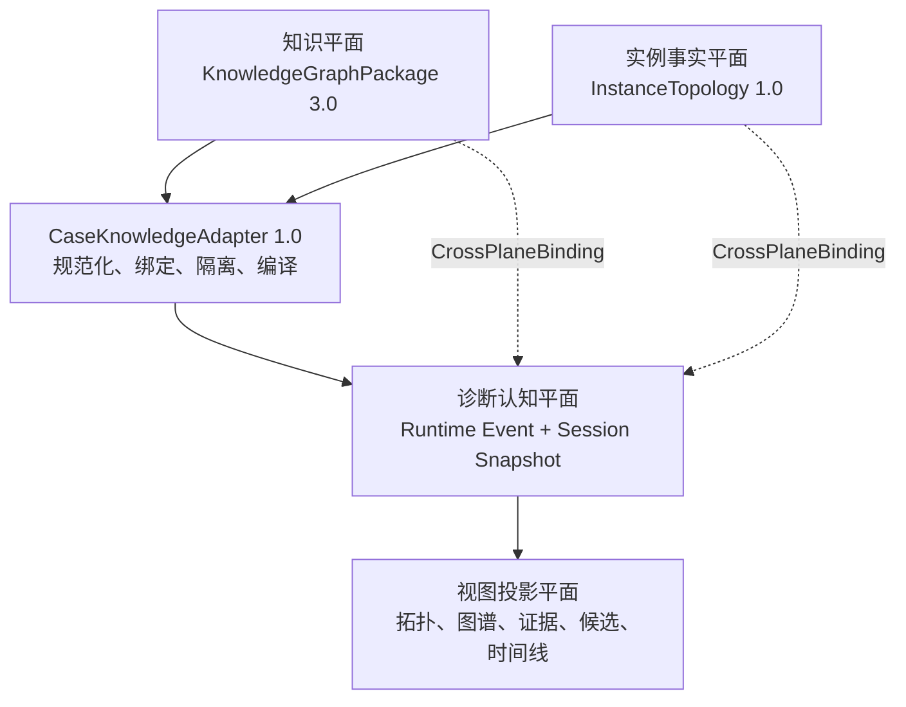
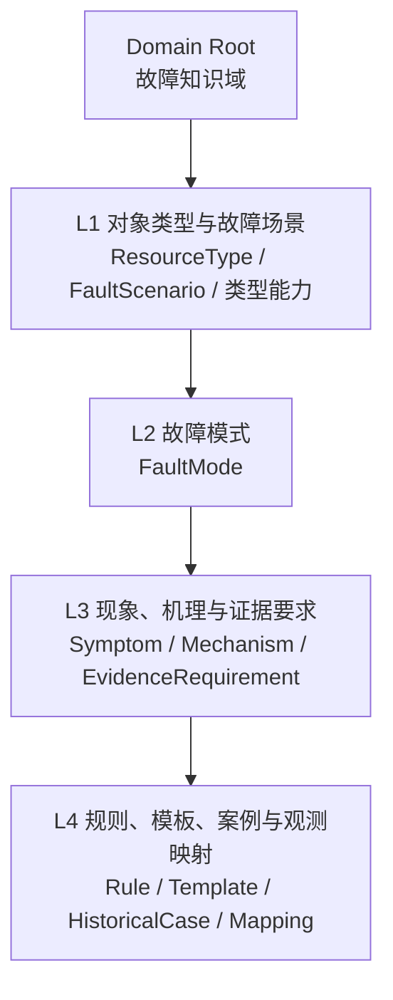
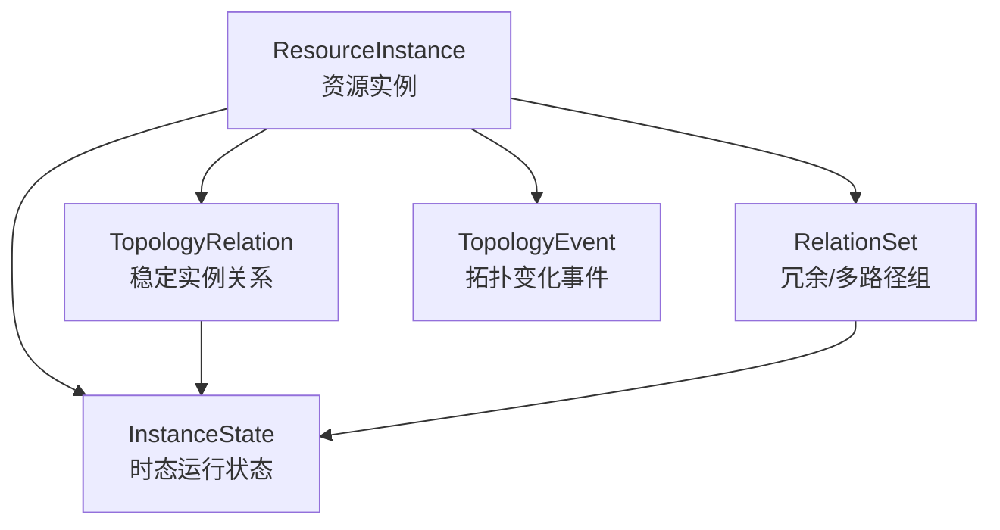
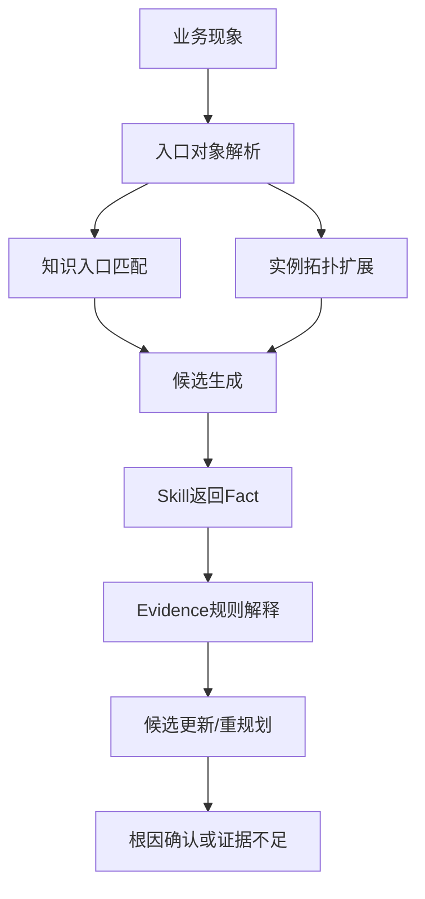
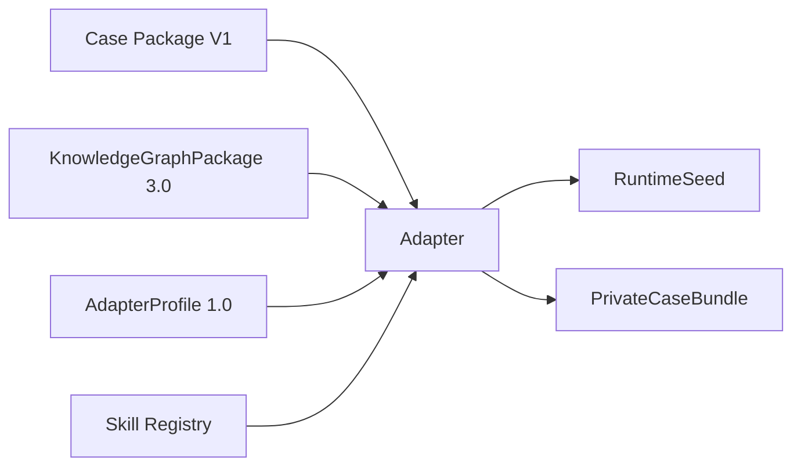

# 故障诊断Agent：知识图谱与实例拓扑统一建模及 Case 适配基线 V1.0

| 文档属性 | 内容 |
|---|---|
| 文档状态 | 正式冻结基线 |
| 文档版本 | V1.0 |
| 协议日期 | 2026-08-04 |
| 适用工程 | 故障诊断 Agent Demo V2 及兼容实现 |
| 核心协议 | KnowledgeGraphPackage 3.0.0、InstanceTopology Contract 1.0、CaseKnowledgeAdapter Contract 1.0 |
| 基线 Case | controller_warm_reset_001、noisy_neighbor_io_contention_001、remote_replication_lag_001 |

> 本文是故障知识图谱、环境实例拓扑、跨平面联动、Case V1 Mock 数据适配、Runtime 真值隔离及前端投影的统一语义基线。后续工程实现、数据构造、接口开发和业务验收均以本文为上位依据。

---

## 1. 文档目标

本文统一回答以下问题：

1. 故障知识应该建模成什么，哪些内容属于类型知识、诊断知识和历史知识；
2. 真实或 Mock 环境中的资源、拓扑、状态和事件应该建模成什么；
3. 知识图谱中的类型、场景、故障模式、机理和证据规则如何与实例拓扑中的具体对象关联；
4. Agent 如何从业务现象进入图谱和拓扑，并在诊断过程中逐步扩展已知范围；
5. Case Package V1.0 中的现有 Mock 数据如何转换到统一模型；
6. 控制器热复位、共享存储扰邻、远程复制异常三个 Case 如何复用同一套模型和 Adapter；
7. 如何隔离完整 Case 真值、Agent 当前已知状态和前端当前显示内容，避免根因提前泄露；
8. 新增第四个 Case 时，如何做到只新增数据包和注册映射，不修改前端状态机或 Runtime 私有分支。

本文不是页面视觉稿，也不是某个数据库或图数据库的物理设计。它定义的是实现无关的统一语义协议。

---

## 2. 统一建模总览

### 2.1 四个平面与一个适配边界



| 平面 | 核心对象 | 保存什么 | 明确不保存什么 |
|---|---|---|---|
| 知识平面 | ResourceType、FaultScenario、FaultMode、FaultMechanism、SymptomConcept、EvidenceRequirement、DiagnosticRule、HistoricalCase | 稳定、可复用、可版本化的领域知识 | 环境实例、当前主备、当前告警、候选分、实际根因 |
| 实例事实平面 | ResourceInstance、TopologyRelation、RelationSet、InstanceState、TopologyEvent | 某个环境中的资源、稳定关系、时态状态与事件 | 故障模式答案、候选、证据解释、实际传播结论、前端坐标 |
| 诊断认知平面 | Fact、Evidence、Candidate、Plan、Task、Decision、Known Ledger | Agent 当前知道什么、正在做什么、为何这样做及如何得出结论 | 未查询真值、未来事件、纯视觉状态 |
| 视图投影平面 | ProjectionGroup、ViewState、Cross-plane highlight、Camera state | 已知语义的聚合、显隐、聚焦和联动 | 新事实、候选更新、根因确认、数据隔离 |
| Adapter 边界 | RuntimeSeed、PrivateCaseBundle、KnowledgeBindingIndex、ReleaseEnvelope | Case 兼容转换、code 绑定、真值分区和事件释放规则 | 自主规划、Skill 执行、证据解释和根因判断 |

### 2.2 五条核心不变量

```text
知识类型 ≠ 环境实例
稳定拓扑 ≠ 运行状态 ≠ 拓扑事件
完整环境真值 ≠ Agent当前已知子图 ≠ 前端当前显示子图
原始Fact ≠ 诊断Evidence ≠ Candidate ≠ Conclusion
视图聚合/隐藏 ≠ 数据隔离
```

任何实现只要破坏上述任一不变量，即使页面能够播放，也不符合本基线。

### 2.3 依赖优先级

出现旧文档或旧字段含义冲突时，按以下优先级解释：

```text
Runtime事件与诊断语义
> 本统一基线
> CaseKnowledgeAdapter Contract 1.0
> InstanceTopology Contract 1.0
> KnowledgeGraphPackage 3.0.0
> Case Package V1.0兼容字段
> Storyboard展示提示
```

Storyboard、前端状态和 Case 文件顺序均不得覆盖 Runtime 语义。

---

## 3. 统一身份、引用与版本规则

### 3.1 ID 与 code 的边界

| 标识 | 作用域 | 用途 |
|---|---|---|
| `node_id` | Knowledge Package 内部 | 图谱节点和边的内部引用，可随重打包变化 |
| `code` | 跨包稳定 | Case、Adapter、Planner、Runtime 与知识资产集成的主键 |
| `resource_id` | 环境或 Case 内稳定 | KPI、告警、日志、拓扑和 Runtime Fact 对具体实例的统一引用 |
| `external_refs` | 外部系统 | DME、CMDB、设备侧、告警平台等外部 ID |
| `projection_id` | 前端会话 | 聚合节点和视图投影引用，禁止被证据、候选和结论引用 |
| `event_id` | 诊断会话 | Runtime Event 的全局唯一、可回放引用 |

正式规则：

- Case 到 KG 只使用稳定 `code`，禁止用中文名称匹配；
- KG 内部边使用 `node_id`；
- 同一实例跨资源、告警、日志、KPI、拓扑和 Runtime 必须使用同一 `resource_id`；
- 前端不得使用 `case_id`、文件名或节点显示名称推断故障类型；
- 所有跨平面关联必须由显式 Binding 提供，禁止按同名字符串自行连线。

### 3.2 三类版本

| 版本 | 含义 | 升级条件 |
|---|---|---|
| `schema_version` | 数据结构与字段协议 | 不兼容字段或语义变化升级主版本 |
| `package_version` / `case_version` | 知识或 Case 内容版本 | 节点、规则、案例、Mock 数据或分镜修订 |
| `compatibility` | 可兼容的 Adapter、Runtime、Player 范围 | 上下游兼容范围变化 |

全部版本采用 SemVer。加载器必须先检查兼容范围，禁止静默忽略核心字段。

---

## 4. KnowledgeGraphPackage 3.0.0

### 4.1 定位

KnowledgeGraphPackage 是可发布、可版本化、可校验的故障知识资产包，不是为某个 Case 临时拼接的一张图。

它同时服务于：

- 故障现象标准化与场景入口匹配；
- 实例关系的类型合法性校验；
- 候选生成与故障模式细化；
- Planner 的证据缺口与验证目标生成；
- Fact 到 Evidence 的规则解释；
- 历史案例检索和诊断解释；
- 知识平面的可视化投影。

### 4.2 包结构基线

```text
knowledge_graph_package/
├── manifest.json
├── ontology/
│   ├── resource_types.json
│   ├── knowledge_node_types.json
│   ├── relation_types.json
│   └── topology_capabilities.json
├── knowledge/
│   ├── nodes.json
│   ├── edges.json
│   ├── diagnostic_templates.json
│   └── evidence_rules.json
├── mappings/
│   ├── symptom_mappings.json
│   ├── observation_mappings.json
│   ├── indicator_mappings.json
│   └── skill_capability_mappings.json
├── cases/
│   └── historical_cases.json
├── schemas/
│   └── *.schema.json
└── validation/
    └── compatibility.json
```

目录可以按实现拆分，但逻辑对象和版本边界不得缺失。

KnowledgeGraphPackage 根清单至少包含：

```json
{
  "schema_name": "dme-fault-knowledge-graph-package",
  "schema_version": "3.0.0",
  "package_id": "dme-storage-fault-knowledge",
  "package_version": "3.0.0",
  "knowledge_domain_code": "STORAGE_FAULT_DIAGNOSIS",
  "created_at": "2026-08-04T00:00:00Z",
  "locale": "zh-CN",
  "files": [],
  "dependencies": [],
  "compatibility": {
    "adapter": ">=1.0.0 <2.0.0",
    "runtime": ">=1.0.0 <2.0.0"
  },
  "content_digest": "sha256:...",
  "status": "RELEASED"
}
```

`content_digest` 不包含打包时间和随机 ID 等非语义字段；相同语义内容必须产生稳定摘要。

### 4.3 Domain Root + L1～L4 四层知识结构



Domain Root 作为知识域根节点，不计入 L1～L4 的四层编号。

| 层级 | 解决的问题 | 典型节点 |
|---|---|---|
| L1 | 哪类对象、哪类场景，以及类型之间允许具有什么拓扑能力 | `ResourceType`、`FaultScenario` |
| L2 | 对某类对象可能发生什么规范故障 | `FaultMode` |
| L3 | 为什么会发生、表现为什么、确认需要哪些证据 | `FaultMechanism`、`SymptomConcept`、`EvidenceRequirement` |
| L4 | 如何检测、如何组合验证、哪些历史案例和观测可映射 | `DiagnosticRule`、`EvidenceRule`、`DiagnosticTemplate`、`HistoricalCase`、`ObservationMapping` |

### 4.4 KnowledgeNode 最小结构

```json
{
  "node_id": "kg-node-fm-controller-warm-reset",
  "node_type": "FAULT_MODE",
  "code": "CONTROLLER_WARM_RESET",
  "name": "控制器热复位",
  "description": "控制器在运行过程中执行热复位并短时退出服务",
  "status": "ACTIVE",
  "knowledge_level": "L2",
  "properties": {
    "severity_default": "CRITICAL"
  },
  "provenance": {
    "source_type": "DOMAIN_EXPERT",
    "source_refs": ["manual://controller/reset"]
  },
  "valid_time": {
    "from": null,
    "to": null
  }
}
```

核心节点类型冻结如下：

| 节点类型 | 作用 | 关键约束 |
|---|---|---|
| `KNOWLEDGE_DOMAIN` | 故障知识域根 | 一个包至少一个根域 |
| `RESOURCE_TYPE` | 资源类型 | `code` 必须可被实例 `resource_type_code` 引用 |
| `FAULT_SCENARIO` | 故障场景或故障类别 | 是 FaultMode 的规范父级 |
| `FAULT_MODE` | 可诊断的规范故障模式 | 必须且只能有一个规范父场景 |
| `FAULT_MECHANISM` | 触发或传播机理 | 只表示可能机理，不证明本次已发生 |
| `SYMPTOM_CONCEPT` | 标准化故障现象 | 可由自然语言、告警、KPI 等映射 |
| `EVIDENCE_REQUIREMENT` | 最小证据要求 | 描述确认某模式需要哪类证据 |
| `DIAGNOSTIC_RULE` | Fact 到 Evidence 的解释规则 | 不直接修改候选或确认根因 |
| `DIAGNOSTIC_TEMPLATE` | 组合验证模板 | 定义组合策略，不定义 Planner 实际执行顺序 |
| `HISTORICAL_CASE` | 已审核历史案例摘要 | 初始入口匹配不得利用其最终答案 |
| `OBSERVATION_MAPPING` | 原始观测到概念/指标/规则的映射 | 必须可追溯到来源和转换版本 |
| `SKILL_CAPABILITY` | 可获取某类事实的通用能力 | 只描述能力，不表示已执行 |

### 4.5 KnowledgeEdge 最小结构

```json
{
  "edge_id": "kg-edge-mechanism-reset",
  "relation_type": "EXPLAINS_MODE",
  "source_ref": "kg-node-mech-watchdog-timeout",
  "target_ref": "kg-node-fm-controller-warm-reset",
  "role": "TRIGGER_MECHANISM",
  "strength": "STRONG",
  "conditions": [],
  "properties": {},
  "provenance": {
    "source_type": "DOMAIN_EXPERT"
  }
}
```

知识关系注册表：

| 关系 | source → target | 语义 |
|---|---|---|
| `HAS_RESOURCE_TYPE` | Domain → ResourceType | 知识域包含对象类型 |
| `HAS_SCENARIO` | Domain → FaultScenario | 知识域包含故障场景 |
| `APPLIES_TO_TYPE` | FaultScenario/FaultMode → ResourceType | 场景或模式适用于哪类资源 |
| `HAS_FAULT_MODE` | FaultScenario → FaultMode | FaultMode 的唯一规范父场景 |
| `EXPLAINS_MODE` | FaultMechanism → FaultMode | 机理解释故障模式，允许不同强度 |
| `MANIFESTS_AS` | FaultMode → SymptomConcept | 故障模式可能表现为某现象 |
| `REQUIRES_EVIDENCE` | FaultMode → EvidenceRequirement | 根因确认所需证据类别 |
| `SATISFIED_BY_RULE` | EvidenceRequirement → DiagnosticRule | 哪条规则可满足证据要求 |
| `SUPPORTED_BY_SKILL` | DiagnosticRule → SkillCapability | 哪类 Skill 可产生规则所需 Fact |
| `TEMPLATE_HAS_MEMBER` | DiagnosticTemplate → 任意诊断知识节点 | 模板成员，成员角色写在 Edge 上 |
| `EXEMPLIFIES` | HistoricalCase → FaultMode | 历史案例对应的已审核故障模式 |
| `OBSERVED_ON_TYPE` | HistoricalCase → ResourceType | 历史案例发生在哪类对象上 |
| `MAPS_TO` | ObservationMapping → Symptom/Rule/Indicator | 原始观测的规范化映射 |

### 4.6 三条强制知识语义

#### 4.6.1 FaultMode 唯一父场景

每个 `FaultMode` 必须且只能通过一条规范 `HAS_FAULT_MODE` 关系归属于一个 `FaultScenario`。

同一个 FaultMode 可以被其他场景引用，但不能拥有多个规范父场景，避免目录、统计、入口匹配和版本继承发生歧义。

#### 4.6.2 Mechanism 到 FaultMode 支持强度

`FaultMechanism → FaultMode` 的关系可以使用：

```text
REQUIRED
STRONG
CONDITIONAL
WEAK
```

强度只是知识先验，不是本次 Case 的诊断支持分，也不能证明机理已经发生。

#### 4.6.3 模板、成员角色与执行顺序分离

```text
DiagnosticTemplate 定义组合策略
TEMPLATE_HAS_MEMBER Edge 定义成员角色
Planner 根据当前已知事实决定执行顺序
```

模板可以规定“直接故障证据 + 触发机理 + 状态变化 + 业务影响”的组合要求，但不能把固定任务序号写成领域知识。

规则和模板的最小结构示例：

```json
{
  "rule_id": "rule-controller-watchdog-reset",
  "rule_code": "CONTROLLER_WATCHDOG_RESET_EVIDENCE",
  "applies_to_resource_types": ["CONTROLLER"],
  "input_fact_types": ["LOG_FINGERPRINT_MATCH"],
  "conditions": [
    {"field": "value.fingerprint", "operator": "EQ", "value": "watchdog_timeout"}
  ],
  "output_evidence": {
    "evidence_type": "MECHANISM",
    "direction": "SUPPORT",
    "strength": "STRONG"
  },
  "provenance": {"source_type": "DOMAIN_EXPERT"}
}
```

```json
{
  "template_id": "template-controller-reset-confirmation",
  "template_code": "CONTROLLER_RESET_MINIMUM_EVIDENCE",
  "composition": "ALL_OF",
  "member_roles": [
    "DIRECT_FAULT",
    "MECHANISM",
    "STATE_CHANGE",
    "BUSINESS_IMPACT"
  ],
  "conflict_policy": "NO_UNRESOLVED_CRITICAL_CONFLICT",
  "planner_order": null
}
```

`planner_order=null` 是强制语义：模板声明“需要什么”，Planner 决定“先查什么”。

### 4.7 L1 类型拓扑能力

L1 只保存资源类型之间允许存在的静态关系或事件能力，不保存任何具体资源实例。

| L1 能力 | 对应实例关系/事件 |
|---|---|
| `CAN_CONTAIN` | `CONTAINS` |
| `CAN_CONNECT_TO` | `CONNECTS_TO` |
| `CAN_ACCESS` | `ACCESSES` |
| `CAN_HOST` | `HOSTS` |
| `CAN_PROVIDE_SERVICE_TO` | `PROVIDES_SERVICE_TO` |
| `CAN_DEPEND_ON` | `DEPENDS_ON` |
| `CAN_BE_BACKED_BY` | `BACKED_BY` |
| `CAN_SHARE` | `SHARES_WITH` |
| `CAN_REPLICATE_TO` | `REPLICATES_TO` |
| `CAN_FORM_REDUNDANCY_WITH` | `REDUNDANT_WITH` |
| `CAN_FAILOVER_TO` | `TopologyEvent.FAILOVER` |

示例：

```text
Controller --CAN_PROVIDE_SERVICE_TO→ BlockService
Controller --CAN_FORM_REDUNDANCY_WITH→ Controller
LUN --CAN_BE_BACKED_BY→ StoragePool
ReplicationSession --CAN_DEPEND_ON→ WANLink
```

存在能力边只表示“可以发生”，不能推出“本次已经发生”。

### 4.8 KnowledgeGraphPackage 校验规则

1. 所有 `code` 在同一节点类型内唯一；规范 FaultMode code 全包唯一；
2. 所有 Edge 端点存在且节点类型符合关系注册表；
3. 每个 FaultMode 有且仅有一个规范父场景；
4. FaultScenario、FaultMode 和 ResourceType 的适用关系闭合；
5. 所有 EvidenceRequirement 至少有一个满足路径或明确标记未实现；
6. DiagnosticRule 必须声明输入 Fact 类型、输出 Evidence 类型和适用对象类型；
7. Template 成员角色明确，模板不得编码 Planner 执行顺序；
8. HistoricalCase 必须有来源、审核状态和匿名化标记；
9. ObservationMapping 必须记录转换版本和原始字段；
10. L1 类型拓扑不得包含实例 ID、当前状态、路径组、主备角色、告警或 KPI；
11. 知识节点不得携带本次诊断候选分和 Case 最终结论；
12. 包内引用闭合，跨包引用必须声明依赖和兼容版本。

---

## 5. InstanceTopology Contract 1.0

### 5.1 定位与五类对象



| 对象 | 保存内容 | 禁止内容 |
|---|---|---|
| `ResourceInstance` | 身份、类型、稳定配置、空间归属、生命周期 | 当前候选、根因、健康光晕、坐标 |
| `TopologyRelation` | 稳定连接、访问、承载、依赖、复制、冗余关系 | 切换事件、故障传播结论、路径高亮 |
| `RelationSet` | 冗余组和多路径组 | 当前谁主谁备、动态诊断路径 |
| `InstanceState` | 某时刻资源、关系或关系组的状态 | Evidence、Candidate 和支持分 |
| `TopologyEvent` | 上下线、Failover、连接变化等事件 | AFFECTS 和根因判断 |

### 5.2 InstanceTopologySnapshot 根结构

```json
{
  "schema_name": "dme-instance-topology",
  "schema_version": "1.0.0",
  "topology_id": "topo-storage-lab-001",
  "environment_id": "env-storage-lab",
  "snapshot_at": "2026-07-30T14:32:00.000+08:00",
  "resources": [],
  "relations": [],
  "relation_sets": [],
  "states": [],
  "provenance": {
    "source_type": "CASE_MOCK",
    "source_ref": "controller_warm_reset_001"
  }
}
```

Snapshot 只表示 `snapshot_at` 时刻成立的资源、稳定关系和状态。未来事件不能提前写入 Snapshot，历史事件通过 `TopologyEvent` 单独查询。

### 5.3 ResourceInstance

```json
{
  "resource_id": "controller-0a",
  "resource_type_code": "CONTROLLER",
  "name": "Controller-0A",
  "external_refs": [{"system": "DME", "id": "controller-0a"}],
  "placement": {
    "spatial_domain": "DEVICE_INTERNAL",
    "layer_code": "S3_2",
    "zone_code": "CONTROL_SERVICE"
  },
  "valid_time": {"from": null, "to": null},
  "properties": {"slot": "0A"},
  "provenance": {
    "source_type": "CASE_MOCK",
    "source_ref": "resources.json#controller-0a"
  }
}
```

资源归属统一使用 `CONTAINS`，不在资源中重复保存 `parent_id/device_id/cluster_id` 作为第二份语义真值。Runtime 可以生成查询索引，但不能反向覆盖规范边。

### 5.4 空间域与存储分层

`spatial_domain` 冻结为：

```text
ENVIRONMENT
SITE
DEVICE_EXTERNAL
STORAGE_CLUSTER
DEVICE_BOUNDARY
DEVICE_INTERNAL
CROSS_SITE_NETWORK
UNRESOLVED
```

存储访问分层采用受控 `layer_code`：

| layer_code | 层级 | 典型资源 |
|---|---|---|
| `S1_1` | 业务应用子层 | 数据库业务、信用卡业务、核心交易、备份、AI 训练业务 |
| `S1_2` | 存储客户端子层 | Host、VM、客户端 OS、挂载点、文件客户端 |
| `S2` | 网络访问层 | 链路、SAN/IP 交换设备、HBA/NIC 端口 |
| `S3_1` | 存储前端子层 | FC/ETH 端口、I/O 模块、NAS LIF/逻辑端口 |
| `S3_2` | 控制器子层 | Controller、CPU、内存、缓存 |
| `S3_3` | 数据与文件服务子层 | Block、NAS、文件/对象、迁移、容灾、备份、快照、QoS 服务 |
| `S3_4` | 存储逻辑资源子层 | LUN、文件系统、存储池、硬盘域、RAID |
| `S3_5` | 存储物理与基础设施子层 | 硬盘、硬盘框、BBU、电源、风扇 |

展示可以把 S3_3/S3_4 合并为“控制与服务/逻辑资源区”，但语义层级不得丢失。

### 5.5 TopologyRelation

```json
{
  "relation_id": "rel-controller0a-block",
  "relation_type": "PROVIDES_SERVICE_TO",
  "source_ref": "controller-0a",
  "target_ref": "block-service-01",
  "valid_time": {"from": null, "to": null},
  "properties": {},
  "provenance": {
    "source_type": "CASE_MOCK",
    "source_ref": "topology.json#e-controller-a-block"
  }
}
```

规范关系注册表：

| 实例关系 | 方向 | 语义 |
|---|---|---|
| `CONTAINS` | container → member | 稳定归属 |
| `CONNECTS_TO` | 对称 | 物理或网络连接 |
| `ACCESSES` | consumer → target | 业务或资源访问 |
| `HOSTS` | host → hosted | 承载 |
| `PROVIDES_SERVICE_TO` | provider → consumer/service object | 服务提供 |
| `DEPENDS_ON` | dependent → dependency | 依赖 |
| `BACKED_BY` | logical → backend | 后端支撑 |
| `SHARES_WITH` | 对称 | 稳定共享关系 |
| `REPLICATES_TO` | source → remote target | 复制关系 |
| `REDUNDANT_WITH` | 对称 | 冗余关系 |

对称关系按 `resource_id` 排序后只保存一次。每条实例关系必须被 L1 类型能力边支持。

### 5.6 RelationSet

```json
{
  "relation_set_id": "controller-ha-01",
  "set_type": "REDUNDANCY_SET",
  "members": [
    {"member_kind": "RESOURCE", "member_ref": "controller-0a"},
    {"member_kind": "RESOURCE", "member_ref": "controller-0b"}
  ],
  "properties": {"mode": "ACTIVE_STANDBY"},
  "valid_time": {"from": null, "to": null}
}
```

V1 冻结：

```text
REDUNDANCY_SET
MULTIPATH_SET
```

当前主备角色由 `InstanceState` 表达，不能写在 RelationSet 中。

### 5.7 InstanceState

```json
{
  "state_id": "state-controller0a-role-001",
  "subject_kind": "RESOURCE",
  "subject_ref": "controller-0a",
  "state_dimension": "OPERATIONAL_ROLE",
  "state_code": "ACTIVE",
  "valid_time": {
    "from": "2026-07-30T14:31:50.000+08:00",
    "to": "2026-07-30T14:32:18.350+08:00"
  },
  "observed_at": "2026-07-30T14:31:50.000+08:00",
  "provenance": {"source_type": "CASE_MOCK"}
}
```

`subject_kind` 支持 `RESOURCE/RELATION/RELATION_SET`。首批状态维度：

```text
HEALTH
AVAILABILITY
OPERATIONAL_ROLE
LINK_STATE
SERVICE_STATE
PATH_STATE
```

同一对象、同一状态维度的有效时间不得重叠。

### 5.8 TopologyEvent

```json
{
  "event_id": "event-failover-0a-0b",
  "event_type": "FAILOVER",
  "source_ref": "controller-0a",
  "target_ref": "controller-0b",
  "occurred_at": "2026-07-30T14:32:18.350+08:00",
  "completed_at": "2026-07-30T14:32:22.900+08:00",
  "event_status": "COMPLETED",
  "provenance": {
    "source_type": "CASE_MOCK",
    "source_ref": "topology.json#e-failover-a-b"
  }
}
```

`FAILOVER_TO` 必须转换为事件。`AFFECTS`、实际故障传播和施压者关系属于 Runtime Fact，不属于原始拓扑。

### 5.9 路径不是基础拓扑事实

`path_group` 只可作为 Mock 查询预期或视图提示。规范路径是一次拓扑查询的结果：

```json
{
  "path_id": "path-block-a",
  "purpose": "BUSINESS_ACCESS",
  "resource_refs": ["db-host-01", "san-fabric-a", "fc-port-0a", "controller-0a", "block-service-01", "lun-db01"],
  "relation_refs": [],
  "computed_at": "2026-07-30T14:32:25.000+08:00",
  "query_ref": "topology-query-017"
}
```

基础拓扑保存“有哪些边”，查询结果表示“本次找到了哪条路径”，Runtime 决定“当前诊断关注哪条路径”，前端决定“如何高亮”。

### 5.10 通用拓扑查询协议

V1 冻结：

```text
get_resource
get_neighbors
get_dependencies
get_consumers
find_paths
find_shared_resources
find_peer_consumers
find_replication_path
get_state_at
get_events
expand_by_relation
```

统一请求至少包含：

```json
{
  "query_id": "topology-query-017",
  "operation": "find_paths",
  "start_refs": ["db-host-01"],
  "target_refs": ["lun-db01"],
  "relation_types": ["ACCESSES", "CONNECTS_TO", "DEPENDS_ON", "PROVIDES_SERVICE_TO"],
  "traversal_direction": "FORWARD",
  "max_hops": 8,
  "as_of": "2026-07-30T14:32:18.120+08:00",
  "limit": 20
}
```

所有查询必须携带 `as_of`。`BOTH` 只表示邻接探索，不能自动解释成因果传播。

### 5.11 InstanceTopology 校验规则

1. 所有 `resource_type_code` 可映射到 KG L1 `ResourceType.code`；
2. 关系端点、状态主体和 RelationSet 成员全部存在；
3. 每条实例关系和事件端点均有 L1 类型能力支持；
4. `CONTAINS` 形成有向无环结构，一个资源最多一个直接容器；
5. `DEVICE_INTERNAL` 资源必须存在 Storage Device 祖先；
6. 外部资源不得直接连接设备内部非边界资源；
7. 对称关系规范排序且不得重复；
8. 状态时间不超出主体生命周期，同维度时间不重叠；
9. Snapshot 不包含 `snapshot_at` 之后才成立的状态；
10. `FAILOVER_TO`、`AFFECTS` 禁止进入稳定关系集合；
11. 资源和关系禁止携带候选、根因、证据和最终影响结论；
12. 基础拓扑禁止携带坐标、颜色、光晕、展开状态和 Storyboard 幕次。

---

## 6. 图谱与实例拓扑的统一联动模型

### 6.1 CrossPlaneBinding

图谱和拓扑不直接混成一张数据图。二者通过显式 `CrossPlaneBinding` 建立可审计关联。

```json
{
  "binding_id": "binding-controller0a-type",
  "binding_type": "INSTANCE_OF",
  "source_plane": "TOPOLOGY",
  "source_ref": "controller-0a",
  "target_plane": "KNOWLEDGE",
  "target_ref": "kg:resource-type:controller",
  "status": "ACTIVE",
  "created_by": {
    "type": "ADAPTER",
    "ref": "compile-controller-warm-reset-001"
  },
  "valid_time": {"from": null, "to": null},
  "provenance": {"rule_ref": "resource_type_mapping@1.0"}
}
```

### 6.2 静态与动态 Binding

| 类型 | 产生者 | 语义 | 产生时机 |
|---|---|---|---|
| `INSTANCE_OF` | Adapter | 实例属于某 ResourceType | 资源规范化后 |
| `ENTRY_OBJECT_TYPE` | Adapter/Runtime | 当前入口对象对应的资源类型 | 入口对象解析后 |
| `PHENOMENON_MATCH` | Knowledge Matcher | 当前现象匹配某 SymptomConcept/Scenario | 入口匹配后 |
| `CONFORMS_TO` | Adapter | 某实例关系符合 L1 能力 | 拓扑校验后 |
| `CANDIDATE_ON_RESOURCE` | Reasoning | 候选落在哪个实例 | 候选生成后 |
| `CANDIDATE_OF_FAULT_MODE` | Reasoning | 候选指向哪个故障模式 | 模式细化后 |
| `EVIDENCE_MATCHES_RULE` | Evidence Engine | Evidence 命中哪条知识规则 | 证据解释后 |
| `ROOT_CAUSE_CONFIRMED_AS` | Reasoning | 根因实例最终确认为什么 FaultMode | 根因确认后 |

动态 Binding 生命周期：

```text
PROPOSED → ACTIVE → SUPERSEDED / REVOKED
```

前端跨平面光柱或曲线只允许绘制 `ACTIVE` Binding。

### 6.3 场景入口匹配

图谱入口匹配只允许使用：

```text
用户公开的原始现象
+ 标准化 Symptom code
+ 已知入口对象 ResourceType
+ 已公开业务范围
+ 当前 Session 已知 Fact
```

禁止使用：

```text
case.json.fault_mode_code
conclusion.root_cause
最终 Candidate 状态或分数
未查询告警、日志和 KPI
HistoricalCase 的最终答案
未来 Runtime 事件
```

一个业务现象可以匹配多个知识入口。演示视图可突出最多两个主入口，但完整匹配结果必须保留，且不得暗示其中一个已经是根因。

### 6.4 双向联动语义

| 用户或 Agent 动作 | 拓扑平面 | 知识平面 | 侧栏/时间线 |
|---|---|---|---|
| 选择实例资源 | 高亮实例、上下游一跳和当前路径 | 通过 `INSTANCE_OF` 高亮 ResourceType；通过当前 Candidate Binding 高亮相关模式 | 展示对象 Fact、候选、证据和任务 |
| 选择 FaultScenario | 高亮当前已知子图中适用类型的实例 | 聚焦场景入口和下属模式 | 展示入口匹配理由与证据缺口 |
| 选择 FaultMode/Candidate | 聚焦候选资源及相关路径 | 聚焦模式、机理、证据要求 | 展示支持/削弱证据、支持分变化和下一步 |
| 选择 Evidence | 聚焦 Fact 来源实例和时间范围 | 高亮命中的 EvidenceRule/Requirement | 展示原始值、来源 Skill、质量和候选影响 |
| 选择时间线事件 | 恢复当时 Known Topology | 恢复当时 Known Knowledge 与 Binding | 恢复当时计划、候选和证据快照 |

选择、聚焦和筛选只改变视图，不改变诊断状态。

### 6.5 诊断推进中的跨平面链



关键边界：拓扑只限定“可能从哪里找”，知识图谱提供“为什么可能及需要验证什么”，Fact/Evidence 决定“本次是否成立”。拓扑可达不等于因果成立。

---

## 7. Known Subgraph 与真值隔离

### 7.1 三套子图必须分离

```text
Truth Knowledge/Topology
  服务端完整知识与环境事实

Known Knowledge/Topology
  当前时刻Agent已经获得的知识与实例元素

View Knowledge/Topology
  Known集合经过聚合、筛选和视角投影后的前端内容
```

前端只能收到 Known 集合及其 View Projection，禁止先返回 Truth 再通过 CSS 隐藏。

### 7.2 暴露状态

| 暴露状态 | 含义 |
|---|---|
| `BASE_VISIBLE` | Session 当前阶段允许直接进入 Known Subgraph |
| `DISCOVERABLE` | 存在于服务端 Truth Store，必须经查询命中后进入 Known Subgraph |
| `RUNTIME_DERIVED` | 原始数据中不存在，必须由 Fact、Evidence 或 Reasoning 生成 |

暴露状态属于服务端策略，不写进 `ResourceInstance` 或知识节点本体。

### 7.3 Known Ledger

Runtime 至少维护：

```text
KnownFactLedger
KnownTopologyLedger
KnownKnowledgeLedger
CandidateLedger
EvidenceLedger
BindingLedger
```

每个新元素必须记录 `known_since`、`acquired_by`、`source_partition` 和来源引用。历史回放只能重建当时已经进入 Ledger 的元素。

---

## 8. CaseKnowledgeAdapter Contract 1.0

### 8.1 正式职责

Adapter 是 Case、KG、InstanceTopology 和 Runtime 的唯一确定性编译边界。

Adapter 必须负责：

- 包读取、路径安全、版本和摘要检查；
- 资源类型、关系、状态、事件、时间和 Skill code 规范化；
- KG code 解析和实例关系的 L1 能力校验；
- 场景入口匹配和安全初始子图生成；
- Mock Task、Result、Evidence、Score Trace、Conclusion Fixture 编译；
- RuntimeSeed 和 PrivateCaseBundle 生成；
- ReleaseEnvelope 编译和真值泄露校验；
- SourceRefMap 和全链路来源追溯。

Adapter 禁止：

- 自主生成或确认根因；
- 解释 Fact 为 Evidence；
- 决定 Planner 下一任务；
- 用最终结论反向补建拓扑或 KG；
- 按 `case_id` 编写私有分支；
- 将完整 Truth Topology、Observation Store 或 Conclusion 返回前端；
- 使用颜色、坐标或 `hide_root_cause` 代替物理隔离。

### 8.2 输入与输出



`RuntimeSeed` 供 Session 初始化，只能包含公开输入和当时安全上下文。

`PrivateCaseBundle` 仅服务端使用，包含完整环境真值、Observation Catalog、知识绑定索引、Mock Fixture、ReleaseEnvelope 和 Ground Truth。

二者不得通过同一个前端接口或同一个序列化对象下发。

`RuntimeSeed` 最小结构：

```json
{
  "schema_name": "dme-diagnosis-runtime-seed",
  "schema_version": "1.0.0",
  "seed_id": "seed-controller-demo-001",
  "public_case_metadata": {
    "public_title": "数据库业务访问变慢诊断",
    "data_mode": "MOCK",
    "data_disclaimer": "本案例数据用于原型演示"
  },
  "public_input": {
    "raw_symptom": "数据库业务访问变慢",
    "entry_object_refs": ["db-business-01"],
    "occurred_at": "2026-07-30T14:32:18.120+08:00"
  },
  "initial_visible_context": {
    "facts": [],
    "known_topology_subgraph": {"resources": [], "relations": [], "states": []},
    "known_knowledge_subgraph": {"nodes": [], "edges": []},
    "active_binding_refs": []
  },
  "planner_seed": {
    "goal": "定位数据库业务访问变慢的原因",
    "known_facts": [],
    "evidence_gaps": ["BUSINESS_OBJECT_MAPPING", "IMPACT_PATH"],
    "allowed_skill_ids": ["business_mapping", "topology_query"]
  },
  "exposure_ledger": []
}
```

```text
PrivateCaseBundle
├── source_descriptor
├── environment_truth
│   ├── topology_snapshot
│   ├── topology_events
│   └── instance_states
├── observation_catalog
├── knowledge_binding_index
├── knowledge_entry_match_set
├── scenario_fixture_index
│   ├── candidate_fixtures
│   ├── task_fixtures
│   ├── result_fixtures
│   ├── evidence_fixtures
│   ├── score_transition_fixtures
│   └── conclusion_fixture
├── presentation_hints
├── release_envelopes
└── source_ref_map
```

### 8.3 确定性编译流水线

| 阶段 | 名称 | 主要动作 |
|---:|---|---|
| A0 | Package Intake | 路径安全、文件清单、摘要和版本检查 |
| A1 | Parse | 解析全部 Case 文件并建立 SourceRef |
| A2 | Pre-partition | 输出生成前先划分敏感数据 |
| A3 | Canonicalize | 资源、关系、状态、事件、时间和 Skill code 规范化 |
| A4 | Knowledge Bind | 绑定 ResourceType、Scenario、FaultMode、Evidence Rule 等 code |
| A5 | Compile Truth | 构建完整环境真值、观测目录和 Mock Fixture |
| A6 | Match Entry | 只使用公开输入匹配安全知识入口 |
| A7 | Build Seed | 生成 T0/T1 初始上下文与 Planner Seed |
| A8 | Compile Release | 生成事件驱动 ReleaseEnvelope |
| A9 | Leak Validate | 字段级、引用级、时间级和响应级泄露检查 |
| A10 | Freeze Output | 生成不可变 Bundle、Seed 和确定性摘要 |

任一 Error 必须原子失败，不得产生部分可用 Seed。

### 8.4 六个数据分区

| 分区 | 内容 | 释放方式 |
|---|---|---|
| `PUBLIC_INPUT` | 用户明确输入的业务对象、原始现象和触发时间 | Session 初始化 |
| `INITIAL_CONTEXT` | 标准化现象、安全 KG 入口和可查询入口对象 | `INITIAL_CONTEXT_READY` |
| `DISCOVERABLE` | 完整实例拓扑、状态、观测索引和静态知识 | 对应 Query/Skill 命中后 |
| `REPLAY_FIXTURE` | 预设任务、Mock Result、Evidence 和分数变化 | Runtime Event 后逐项释放 |
| `GROUND_TRUTH` | 最终根因、实际传播链、最终分数和状态 | 根因确认/诊断完成后 |
| `PRESENTATION_HINT` | 幕次、聚焦和动画建议 | 仅在语义允许集合内生效 |

### 8.5 RuntimeSeed 初始化时刻

```text
T0 SESSION_CREATED
  仅公开用户原始输入

T1 INITIAL_CONTEXT_READY
  完成现象标准化、入口对象确认和安全知识入口匹配
```

T1 可以包含 SymptomConcept、通用 FaultScenario 入口、已知 ResourceType 和不指向答案的 EvidenceRequirement；禁止包含本 Case 实际 FaultMode、具体 Mechanism、历史答案、候选、证据、最终支持分和传播链。

### 8.6 ReleaseEnvelope

```json
{
  "envelope_id": "release-ev-controller-reset-alarm",
  "payload_kind": "FACT",
  "payload_refs": ["alm-0a-78421"],
  "release_on": {
    "event_type": "SKILL_EXECUTION_COMPLETED",
    "execution_ref": "exec-query-controller-alarm",
    "required_status": ["SUCCESS", "PARTIAL"]
  },
  "preconditions": [
    "TASK_WAS_PLANNED",
    "QUERY_SCOPE_COVERS_SOURCE",
    "SOURCE_TIME_NOT_AFTER_SESSION_CURSOR"
  ],
  "audit": {
    "source_ref": "observations/alarms.json#alm-0a-78421"
  }
}
```

固定幕次和定时器不能触发数据释放。Storyboard 只能等待或投影 Runtime Event。

---

## 9. Case Package V1.0 到统一模型的文件级转换

### 9.1 Case V1 保持兼容

现有目录和字段不改版：

```text
case/
├── manifest.json
├── case.json
├── resources.json
├── topology.json
├── observations/
├── knowledge/
├── diagnosis/
└── playback/storyboard.json
```

Case V1 是演示数据交换格式，不直接等同于 Runtime 的规范模型。

### 9.2 文件分区与转换

| Case V1 文件 | 规范目标 | 默认分区 | 关键处理 |
|---|---|---|---|
| `manifest.json` | SourcePackageDescriptor | SERVER_ONLY | 版本、文件、摘要和兼容检查 |
| `case.json` | Public metadata + Private compatibility metadata | 混合 | 含答案的 name、fault_mode_code 私有化 |
| `resources.json` | ResourceInstance + InstanceState + View Hint | DISCOVERABLE | identity/placement/state/display 拆分 |
| `topology.json` | TopologyRelation + RelationSet + InstanceState + TopologyEvent | DISCOVERABLE | 稳定关系、状态和事件拆分 |
| `symptoms.json` | Initial Observation 或 Discoverable Fact | PUBLIC/DISCOVERABLE | 仅用户明确输入的症状公开 |
| `alarms/logs/fingerprints/kpis.json` | Observation Catalog / Fact Fixture | DISCOVERABLE | Skill 查询命中后释放 |
| `fault_patterns.json` | 旧式知识兼容 Fixture | REPLAY_FIXTURE | 不直接当作新 KG，也不直接计分 |
| `similar_cases.json` | HistoricalCase query fixture | DISCOVERABLE | 相似案例 Skill 后释放 |
| `candidates.json` | Candidate Fixture | REPLAY_FIXTURE | 忽略最终状态，初始泛化表达 |
| `tasks.json` | TaskTemplate + TaskExecutionFixture | REPLAY_FIXTURE | 计划字段和未来结果拆分 |
| `evidence.json` | Evidence Fixture | REPLAY_FIXTURE | 来源 Fact 公开后才允许发布 |
| `confidence_trace.json` | CandidateTransitionFixture | REPLAY/GROUND_TRUTH | 逐证据释放，不得提前加载最终点 |
| `conclusion.json` | Conclusion Fixture | GROUND_TRUTH | 根因确认和诊断完成后分阶段释放 |
| `storyboard.json` | Presentation Hint | PRESENTATION_HINT | 与 Runtime 允许集合取交集 |

### 9.3 资源字段转换

| Case V1 字段 | 规范输出 |
|---|---|
| `resource_id` | `ResourceInstance.resource_id` |
| `resource_type` | 映射为 `resource_type_code` 并生成 `INSTANCE_OF` Binding |
| `name` | `ResourceInstance.name` |
| `parent_id` | 生成 `CONTAINS` |
| `device_id` | 校验包含祖先，不保存第二份真值 |
| `zone/location` | `placement.spatial_domain/layer_code/zone_code` |
| 稳定 `attributes` | `properties` |
| `attributes.role/state` | `InstanceState` |
| `display.*` | View Projection Hint |

未带时间的旧状态必须标记：

```text
time_quality = LEGACY_UNTIMED
evidence_eligible = false
```

它可以展示基线配置，但不能单独证明本次故障或切换。

### 9.4 关系字段转换

| Case V1 relation | 规范输出 |
|---|---|
| `ACCESSES` | `ACCESSES` |
| `PHYSICAL_CONNECTS` | `CONNECTS_TO` |
| `PROVIDES_SERVICE` | `PROVIDES_SERVICE_TO` |
| `BELONGS_TO` | 交换端点后生成 `CONTAINS` |
| `PRIMARY_BACKUP_OF` | `REDUNDANT_WITH` + `RelationSet` + 角色状态 |
| `BACKED_BY` | `BACKED_BY` |
| `FAILOVER_TO` | `TopologyEvent(event_type=FAILOVER)` |
| `AFFECTS` | 不进入拓扑；仅可成为 Runtime ImpactFact Fixture |
| `path_group` | Mock 查询预期或 View Hint |
| `redundancy_group` | `RelationSet` |
| Edge `state` | `InstanceState` |
| `direction` | 校验后丢弃，由关系注册表决定 |

### 9.5 Candidate、Task、Evidence 与 Conclusion

- Candidate 文件中的精确 FaultMode、`confirmed/excluded` 和最终排序全部私有；
- 首轮候选统一投影为场景级或对象异常级假设；
- Task 拆成可由 Planner 生成的 `TaskTemplate` 和未来的 `TaskExecutionFixture`；
- Skill Result 只产生原始 Fact，不含 Evidence 强度、候选影响和分数变化；
- Evidence 只有在对应 Task 完成、来源 Fact 已知、Candidate 已存在且对象/时间范围一致时才能发布；
- 旧 `confidence` 是 `legacy_score_hint`，Runtime 统一使用 0～100 的“诊断支持分”，不是概率；
- 根因确认仍需最小证据链、竞争候选检查和关键冲突消解，分数达标不能单独确认；
- Conclusion 始终属于 Ground Truth，禁止参与入口匹配、候选生成和初始聚焦。

---

## 10. 控制器热复位 Mock Case 完整适配样例

### 10.1 已核对的数据规模

`controller_warm_reset_001` 已通过 Case V1 校验器：

| 数据项 | 数量 |
|---|---:|
| Resource | 13 |
| Topology Edge | 14 |
| Alarm | 2 |
| Log | 14 |
| KPI Series | 5 |
| Candidate | 4 |
| Task | 7 |
| Evidence | 10 |
| Storyboard Scene | 8 |

### 10.2 关键资源转换

| Case 资源 | ResourceType | Placement | 额外输出 |
|---|---|---|---|
| `db-business-01` | `BUSINESS` | `DEVICE_EXTERNAL / S1_1 / BUSINESS_SIDE` | 初始入口业务对象 |
| `db-host-01` | `HOST` | `DEVICE_EXTERNAL / S1_2 / ACCESS_SIDE` | 业务映射后发现 |
| `san-fabric-a/b` | `SAN_FABRIC` | `DEVICE_EXTERNAL / S2 / NETWORK_SIDE` | state 拆为 InstanceState |
| `storage-01` | `STORAGE_DEVICE` | `DEVICE_BOUNDARY` | 内部资源根容器 |
| `fc-port-0a/0b` | `FC_PORT` | `DEVICE_INTERNAL / S3_1 / FRONTEND_ACCESS` | state 拆分，保留端口属性 |
| `controller-0a/0b` | `CONTROLLER` | `DEVICE_INTERNAL / S3_2 / CONTROL_SERVICE` | role 拆为 OPERATIONAL_ROLE |
| `block-service-01` | `BLOCK_SERVICE` | `DEVICE_INTERNAL / S3_3 / DATA_SERVICE` | 由 Controller 提供服务 |
| `lun-db01` | `LUN` | `DEVICE_INTERNAL / S3_4 / LOGICAL_RESOURCE` | 业务影响对象 |
| `storage-pool-01` | `STORAGE_POOL` | `DEVICE_INTERNAL / S3_4 / LOGICAL_RESOURCE` | LUN 后端支撑 |
| `disk-group-01` | `DISK_ENCLOSURE` | `DEVICE_INTERNAL / S3_5 / PHYSICAL_RESOURCE` | 默认聚合显示 |

所有带 `parent_id=storage-01` 的内部资源均转换为 `storage-01 --CONTAINS→ resource`。

### 10.3 关键边转换

| 原始 Edge | 原始类型 | 规范输出 |
|---|---|---|
| `e-business-host` | ACCESSES | Business → Host 的 `ACCESSES` |
| `e-host-san-a/b` | ACCESSES | Host → SAN 的两条访问关系，进入 MULTIPATH_SET |
| `e-san-a-fc-a` / `e-san-b-fc-b` | PHYSICAL_CONNECTS | `CONNECTS_TO` |
| `e-fc-a-controller-a` / `e-fc-b-controller-b` | DEPENDS_ON | `DEPENDS_ON` |
| `e-controller-a-block` / `e-controller-b-block` | PROVIDES_SERVICE | `PROVIDES_SERVICE_TO`；边状态拆分 |
| `e-controller-ha` | PRIMARY_BACKUP_OF | `REDUNDANT_WITH` + `controller-ha-01` RelationSet |
| `e-failover-a-b` | FAILOVER_TO | `TopologyEvent.FAILOVER`，14:32:18.350 至 14:32:22.900 |
| `e-block-lun` | PROVIDES_SERVICE | `PROVIDES_SERVICE_TO` |
| `e-lun-pool` / `e-pool-disks` | BACKED_BY | `BACKED_BY` |

`block-path-a/b`、`business-path` 和 `storage-backend` 不直接进入稳定关系，只作为查询预期和安全视图提示。

### 10.4 私有真值处理

以下内容在 Session 初始化时必须隔离：

- Case 名称和 `fault_mode_code=CONTROLLER_WARM_RESET`；
- 0A/0B 接管变化和 `FAILOVER_TO`；
- 告警、watchdog 日志指纹、吞吐和 LUN 时延异常值；
- Candidate 文件中的“Controller-0A 热复位”、`confirmed/excluded`；
- Task 的未来状态、时间和 `result_refs`；
- 最终 0.96/96 分、根因链、影响链和恢复链；
- Storyboard 中的 `hide_root_cause` 和未来聚焦目标。

首轮候选必须显示为：

```text
Controller-0A异常或复位
FC端口链路异常
SAN链路异常
存储池性能瓶颈
```

只有热复位告警或等价直接 Fact 已经由 Skill 返回并形成 Evidence 后，第一候选才可细化为 `CONTROLLER_WARM_RESET`。

### 10.5 合法事件链

```text
数据库业务变慢
→ 业务对象映射到 Host/LUN
→ 发现双 SAN、端口、Controller、Block Service 路径
→ 生成四个泛化候选
→ 查询并获得热复位告警 Fact
→ 获得 watchdog_timeout 日志 Fact
→ 获得 0A 吞吐归零、0B 接管和 LUN 时延 Fact
→ 形成直接故障、机理、状态变化和业务影响 Evidence
→ 削弱 FC/SAN/Pool 竞争候选
→ Conclusion Check
→ ROOT_CAUSE_CONFIRMED
```

最小证据链：

```text
至少1条直接故障证据
AND 至少1条触发机理证据
AND 至少1条状态变化证据
AND 至少1条业务影响证据
AND 时序符合因果关系
AND 无未解释关键冲突
```

---

## 11. 共享存储扰邻 Case 统一建模

### 11.1 Case 目标

```text
Host-A业务负载激增
→ 共享LUN/Pool/Controller资源争用
→ Host-B业务变慢
→ 从受害者Host-B路径出发反向发现Host-A
```

### 11.2 通用资源与关系

| 资源 | 典型类型 | 通用关系 |
|---|---|---|
| Business-B / Host-B | BUSINESS / HOST | `ACCESSES` 受影响 LUN |
| LUN-B 或共享 LUN | LUN | `BACKED_BY` 共享 Pool |
| Storage Pool / Controller | STORAGE_POOL / CONTROLLER | 被多个消费者路径共享 |
| Host-A / Business-A | HOST / BUSINESS | `ACCESSES` 共享资源 |

不得新增：

```text
AGGRESSOR_OF
NOISY_NEIGHBOR_OF
扰邻专用Skill
```

“Host-A 是施压者”只能由 Runtime Evidence 和 ImpactFact 推导。

### 11.3 合法发现与可见性

```text
初始：Host-B业务变慢
→ 查询B访问路径
→ 发现共享LUN/Pool
→ find_peer_consumers
→ Host-A进入Known Topology
→ 查询A负载、共享队列/时延/带宽
→ 对齐A激增、共享拥塞、B变慢和A降载后B恢复
→ Runtime确认施压者
```

Host-A 在完整环境中是 `DISCOVERABLE`；“Host-A 是施压者”是 `RUNTIME_DERIVED`。初始 Seed、初始图谱和首屏前端均不得出现施压者答案。

### 11.4 知识映射

- `SymptomConcept`：业务时延升高、吞吐下降；
- `FaultScenario`：共享资源性能退化；
- `FaultMode`：共享 I/O 资源争用；
- `FaultMechanism`：并发负载超过共享服务能力、排队时间上升；
- `EvidenceRequirement`：施压方负载激增、共享资源饱和、受害方同期退化、反事实恢复；
- `DiagnosticRule`：时间对齐、共享汇聚点确认、降载恢复验证。

拓扑可共享只生成候选范围，不等于扰邻因果成立。

---

## 12. 远程复制异常 Case 统一建模

### 12.1 Case 目标

```text
WAN丢包/时延升高
→ 复制有效吞吐下降和重传
→ 复制积压增大
→ RPO超标
```

### 12.2 通用资源与关系

| 资源 | 典型类型 | 通用关系 |
|---|---|---|
| 源端 LUN/FS | LUN / FILE_SYSTEM | 参与复制 |
| 复制会话/服务 | REPLICATION_SESSION / REPLICATION_SERVICE | `DEPENDS_ON` 源端、WAN、远端服务 |
| WAN 链路/网络 | WAN_LINK / IP_NETWORK | `CONNECTS_TO` 两站点 |
| 远端 LUN/FS | LUN / FILE_SYSTEM | `REPLICATES_TO` 的目标 |
| Site-A / Site-B | SITE | `CONTAINS` 各自设备和资源 |

`REPLICATES_TO` 表示稳定复制关系；WAN 丢包、复制积压和 RPO 风险属于 `InstanceState/Fact`。`CROSS_SITE_NETWORK` 只表示空间域，不证明本次 WAN 故障。

### 12.3 合法发现与可见性

```text
初始：复制滞后或RPO异常
→ 定位复制源对象和复制会话
→ 沿REPLICATES_TO发现远端对象
→ find_replication_path查询WAN依赖
→ 分别查询源端、WAN、远端和配置事实
→ 形成复制积压、源端正常、WAN异常、远端正常的Evidence
→ 确认WAN贡献根因
```

初始化必须隔离最终异常 WAN 节点、最终故障域和实际传播链。结论必须同时保留：

```text
本地生产业务正常
AND 容灾保护能力降级
```

### 12.4 知识映射

- `SymptomConcept`：复制滞后、RPO 超标；
- `FaultScenario`：远程复制保护退化；
- 候选域：源端、WAN、远端、配置；
- `FaultMechanism`：丢包重传、RTT 升高、有效带宽下降、积压增长；
- `EvidenceRequirement`：复制积压、WAN 质量异常、源端能力正常、远端写入能力正常、时间对齐；
- `DiagnosticRule`：多域对比和贡献归因。

不增加 Case 私有关系或远程复制专用前端状态机。

---

## 13. Runtime Event 与渐进式联动

### 13.1 标准事件链

```text
SESSION_CREATED
→ INITIAL_OBSERVATION_ACCEPTED
→ ENTRY_OBJECT_RESOLVED
→ KNOWLEDGE_ENTRIES_MATCHED
→ TOPOLOGY_SUBGRAPH_DISCOVERED
→ CANDIDATES_GENERATED
→ PLAN_CREATED / TASK_SELECTED
→ SKILL_EXECUTION_COMPLETED
→ FACTS_CREATED
→ EVIDENCE_DERIVED
→ CANDIDATE_UPDATED / PLAN_REVISED
→ CONCLUSION_CHECKED
→ ROOT_CAUSE_CONFIRMED | PROBABLE_CAUSES_DECLARED | INSUFFICIENT_EVIDENCE_DECLARED
→ DIAGNOSIS_COMPLETED
```

### 13.2 模块写入边界

| 模块 | 可以提交 | 禁止直接修改 |
|---|---|---|
| Adapter | Seed、静态 Binding、真值分区、ReleaseEnvelope | 动态 Candidate、Evidence、Conclusion |
| Planner | Plan、Task、重规划决定 | Fact、Evidence 和支持分 |
| Skill Executor | 执行状态和原始 Result | Evidence 方向和根因 |
| Fact Normalizer | Fact | Candidate 和 Decision |
| Evidence Engine | Evidence、冲突和 Requirement 状态 | 原始 Result |
| Reasoning Engine | Candidate 更新、Decision 和动态 Binding | 原始观测 |
| View Projector | View Hint | 任何诊断语义对象 |

### 13.3 Fact、Evidence、Candidate 和 Conclusion

| 对象 | 定义 | 示例 |
|---|---|---|
| Fact | Skill 实际返回并完成结构化的数据 | Controller-0A 出现 watchdog_timeout 日志 |
| Evidence | 对 Fact 与候选关系的诊断解释 | 该日志强支持控制器自身异常触发机理 |
| Candidate | 尚待验证的“资源实例 + 故障场景/模式” | Controller-0A 异常或复位 |
| Conclusion | 通过四重门槛后的诊断决定 | watchdog 超时触发 Controller-0A 热复位 |

候选分统一称为“诊断支持分”，不是概率。根因确认必须同时满足：

```text
支持分门槛
+ 最小证据链
+ 竞争候选检查
+ 关键冲突消解
```

### 13.4 八幕只作为事件检查点

| 幕次 | 业务含义 | 最低事件 |
|---:|---|---|
| 1 | 故障输入 | `INITIAL_OBSERVATION_ACCEPTED` |
| 2 | 对象定位 | `ENTRY_OBJECT_RESOLVED` |
| 3 | 图谱与范围 | `KNOWLEDGE_ENTRIES_MATCHED`、`TOPOLOGY_SUBGRAPH_DISCOVERED` |
| 4 | 候选生成 | `CANDIDATES_GENERATED` |
| 5 | 并行取证 | `SKILL_EXECUTION_STARTED/COMPLETED`、`FACTS_CREATED` |
| 6 | 验证排除 | `EVIDENCE_DERIVED`、`CANDIDATE_UPDATED/EXCLUDED` |
| 7 | 结论 | 三种诊断终态之一 |
| 8 | 处置展望 | 仅展示检查点，V1 不伪造修复成功 |

跳幕只能到已生成的检查点，不能释放未来数据。

---

## 14. 前端投影与交互边界

### 14.1 数据来源

前端只消费：

```text
DiagnosisSessionSnapshot
+ Runtime增量事件
+ 当前KnownTopologySubgraph
+ 当前KnownKnowledgeSubgraph
+ ACTIVE CrossPlaneBinding
+ View Projection Hint
```

前端不得直连 Case 原始文件、PrivateCaseBundle 或完整 Truth Store。

### 14.2 聚合、钻取和缩放

- 首屏建议可见节点预算 30～40，允许范围 30～50；
- 实例拓扑按业务、客户端、网络、存储边界和设备内分层聚合；
- 知识图谱按 Domain Root、L1～L4 分层聚合；
- 当前诊断对象、上下游一跳、关键访问/影响路径和 ACTIVE Binding 不得被错误聚合；
- 聚合、展开、收起和自适应相机只改变视图，不改变原始事实和 Agent 决策；
- 隐藏成员的跨平面连线必须汇聚到当前可见聚合节点，不能穿透隐藏节点；
- `projection_id` 不得被 Candidate、Evidence、Task 或 Conclusion 引用。

### 14.3 LUI 三问

任何时刻 Snapshot 必须直接回答：

| 问题 | 数据来源 |
|---|---|
| Agent 当前知道什么 | Known Ledger、Fact、Evidence、Candidate |
| Agent 正在做什么 | Current Activity、运行中 Task/Skill |
| 下一步为什么这样做 | Current Decision、Evidence Gap、目标候选和预期证据 |

### 14.4 用户探索隔离

`select/focus/filter` 属于前端 ViewState：

- 不写 Runtime Event Log；
- 不改变候选分、任务状态或结论；
- 可以覆盖自动聚焦建议；
- 历史回放时保持只读；
- 返回当前状态时恢复最新 Snapshot，并保留用户浏览上下文。

---

## 15. Storyboard 安全适配

Storyboard 是不可信展示提示。有效动作必须满足：

```text
Runtime当前允许的语义集合
∩ Storyboard引用集合
= Effective View Action Set
```

正式规则：

1. `show_topology target=all` 只能显示当前 Known Topology；
2. `focus_resource_ids` 只能聚焦已进入 Known Ledger 的资源；
3. Storyboard 引用未知资源不能导致资源被发现；
4. `hide_root_cause` 不具备隔离语义，必须忽略或报兼容警告；
5. 禁止先传完整节点再用隐藏、透明、折叠或摄像机避开根因；
6. `mark_root_cause` 只允许在 `ROOT_CAUSE_CONFIRMED` 后执行；
7. `exclude_candidate` 必须有对应 Candidate Event；
8. View Action 不能写入 Candidate、Task、Evidence 和 Conclusion。

---

## 16. 工程接口基线

### 16.1 Adapter

```text
compile_case(CasePackage, KnowledgeGraphPackage, AdapterProfile)
→ AdapterCompileResult

create_runtime_seed(compiled_case_ref, SessionInitRequest)
→ RuntimeSeed

resolve_release(compiled_case_ref, RuntimeEvent, CurrentLedgerDigest)
→ ReleaseDelta | NoRelease | AdapterError
```

### 16.2 Topology Service

```text
query_topology(TopologyQueryRequest)
→ resources + relations + states + paths + discovery_delta

query_topology_events(resource_refs, time_range, event_types)
→ topology_events
```

### 16.3 Knowledge Service

```text
match_entries(symptom_code, resource_type_code, known_fact_refs)
→ KnowledgeEntryMatchSet

expand_knowledge(entry_refs, relation_types, max_hops)
→ KnownKnowledgeDelta

get_evidence_requirements(fault_mode_or_scenario_ref)
→ EvidenceRequirementSet
```

### 16.4 Runtime

```text
append_event(session_id, RuntimeEvent)
→ accepted_sequence

get_snapshot(session_id, sequence?)
→ DiagnosisSessionSnapshot

subscribe_events(session_id, after_sequence)
→ RuntimeEvent stream
```

同一初始 Seed 和同一有序事件序列必须生成语义等价 Snapshot。

---

## 17. 校验器分层

### 17.1 Validator 职责

| 校验器 | 负责内容 |
|---|---|
| Case Package Validator | 文件存在、JSON、ID、引用、时间、8 幕和 Case 内一致性 |
| Knowledge Package Validator | KG code、层级、关系、唯一父场景、模板和来源 |
| Instance Topology Validator | 资源、关系、包含树、状态、事件、空间和 L1 能力匹配 |
| Adapter Integration Validator | 字段转换、code 绑定、Fixture、ReleaseEnvelope 和 Seed |
| Leak Validator | 初始响应、事件流、快照、日志和 Storyboard 的真值泄露 |
| Runtime Replay Validator | 事件顺序、幂等、快照一致性和历史回放 |
| Frontend Contract Validator | 只消费 Known 集合、Binding 联动和 ViewState 隔离 |

### 17.2 错误码命名

```text
KG-*           知识包错误
IT-REF-*       实例引用错误
IT-KG-*        L1类型能力不匹配
IT-SEM-*       包含、关系或空间语义错误
IT-TIME-*      生命周期和时态错误
IT-STATE-*     状态冲突
CKA-PKG-*      Case包读取和版本错误
CKA-MAP-*      资源、关系、状态和Skill映射错误
CKA-KG-*       KG绑定与入口匹配错误
CKA-FIXTURE-*  Task/Evidence/Trace/Conclusion编译错误
CKA-SEED-*     RuntimeSeed构造错误
CKA-RELEASE-*  ReleaseEnvelope错误
CKA-LEAK-*     真值、未来事实或私有字段泄露
CKA-COMPAT-*   Case V1兼容错误
RT-*           Runtime事件、归约与快照错误
```

禁止静默修复以下问题：多义 code、无法映射的资源类型、悬空端点、无法解析的事件时间、分数口径冲突、Conclusion 根因不在候选集合、初始上下文含最终答案或 Storyboard 越权。

---

## 18. 业务验收门槛

### Gate 1：知识包

- [ ] 四层知识结构和 Domain Root 可完整加载；
- [ ] 每个 FaultMode 只有一个规范父场景；
- [ ] ResourceType、Scenario、Mode、Mechanism、Evidence 和 Rule 引用闭合；
- [ ] L1 仅包含类型和能力，不包含实例与运行态。

### Gate 2：实例拓扑

- [ ] 三个 Case 的资源和关系都可用同一 Contract 表达；
- [ ] 所有实例关系都通过 L1 类型能力校验；
- [ ] 稳定关系、状态和事件正确拆分；
- [ ] 外部访问必须通过设备边界端口；
- [ ] `FAILOVER_TO` 和 `AFFECTS` 未混入稳定拓扑。

### Gate 3：跨平面联动

- [ ] 类型与实例只通过 Binding 关联；
- [ ] 初始图谱入口不利用最终真值；
- [ ] Candidate、Evidence 和 Root Cause Binding 均由对应 Runtime Event 激活；
- [ ] 任一拓扑/图谱选择可以追溯关联来源。

### Gate 4：Case 适配

- [ ] Case V1 不改目录和字段即可加载；
- [ ] 三个 Case 使用同一 Adapter 代码路径；
- [ ] Runtime 和前端不存在 `if case_id == ...`；
- [ ] 新增 Case 只增加数据包和注册映射。

### Gate 5：真值隔离

- [ ] T0/T1 Seed 不含 Ground Truth；
- [ ] 热复位候选生成阶段不出现“热复位”和 96 分；
- [ ] 扰邻初始上下文不出现 Host-A 施压者结论；
- [ ] 远程复制初始上下文不出现最终故障域；
- [ ] 前端网络响应不含 PrivateCaseBundle 字段。

### Gate 6：Runtime 与推理

- [ ] Fact、Evidence、Candidate 和 Conclusion 分离；
- [ ] 每次候选更新都引用已公开 Evidence；
- [ ] 分数使用“诊断支持分”且明确非概率；
- [ ] 根因确认通过最小证据链、竞争候选和冲突检查；
- [ ] 证据不足时可以进入 `PROBABLE_CAUSES` 或 `INSUFFICIENT_EVIDENCE`。

### Gate 7：回放

- [ ] 回放任意时刻只恢复当时 Known Ledger；
- [ ] Storyboard 跳幕不释放未来事件；
- [ ] 同一 Seed 与事件序列产生相同 Snapshot；
- [ ] Scene 8 只展示未来处置能力，不伪造修复成功。

### Gate 8：前端交互

- [ ] 图谱、拓扑、候选、证据和时间线联动一致；
- [ ] 用户选择、聚焦和筛选不改变诊断状态；
- [ ] 当前对象、关键路径和跨平面 Binding 不被错误聚合；
- [ ] 页面能够持续回答 LUI 三问。

### Gate 9：三 Case 业务断言

- [ ] 热复位能展示双控切换、业务影响和恢复路径；
- [ ] 扰邻通过共享资源和反向消费者查询发现施压者，不增加专用 Skill；
- [ ] 远程复制能跨站点展开源端、WAN、远端和配置四域；
- [ ] 三个 Case 均不依赖前端私有状态机。

---

## 19. 工程实现建议目录

```text
src/
├── contracts/
│   ├── knowledge_graph/
│   ├── instance_topology/
│   ├── cross_plane_binding/
│   └── runtime_event/
├── adapters/
│   ├── case_v1_reader/
│   ├── canonicalizers/
│   ├── knowledge_binder/
│   ├── exposure_compiler/
│   └── leak_validator/
├── runtime/
│   ├── event_log/
│   ├── reducer/
│   ├── ledgers/
│   └── snapshot/
├── services/
│   ├── topology_query/
│   └── knowledge_query/
├── projection/
│   ├── topology_projection/
│   ├── knowledge_projection/
│   └── cross_plane_projection/
└── validators/
```

不限定 Python、Flask、Node 或具体图数据库。目录表达的是职责边界。

---

## 20. 新增 Case 的标准流程

```text
1. 使用 Case Package V1 构造客观事实和统一时间线
2. 为所有资源和关系选择已有规范 code
3. 若缺少通用 ResourceType/FaultMode/Rule，先更新并发布 Knowledge Package
4. 构造稳定拓扑、状态和事件，禁止预写实际影响关系
5. 构造观测、Task、Evidence、Score Trace 和 Conclusion Fixture
6. 配置通用 AdapterProfile 映射，禁止 case_id 私有逻辑
7. 运行 Case Validator
8. 运行 KG/Topology Integration Validator
9. 生成 RuntimeSeed 与 PrivateCaseBundle
10. 运行 T0/T1 和全事件链泄露回归
11. 运行 Runtime Replay 与前端 Contract 验收
12. 纳入三 Case 之外的扩展性回归
```

如果新增 Case 必须修改前端事件类型、写 `if case_id` 或增加仅为该 Case 存在的关系，优先判定为建模或 Adapter 设计缺陷，而不是合理扩展。

---

## 21. 正式冻结结论

1. 知识图谱、实例拓扑、Runtime 认知和视图投影严格分层；
2. KnowledgeGraphPackage 采用 Domain Root + L1～L4 四层知识结构；
3. FaultMode 只有一个规范父场景；Mechanism 到 Mode 可表达不同知识强度；
4. Template 定义组合策略，Edge 定义成员角色，Planner 决定执行顺序；
5. KG L1 只保存 ResourceType 和类型拓扑能力，不保存实例与运行态；
6. InstanceTopology 统一拆分资源、稳定关系、关系组、状态和事件；
7. 资源归属统一使用 `CONTAINS`，不保存第二份父子语义真值；
8. 主备配置用 `REDUNDANT_WITH/RelationSet`，当前角色用 `InstanceState`；
9. `FAILOVER_TO` 转换为 TopologyEvent，`AFFECTS` 只属于 Runtime Fact；
10. 路径是查询结果，不是基础拓扑属性；
11. 每条实例关系必须由 KG L1 类型能力验证；
12. 图谱与拓扑只通过显式 CrossPlaneBinding 联动；
13. 静态 Binding 由 Adapter 生成，动态 Binding 由 Runtime Event 激活；
14. Case Package V1.0 保持不变，由 CaseKnowledgeAdapter 统一兼容；
15. Adapter 是确定性编译和真值隔离边界，不承担规划、取证和推理；
16. Adapter 输出 RuntimeSeed 与 PrivateCaseBundle，二者物理隔离；
17. 完整 Case 可一次加载，但不能一次进入 Session 或前端；
18. 入口匹配禁止使用 fault_mode_code、Conclusion 和未查询观测；
19. Candidate、Task、Evidence、Trace 和 Conclusion 通过 Runtime Event 渐进释放；
20. 旧 confidence 仅作兼容提示，Runtime 使用非概率的诊断支持分；
21. Truth、Known 和 View 三套子图严格分离；
22. Storyboard 只提供展示提示，不具备发现、推理和状态变更权限；
23. 控制器热复位、共享存储扰邻和远程复制使用同一建模协议和 Adapter 路径；
24. 扰邻不新增专用 Skill 或 AGGRESSOR_OF；
25. 远程复制不新增 Case 私有关系或前端状态机；
26. 新增 Case 原则上只增加 Case Package、Knowledge Package 内容和稳定映射配置；
27. 前端只消费 Runtime Snapshot、增量事件、Known Subgraph 和 ACTIVE Binding；
28. 聚合、钻取、缩放、选择、聚焦和筛选均不得改变诊断语义；
29. 根因必须通过最小证据链、竞争候选和冲突检查确认；
30. 三个标准 Case 全部通过九道 Gate 后，工程实现才可宣称符合本基线。

---

## 附录 A：Case V1 到统一模型速查表

| 旧表达 | 统一表达 |
|---|---|
| `resource_type` | `resource_type_code` + `INSTANCE_OF` |
| `parent_id` | `CONTAINS` |
| `device_id` | 包含祖先校验索引 |
| `zone/location` | `placement` |
| `attributes.role/state` | `InstanceState` |
| `display.*` | View Projection Hint |
| `PHYSICAL_CONNECTS` | `CONNECTS_TO` |
| `PROVIDES_SERVICE` | `PROVIDES_SERVICE_TO` |
| `BELONGS_TO` | 反向 `CONTAINS` |
| `PRIMARY_BACKUP_OF` | `REDUNDANT_WITH` + RelationSet + State |
| `FAILOVER_TO` | TopologyEvent.FAILOVER |
| `AFFECTS` | Runtime ImpactFact |
| `path_group` | Query Fixture / View Hint |
| `redundancy_group` | RelationSet |
| Edge `state` | InstanceState |
| Candidate 精确 FaultMode | 私有 Fixture，按已知事实渐进细化 |
| `initial_confidence/confidence_trace` | 版本化 legacy_score_hint → support_score |
| `conclusion.json` | Ground Truth Fixture |
| `show_topology: all` | 当前 Known Topology 全部 |
| `hide_root_cause` | 无隔离语义，忽略或告警 |

## 附录 B：关联基线

本文吸收并统一以下既有规范的相关内容：

- 《Case 数据包定义规范 V1.0》；
- 《实例拓扑视图展示与交互规格 V1.0》；
- 《故障诊断 Agent 前端交互联动规则基线 V1.0》；
- 《故障诊断 Agent 可视化原型与诊断推理基线 V1.0》；
- 《故障诊断 Agent Planner 输出协议与重规划基线 V1.0》；
- 《故障诊断 Agent 演示级 Skill 规范 V1.0》；
- 《故障诊断 Agent 推理模块与候选更新规则基线 V1.0》；
- `CaseKnowledgeAdapter Contract 1.0`；
- `Runtime Event Contract 1.0`。

当专项文档只描述页面展示、旧字段或演示编排时，不得用其覆盖本文的统一语义、隔离和事件边界。
