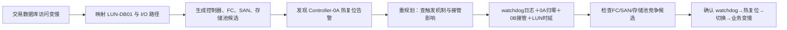

# Case 01：控制器热复位诊断设计 V2.0

## 1. 场景

Controller-0A 因 `watchdog_timeout` 触发热复位，Block Service 切换至 Controller-0B，LUN-DB01 时延由 1.8ms 升至 38.6ms，业务短时变慢后恢复。

## 2. 整体流程



## 3. 对象与候选

| 类别 | 对象 |
|---|---|
| 业务 | 交易数据库、DB Host |
| 网络 | SAN Fabric A/B、FC Port A/B |
| 存储 | Storage-01、Controller-0A/0B、Block Service、LUN-DB01、Pool-01 |
| 候选 | 0A热复位、FC链路抖动、SAN链路异常、池性能瓶颈 |

## 4. Round 0：输入完整性

- 输入：“交易数据库刚才突然变慢了”；
- 缺口：时间窗；
- Planner：`ASK_USER`；
- 回答：约 14:32 开始，持续几十秒；
- 输出：标准化现象与会话时间窗。

## 5. Round 1：现象验证与范围定位

- `business_mapping`：业务→Host→LUN-DB01；
- `kpi_query`：LUN时延 1.8→38.6ms；
- `topology_query`：展开双SAN、双控制器和LUN路径；
- 生成 4 个对象＋故障模式候选；
- LUI 显示“已确认业务影响，正在定位路径原因”。

## 6. Round 2：第一轮取证

- Planner 选择路径对象告警查询；
- `alarm_query` 返回 Controller-0A 热复位告警，14:32:17.842；
- 创建 ALARM Fact 和直接故障 Evidence；
- 控制器候选 32→62，成为领先；
- 触发 `PLAN_REPLANNED`。

## 7. Round 3：机制与影响链

- `log_fingerprint_query` 命中 `watchdog_timeout`，`timeout_ms=3000`；
- `kpi_query` 返回 0A 8.4GB/s→0、0B 7.9→15.6GB/s；
- LUN时延在相同窗口升高并恢复；
- `topology_query` 证明 0A/0B 主备与接管路径；
- 控制器候选 62→84/96，机制和影响要求满足。

## 8. Round 4：竞争候选检查

- FC CRC 增量=0、端口保持 Up；
- 双 SAN 无链路告警；
- Pool 利用率 63.2%→63.3%，无负载突增；
- 三个竞争候选更新为 `WEAKENED`，不用“完全排除”。

## 9. Round 5：结论

最小证据链：直接故障、机制、对象路径、时间一致、影响闭环、竞争检查全部满足；无关键冲突。

```text
watchdog_timeout
→ Controller-0A热复位
→ 主I/O短时中断
→ Controller-0B接管
→ LUN时延升高
→ 交易数据库访问变慢
→ 接管稳定后恢复
```

## 10. LUI 关键值

| 层级 | 内容 |
|---|---|
| 当前行动摘要 | `watchdog_timeout · timeout_ms=3000` |
| 证据链 | 告警14:32:17.842、0A归零、0B升至15.6GB/s、LUN峰值38.6ms |
| Fact Detail | 告警生命周期、日志上下文、KPI样本、CRC=0与查询覆盖 |

## 11. 验收

- 根因在幕2前不可见；
- 至少两次有原因的重规划；
- 支持分无百分号；
- 根因确认依赖完整链而非分数；
- 旧 Case V1.0 可经 Adapter 运行。

