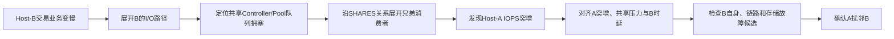
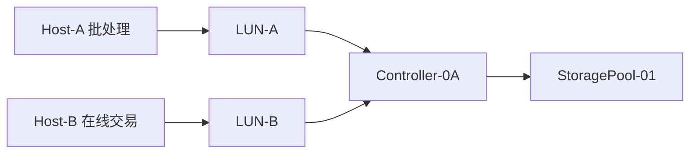

# Case 02：共享存储扰邻诊断设计 V2.0

> Case ID：`noisy_neighbor_io_contention_001`  
> 数据实现：`cases/noisy_neighbor_io_contention_001/`，Case V1.0 Mock 数据包，已通过统一校验器。

## 1. 场景

Host-A 与 Host-B 使用同一存储系统的不同 LUN，但共享前端端口、Controller-0A 与 StoragePool-01。Host-A 批处理业务 I/O 突增，占用共享队列和后端带宽，Host-B 的在线交易时延升高。诊断从受害者 Host-B 开始，沿其路径向下定位共享瓶颈，再通过图谱的 `SHARES` 关系反向发现 Host-A 是施压者。

本 Case 不新增“扰邻分析 Skill”。推理由 Agent＋故障图谱完成，数据只通过既有 `business_mapping`、`topology_query`、`kpi_query`、`alarm_query` 和 `log_fingerprint_query` 获取。

## 2. 整体流程



## 3. 拓扑



投影时左右放 Host-A/Host-B，中间汇聚共享 Controller/Pool；初始只突出 Host-B 路径，发现共享压力后再拆出 Host-A。

## 4. 候选

1. Host-B 自身 CPU/应用异常；
2. Host-B FC/SAN 链路异常；
3. LUN-B/共享池性能瓶颈；
4. Controller-0A 故障或过载；
5. 共享消费者工作负载突增导致资源争用。

## 5. Round 0：输入与时间窗

- 输入：“Host-B 上的交易业务突然变慢”；
- 追问：开始时间和受影响业务；
- 标准化：Host-B/交易应用，10:15:00～10:20:00，时延升高；
- Agent 初始只知道受害者 B，不知道 A。

## 6. Round 1：验证 B 的现象

- `business_mapping` 定位 Host-B→LUN-B；
- `kpi_query`：B业务时延 3.2→42ms，LUN-B时延同步升高；
- Host-B CPU、内存和应用错误率无同窗异常；
- B自身候选被初步削弱，但不确认根因。

## 7. Round 2：沿 B 路径向下定位

- `topology_query` 展开 B→Fabric→Port→Controller-0A→LUN-B→Pool；
- `kpi_query` 发现 Controller 队列深度 12→186、Pool 后端带宽接近上限；
- B FC CRC=0、无 Link Down/Up；
- 共享资源压力候选成为领先；
- Planner 重规划：寻找共享资源的其他消费者与压力来源。

## 8. Round 3：图谱反向展开共享消费者

Agent 不调用专用扰邻 Skill，而是：

1. 从异常 `Controller-0A/Pool-01` 读取 `SHARES/ACCESSES` 关系；
2. 通过 `topology_query` 展开同一资源的 sibling LUN/Host；
3. 发现 LUN-A→Host-A；
4. 为 Host-A 工作负载突增生成/细化候选；
5. 规划 `kpi_query` 对比 A、B 与共享资源指标。

## 9. Round 4：施压者与时间因果

建议 Mock 数据：

| 指标 | 基线 | 异常值 |
|---|---:|---:|
| Host-A/LUN-A IOPS | 18K | 165K |
| Host-A 吞吐 | 1.2GB/s | 9.4GB/s |
| Controller队列深度 | 12 | 186 |
| Host-B/LUN-B IOPS | 22K | 21K（需求未增加） |
| Host-B LUN时延 | 3.2ms | 42ms |
| FC CRC增量 | 0 | 0 |

时间顺序：A负载突增→共享队列/带宽饱和→B时延升高。若加入恢复段：A任务结束→共享压力回落→B时延恢复，可形成更强因果闭环。

## 10. Round 5：竞争检查与结论

- B自身资源正常；
- B前端链路完整；
- 控制器无复位/硬件告警；
- Pool 无磁盘故障，仅表现为工作负载压力；
- A突增与共享压力及B影响严格同窗；
- 确认“Host-A工作负载突增通过共享存储资源扰邻Host-B”。

## 11. 最小证据链

```text
B业务影响事实
→ B位于共享资源路径
→ 共享资源出现压力
→ 沿共享关系发现A
→ A负载突增先于/同步于共享压力
→ B自身与链路候选被区分
→ （可选）A降载后B恢复
```

## 12. LUI 与图谱重点

- 顶部在 Round 0～2 只能显示“共享资源压力”领先候选，不能提前显示 A；
- Round 3 的重规划理由必须显示“异常对象为共享资源，需要展开其他消费者”；
- 点击 Host-A 候选同时高亮 A→共享资源→B 的跨业务影响链；
- Fact Detail 展示 A/B IOPS、共享队列、B时延的对齐趋势；
- 诊断文本区分“受害者B”“共享瓶颈”“施压者A”。

## 13. 验收

- 不新增扰邻专用 Skill；
- 不从 Case ID 直接显示 Host-A；
- 必须先定位共享资源，再反向发现 A；
- B 自身无异常不能单独确认扰邻；
- 结论由拓扑共享关系＋多对象 KPI 时间对齐形成；
- 与控制器 Case 共用相同 Fact/Evidence/Candidate/LUI 协议。

## 14. Mock 数据包覆盖

数据包包含 12 个资源、14 条拓扑关系、2 条告警、6 条原始日志、6 个日志指纹、8 组 KPI、5 个候选、9 个任务、11 条证据和 8 幕回放。

关键实现约束：

- 初始症状与前三幕只聚焦 Host-B 及其 I/O 路径；
- `task-expand-shared-consumers` 运行后，才通过 `SHARES_RESOURCE_WITH` 关系揭示 Host-A；
- `kpi-lun-a-iops`、`kpi-controller-queue-depth`、`kpi-pool-bandwidth-util` 与 `kpi-lun-b-latency` 使用同一时间轴；
- `fp-batch-complete-005` 与恢复段 KPI 形成因果闭环；
- Host-B CPU、FC CRC、控制器硬件告警和Pool固有故障均有明确竞争证据。
