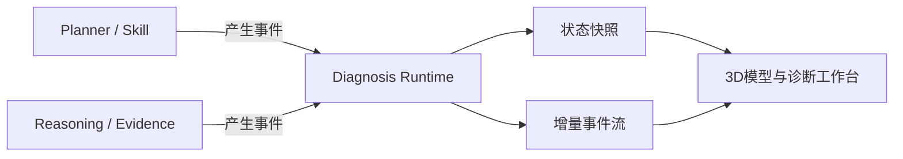

# 故障诊断Agent 前端交互联动规则基线 V1.0

> 文档状态：已完成 3D 产品主线与场景路由对齐  
> 版本：V1.1  
> 日期：2026-07-30  
> 适用范围：故障诊断 Agent 可视化原型、Mock Case 演示及后续真实运行时接入

---

## 1. 文档目标

本规范定义故障诊断 Agent 一屏探索界面的交互联动规则，使用户能够从任一故障对象、候选根因、证据或诊断事件出发，回答以下问题：

1. Agent 当前知道什么；
2. Agent 正在做什么；
3. 为什么选择当前动作；
4. 当前怀疑哪些根因，依据和缺口分别是什么；
5. 某项证据来自哪里、影响了哪个候选；
6. 计划为什么调整；
7. 最终为什么能够确认根因，或为什么仍不能确认。

本规范重点约束跨区域联动、状态恢复、事件回放和诊断语义，不定义具体视觉风格，也不展示大模型内部原始思维链。

本规范必须在以下产品主线下使用：

```text
3D实例拓扑—故障知识图谱模型探索
→ 用户输入故障现象
→ 现象标准化与Case路由
→ 创建diagnosis_session
→ Runtime事件驱动诊断推演
→ 结论收敛与复盘
```

无诊断 Session 时，页面仍必须是完整可探索的 3D 模型，而不是空白诊断工作台。

---

## 2. 基线定位

### 2.1 核心设计原则

前端总体采用：

> **拓扑主导、推理联动；图谱与拓扑负责解释故障，候选、证据、Skill 和时间线负责解释 Agent 如何判断。**

页面布局保持稳定，通过局部状态变化呈现 Agent 认知逐步收敛，避免在多个页面之间跳转。

3D 实例拓扑与故障知识图谱使用同一个 `3d-force-graph` 场景、相机和拾取系统。前端不允许用二维图或 CSS 透视替代，也不允许两套图引擎分别维护拓扑和图谱。

### 2.2 一屏信息结构

| 区域 | 主要职责 | 回答的问题 |
|---|---|---|
| 顶部全局区 | 模型版本、视角、搜索和诊断入口；诊断启动后增加当前判断、当前动作与阶段 | 当前是在探索模型还是执行诊断 |
| 中部主视图区 | 上层3D实例拓扑、下层故障知识图谱、跨层映射；诊断启动后叠加故障、候选和路径 | 系统如何构成，故障发生在哪里、如何传播 |
| 中部候选区 | 3～5 个候选、诊断支持分、状态、最近变化和证据缺口 | 当前怀疑什么 |
| 底部执行区 | Planner、Skill、Evidence、Reasoning 的关键语义事件 | Agent 做过什么、正在做什么 |
| 底部决策区 | 下一步、选择原因、依据、目标候选和期望证据 | 为什么这样做 |
| 详情抽屉 | 原始事实、Skill 来源、完整证据链、历史变化 | 如何追溯 |

候选区、执行区和决策区在 `MODEL_OVERVIEW` 中收起或隐藏；只有 Case 路由成功并创建 Session 后才进入诊断布局。

### 2.4 产品状态

```text
MODEL_OVERVIEW
→ DIAGNOSIS_INPUT
→ SESSION_INITIALIZING
→ DIAGNOSING
→ DIAGNOSIS_REVIEW
→ MODEL_OVERVIEW
```

- `MODEL_OVERVIEW`：浏览、旋转、缩放、搜索、聚焦和展开模型，不修改诊断状态；
- `DIAGNOSIS_INPUT`：收集故障现象、时间和范围；
- `SESSION_INITIALIZING`：完成标准化、Case 路由、数据校验和 Session 创建；
- `DIAGNOSING`：消费 Runtime Event，展示 Planner、Skill、证据和候选演进；
- `DIAGNOSIS_REVIEW`：展示终态结论、完整证据链和历史复盘。

### 2.3 信息密度分层

1. **主视图**：当前结论、主要故障对象、领先候选、当前动作和下一步；
2. **展开视图**：候选依据、证据缺口、相关任务和影响路径；
3. **详情视图**：原始 Skill 结果、完整事件、参数、分数历史和状态快照。

---

## 3. 统一诊断语义

### 3.1 四层认知对象

| 层次 | 定义 | 示例 | 推荐措辞 |
|---|---|---|---|
| 已确认事实 `fact` | Skill 实际返回并完成结构化的数据 | Controller-0A 于 14:32:14 发生热复位 | 已发现 |
| 诊断证据 `evidence` | 对事实与候选关系的诊断解释 | 热复位在故障窗口内，强支持控制器异常 | 支持、削弱、冲突 |
| 候选假设 `candidate` | 尚待验证的根因解释 | Controller-0A 异常或复位 | 怀疑、候选、领先 |
| 当前结论 `conclusion` | 满足确认规则后的根因判断 | watchdog 超时触发 Controller-0A 热复位 | 确认 |

候选支持分是“诊断支持分”，不是概率或置信度。分数达到门槛不能单独触发根因确认，必须同时满足最小证据链、竞争候选检查和关键冲突消解要求。

### 3.2 状态与视觉叠加

对象可以同时具有业务状态、诊断状态和交互状态。例如 Controller-0A 可以同时是：

- 运行异常；
- 领先候选；
- 当前选中对象。

前端不得只依赖单一基础颜色表达全部含义。异常、根因、受影响、冗余接管、待确认和选中状态必须可同时辨识。

---

## 4. 前端状态模型

### 4.1 单一状态来源

前端存在两个互不混淆的状态域：

1. `model_view_state`：模型探索的相机、选择、展开、筛选和视角状态；
2. `diagnosis_session`：诊断事实、证据、候选、计划、任务、事件和结论状态。

无诊断 Session 时，前端只消费模型资产和 `model_view_state`。诊断启动后，Planner、Skill、Reasoning 和 Evidence 模块只产生事件，由 Diagnosis Runtime 归并为 `diagnosis_session`；诊断状态再以 Overlay 投影到同一 3D 模型。



用户的旋转、缩放、悬停、选择和视角切换只更新 `model_view_state`，不能生成 Fact/Evidence、改变支持分或确认根因。

### 4.2 状态快照最小内容

```yaml
diagnosis_session:
  session_id: session_001
  version: 18
  phase: ROOT_CAUSE_VERIFICATION
  current_summary: Controller-0A异常成为领先候选，尚未达到确认条件

  current_activity:
    task_id: task_006
    type: SKILL_EXECUTION
    display_text: 正在查询Controller-0A复位前异常日志

  current_decision:
    action: VERIFY_RESET_MECHANISM
    reason: 已发现热复位事件，但仍缺少触发机制
    based_on: [evidence_controller_reset]
    target_candidates: [candidate_controller]
    expected_evidence: [watchdog_timeout_fingerprint]

  focused_selection:
    source_type: candidate
    source_id: candidate_controller

  topology_view:
    perspective: diagnosis
    focused_nodes: [controller_0a]
    highlighted_paths: [path_controller_to_lun]

  candidates: []
  facts: []
  evidences: []
  active_plan: []
  timeline_summary: []
```

### 4.3 事件与快照

- 首次进入或刷新：获取完整状态快照；
- 诊断运行期间：订阅递增序号的增量事件；
- 断线恢复：从最后一个 `sequence` 续传；
- 无法续传：重新获取最新快照；
- 历史回放：按选中事件恢复对应版本的只读快照；
- 返回当前：恢复最新实时快照与此前探索上下文。

---

## 5. 选择、聚焦与筛选的通用规则

### 5.1 三种交互语义

| 交互 | 含义 | 是否改变诊断状态 |
|---|---|---|
| 选中 `select` | 查看某对象详情 | 否 |
| 聚焦 `focus` | 强调相关对象、路径、候选、证据和任务 | 否 |
| 筛选 `filter` | 暂时隐藏或降低无关内容 | 否 |

用户探索不能修改 Agent 的候选分、任务状态、决策或结论。诊断状态只由运行时事件更新。

### 5.2 联动显示规则

- **直接相关项**：高亮；
- **间接相关项**：保持可见并降低强调；
- **无关项**：降暗但仍可访问；
- **被筛选项**：可通过“显示全部”恢复；
- **数据不完整项**：进入“待确认区域”，不得由前端推测连接。

### 5.3 单选与多选

V1 采用单一主选择：

- 同一时刻只有一个 `focused_selection`；
- 用户点击新对象时替换原主选择；
- 相关路径可以多条同时高亮；
- 不支持复杂多选比较，候选间比较通过专用详情视图完成。

---

## 6. 四条核心联动链

## 6.1 拓扑对象 → 候选 / 证据 / 任务

用户点击拓扑或诊断图谱中的节点后：

| 区域 | 响应 |
|---|---|
| 拓扑/图谱 | 节点进入选中状态；高亮直接上下游、故障路径、影响路径和有效冗余路径 |
| 候选区 | 与该对象直接关联的候选置顶或高亮；其他候选不删除 |
| 证据区 | 展示该对象相关的支持、削弱、冲突和缺失证据 |
| 执行区 | 高亮已执行和待执行的对象相关任务 |
| 决策区 | 若当前决策以该对象为目标，则突出显示；否则保持 Agent 当前决策，不随用户点击改写 |
| 详情抽屉 | 展示对象属性、层级、上下游、运行状态、相关事实和数据完整性 |

特殊规则：

- 点击聚合节点可逐级展开，并能恢复展开前状态；
- “仅看此路径”只调整强调与可见性，不改变基础布局；
- 故障路径与有效冗余路径可同时展示；
- 退出聚焦后恢复此前视口、展开层级和浏览上下文。

## 6.2 候选根因 → 对象 / 证据 / 缺口 / 计划

用户点击候选后：

| 区域 | 响应 |
|---|---|
| 拓扑/图谱 | 高亮候选对象、根因假设链、可能影响路径及需要验证的竞争路径 |
| 候选区 | 展开当前候选，显示支持分历史、状态和最近变化原因 |
| 证据区 | 按“支持、削弱、冲突、缺失”四组展示 |
| 执行区 | 高亮用于验证该候选的已完成、执行中、待执行和暂停任务 |
| 决策区 | 展示当前计划是否正在验证该候选，以及选择或暂缓的原因 |

候选详情最少包含：

```yaml
candidate_detail:
  current_score: 62
  status: LEADING
  score_changes:
    - from: 32
      to: 62
      caused_by: evidence_controller_reset
  supporting_evidence: []
  weakening_evidence: []
  conflicting_evidence: []
  missing_evidence: []
  confirmation_requirements: []
```

候选高亮不得被显示为“根因确认”；只有 `ROOT_CAUSE_CONFIRMED` 事件可以将状态升级为 `CONFIRMED`。

## 6.3 证据 → 来源 / 对象 / 候选变化

用户点击证据后：

| 区域 | 响应 |
|---|---|
| 拓扑/图谱 | 定位证据对象及其与业务现象之间的相关路径 |
| 候选区 | 高亮受到该证据影响的候选，并展示分数前后变化 |
| 证据区 | 展开事实、诊断解释、强度、方向和时间关系 |
| 执行区 | 定位产生该证据的 Skill 任务和对应事件 |
| 决策区 | 展示该证据是否触发继续验证、重规划或根因确认 |
| 详情抽屉 | 展示原始 Skill 结果、查询时间窗、数据来源及追溯标识 |

证据详情必须保留：

```yaml
evidence:
  evidence_id: evidence_controller_reset
  derived_from_fact: fact_controller_reset
  source_task_id: task_alarm_query
  source_skill_id: alarm_query
  target_candidates: [candidate_controller]
  direction: SUPPORT
  strength: STRONG
  score_delta: 30
  explanation: 对象位于业务I/O路径，事件时间落入异常窗口
```

禁止由前端根据原始数据自行计算证据强度或候选分变化。

## 6.4 时间线事件 → 历史快照 / 当时决策

用户点击时间线事件后，界面进入历史回放模式：

- 恢复事件发生后的状态快照；
- 顶部明确显示“历史回放”及事件时间；
- 所有区域展示当时 Agent 已知的信息，不能泄露后续证据和最终结论；
- 高亮事件直接影响的对象、候选、证据和任务；
- 决策区展示当时的下一步、原因与期望证据；
- 自动诊断播放暂停；
- 提供“上一步、下一步、继续播放、返回当前”。

返回实时模式时：

- 获取或恢复最新状态版本；
- 保留用户进入回放前的视口和展开状态；
- 若回放期间产生新事件，显示“有新进展”提示，不强制跳转。

---

## 7. 图谱、拓扑与认知分层联动

### 7.1 3D 双平面与三类观察视角

首屏结构固定为：

| 空间层 | 主要内容 | 默认行为 |
|---|---|---|
| 上层实例拓扑 | 业务、主机、网络、端口、控制器、服务、LUN、存储池和物理资源 | 视觉权重略高，按五个空间域聚合 |
| 下层故障知识图谱 | 对象类型、故障现象、故障模式、机制、证据规则和案例 | 按四层知识结构聚合 |
| 中间跨层映射 | `instance_of`、故障模式映射、证据映射和 `case_match` | 只强化当前选中或诊断相关关系 |

| 视角 | 展示重点 |
|---|---|
| 资源拓扑 | 强化 Host、端口、控制器、存储池、LUN、磁盘等实例与连接 |
| 故障知识图谱 | 强化对象类型、故障现象、故障模式、证据规则及案例关系 |
| 影响视角 | 根因链、影响传播链、冗余接管链和恢复链 |

三类视角在同一 `3d-force-graph` 场景中切换相机预设和视觉权重，不切换到另一张图。切换视角时应保持：

- 当前选中对象；
- 视口中心；
- 展开层级；
- 时间位置；
- 当前聚焦候选或证据。

### 7.2 分层探索

用户从业务现象向下探索时，推荐按需展开：

```text
业务 / Host
→ 前端网络与端口
→ 控制器与服务
→ 存储池 / LUN
→ 硬盘框 / 磁盘
→ 日志、告警、KPI 等观测证据
```

模型探索态默认展示聚合后的全环境实例拓扑和知识图谱，不一次性展开全部 CMDB/知识节点；诊断态只自动展开当前 Session 已知的相关对象。新增节点必须来自真实模型数据或明确标记的知识关系，不允许前端推测性连线。

### 7.3 诊断状态叠加顺序

```text
中性模型
→ 用户输入对应的业务对象
→ 已定位的异常范围
→ 泛化候选
→ 新事实与证据映射
→ 候选排序与重规划
→ 根因链、影响链和恢复链
```

任何 Overlay 都必须由当前 Session 版本计算，不能根据 Case 最终结论一次性绘制。

---

## 8. 动态诊断与重规划联动

### 8.1 事件驱动局部刷新

| 事件 | 主要刷新区域 |
|---|---|
| `DIAGNOSIS_INITIALIZED` | 顶部、拓扑、执行区 |
| `CANDIDATES_GENERATED` | 候选区、拓扑/图谱 |
| `SKILL_STARTED` | 当前动作、执行区 |
| `FACT_DISCOVERED` | 事实详情、拓扑节点 |
| `EVIDENCE_CREATED` | 证据区、候选关联 |
| `CANDIDATE_UPDATED` | 分数、排序、状态和变化原因 |
| `PLAN_REPLANNED` | 顶部、执行区、决策区 |
| `ROOT_CAUSE_CONFIRMED` | 全局结论、完整证据链 |
| `DIAGNOSIS_COMPLETED` | 结论与处置建议 |

### 8.2 重规划展示

`PLAN_REPLANNED` 发生时必须同时展示：

1. 重规划触发证据；
2. 原计划；
3. 新计划；
4. 调整原因；
5. 被暂停或降级的任务；
6. 新计划希望补齐的证据链。

重规划动画仅强调候选分变化、时间线新增事件和决策区切换，不整屏重载。

### 8.3 当前活动

V1 只允许一个 `current_activity`。未来支持并行 Skill 后：

- `primary_activity` 表示当前主诊断动作；
- `background_activities` 表示辅助查询；
- 顶部只展示主活动，辅助活动进入执行区。

---

## 9. 五阶段页面联动基线

以下五阶段只描述 Case 路由成功后的诊断运行态；其前置步骤固定为“3D 模型探索 → 故障现象输入 → Case 路由 → Session 初始化”。

| 阶段 | 主要交互目标 | 可探索内容 |
|---|---|---|
| 诊断初始化 | 验证现象、对象和时间窗 | 业务对象、初始拓扑、数据缺口 |
| 初始候选生成 | 理解候选从何而来 | 候选对象、知识依据、第一轮计划 |
| Skill 查询与证据更新 | 追溯事实如何转为证据 | Skill 来源、事实、证据、分数变化 |
| 强证据触发重规划 | 理解计划为何改变 | 触发证据、原计划、新计划、缺口 |
| 根因确认与报告 | 验证最小证据链和结论边界 | 根因链、影响链、竞争候选、建议 |

五阶段共用同一页面布局，页面只更新内容和视觉强调。

---

## 10. 控制器热复位 Case 联动示例

以用户输入“数据库访问突然变慢”、系统路由到 Controller 热复位 Case 为基线：

1. 路由成功后，相机聚焦数据库业务入口，不标记根因；
2. 业务映射与拓扑 Skill 定位 `LUN-DB01`，3D 模型高亮业务 I/O 路径；
3. 推理模块生成控制器、FC 链路、SAN 链路、存储池等泛化候选，下层知识图谱展开相应故障模式和待验证证据；
4. 用户点击“Controller-0A 异常或复位”：模型聚焦 Controller-0A、Controller-0B 和 LUN-DB01，并展示当前证据缺口；
5. 用户点击“热复位证据”：执行区定位告警查询 Skill，候选区展示 `32 → 62`，决策区解释为何优先查询复位前日志；
6. 用户点击第一次 `PLAN_REPLANNED`：进入历史快照，展示原计划、新计划和新增的机制/状态/影响验证；
7. 用户点击 `watchdog_timeout` 证据：知识图谱与拓扑共同高亮“触发机制 → 热复位 → 接管 → LUN 时延”的证据链；
8. 第二次重规划完成竞争候选检查后，根因才允许确认；
9. 根因确认后点击 FC 链路候选，仍可查看其削弱证据，但主结论保持不变。

---

## 11. 异常、空态与冲突处理

### 11.1 数据不足

- 明确显示缺失的对象、时间窗或证据；
- 候选保持 `INSUFFICIENT_EVIDENCE` 或待验证状态；
- 不生成推测性拓扑连接；
- 不用支持分替代缺失证据。

### 11.2 事件乱序与重复

- 所有事件带递增 `sequence`；
- 低于当前版本的晚到事件不覆盖新状态；
- 重复事件按 `event_id` 去重；
- 发现序号缺口时暂停增量应用，并请求补传或重新拉取快照。

### 11.3 冲突证据

- 候选和对象增加冲突标识；
- 支持与削弱证据同时可见；
- 决策区说明冲突点和下一步消歧动作；
- 未解决关键冲突时不能确认根因。

### 11.4 Skill 失败

- 执行区显示失败任务及可理解原因；
- 决策区展示重试、替代 Skill 或信息不足的决策；
- Skill 失败不能被解释为候选不成立。

---

## 12. V1 交互边界

### 12.1 V1 必须支持

- `3d-force-graph` 实例拓扑—故障知识图谱双平面、跨层连线和真实 3D 相机交互；
- 模型探索态下的搜索、聚焦、旋转、缩放、按需展开和视角切换；
- 故障现象输入、现象标准化、Case 路由以及歧义/未匹配状态；
- 自动诊断播放、暂停、前后单步、重置和返回当前；
- 拓扑对象、候选、证据、时间线四类主入口；
- 分层拓扑、诊断图谱、影响路径和认知分层联动；
- 候选支持分变化与具体证据可追溯；
- 强证据触发重规划及原因展示；
- 事实、证据、候选和结论的明确区分；
- Mock Case 与真实 Skill 共用同一状态和事件协议；
- 用户探索不改变 Agent 诊断状态。

### 12.2 V1 暂不支持

- 自由拖拽并持久化拓扑布局；
- 复杂多对象或多候选并排比较；
- 多个主活动并行展示；
- 原始日志墙；
- 前端自行推断证据、计算候选分或确认根因；
- 在主屏展示大模型内部原始思维链。

---

## 13. 验收标准

### 13.1 可理解性

- 用户进入系统后在 5 秒内能识别实例拓扑、故障知识图谱、跨层映射和诊断入口；
- 用户在 5 秒内能识别当前故障现象、领先候选、当前动作和下一步原因；
- 用户无需从候选、任务和 Skill 零散字段中猜测 Planner 决策；
- “领先候选”和“根因确认”在措辞与视觉上可明确区分。

### 13.2 可探索性

- 点击任一拓扑对象，可定位其相关候选、证据和任务；
- 点击任一候选，可查看支持、削弱、冲突和缺失证据；
- 点击任一证据，可追溯 Skill 来源、事实、对象和分数变化；
- 点击任一关键事件，可恢复当时快照，且不泄露未来信息。

### 13.3 一致性

- 所有区域基于同一 `diagnosis_session.version`；
- 事件流断线后可以续传或通过快照恢复；
- 图谱、拓扑、候选、证据和任务使用统一 ID；
- 视角切换和退出聚焦后能够恢复浏览上下文。

### 13.4 诊断正确性

- 原始事实与诊断推演分离；
- Skill 失败不等于候选被削弱；
- 数据不完整时不出现推测性连线；
- 支持分达到门槛但证据链不完整时，界面不得显示“根因已确认”。

---

## 14. 冻结结论

V1.1 正式冻结以下交互基线：

1. 首屏是 3D 实例拓扑—故障知识图谱融合模型，诊断流程不是默认首页；
2. 用户输入必须先经过现象标准化和 Case 路由，只有唯一匹配后才创建 Session；
3. 模型探索使用独立 `model_view_state`；诊断前端只对接统一诊断会话，不直接拼装各模块状态；
4. 采用“状态快照 + 增量事件流”的运行模型；
5. 页面以 3D 拓扑和知识图谱为主视觉，以候选、证据、Skill 和时间线解释推理；
6. 拓扑对象、候选、证据、时间线构成四条核心探索入口；
7. 用户交互只改变选中、聚焦和筛选，不改变 Agent 诊断状态；
8. 候选变化必须追溯到证据，证据必须追溯到事实和 Skill；
9. 重规划必须展示触发证据、原计划、新计划和调整原因；
10. 历史回放使用当时快照，不能提前展示后续结论；
11. 根因确认必须满足最小证据链，不能仅由诊断支持分触发；
12. Mock Case、真实 Skill 和真实推理共用同一交互协议。

---

## 15. 与现有基线文档的关系

| 文档 | 本规范的衔接关系 |
|---|---|
| 《故障诊断Agent 可视化原型与诊断推理基线 V1.0》 | 继承候选、证据、重规划和确认规则，补充跨区域联动 |
| 《故障诊断Agent 推理模块与候选更新规则基线 V1.0》 | 消费候选状态、分数变化及确认结果，不在前端重复推理 |
| 《故障诊断Agent Planner 输出协议与重规划基线 V1.0》 | 消费结构化 `current_decision` 和重规划事件 |
| 《故障诊断Agent 演示级 Skill 规范 V1.0》 | 追溯 Skill 任务、事实来源及执行状态 |
| 《实例拓扑视图展示与交互规格 V1.0》 | 继承拓扑分层、路径表达、展开与视口恢复规则 |
| 《Case 数据包定义规范 V1.0》 | 使用统一对象 ID、时间基准、事件序列和事实/推演分离原则 |
